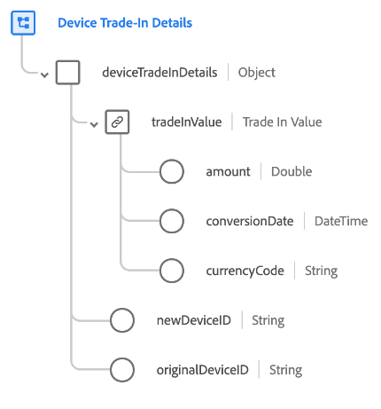

# [!UICONTROL Détails d’échange de l’appareil] groupe de champs de schéma

>[!NOTE]
>
>Les noms de plusieurs groupes de champs de schéma ont changé. Pour plus d’informations, consultez le document sur les [mises à jour des noms de groupes de champs](../name-updates.md).

[!UICONTROL Device Trade-In Details] est un groupe de champs de schéma standard pour la [[!DNL XDM ExperienceEvent] classe](../../classes/experienceevent.md). Il fournit un champ unique (`deviceTradeInDetails`) qui décrit une transaction d’échange d’appareil, y compris la valeur d’échange, l’identifiant d’appareil d’origine et le nouvel identifiant d’appareil.

| Propriété | Type de données | Description |
| --- | --- | --- |
| `tradeInValue` | [Devise](../../data-types/currency.md) | Valeur de l’appareil échangé. |
| `newDeviceID` | Chaîne | Identifiant du nouvel appareil échangé. |
| `originalDeviceID` | Chaîne | Identifiant de l’appareil échangé. |

{style="table-layout:auto"}

Pour plus d’informations sur le groupe de champs , consultez le référentiel XDM public :

* [Exemple renseigné](https://github.com/adobe/xdm/blob/master/components/fieldgroups/experience-event/industry-verticals/experienceevent-device-trade-in-details.example.1.json)
* [Schéma complet](https://github.com/adobe/xdm/blob/master/components/fieldgroups/experience-event/industry-verticals/experienceevent-device-trade-in-details.schema.json)
