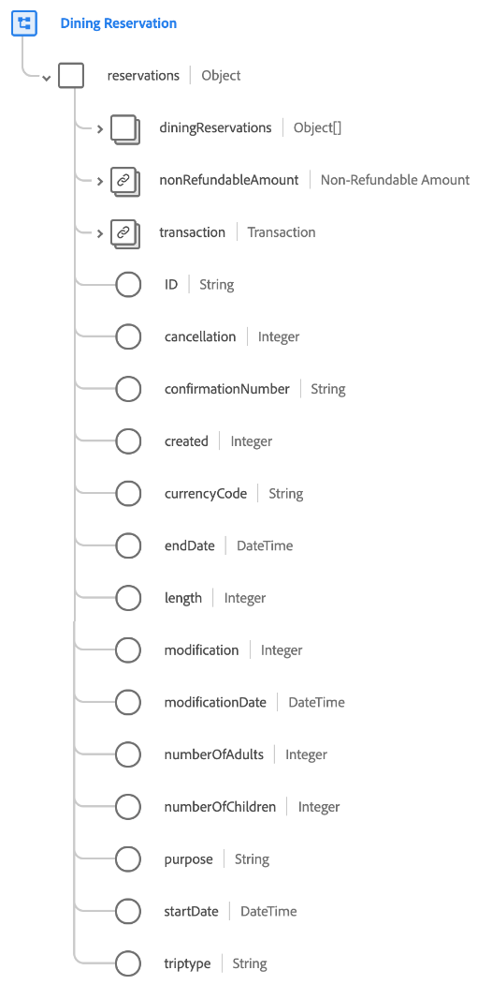
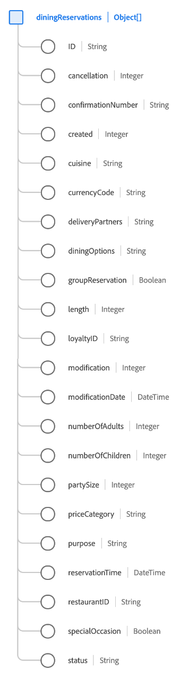

# [!UICONTROL Réservation de restaurant] groupe de champs de schéma

[!UICONTROL Réservation au restaurant] est un groupe de champs de schéma standard pour la [[!DNL XDM ExperienceEvent] classe](../../classes/experienceevent.md) utilisé pour capturer des informations concernant une réservation au restaurant.

Le groupe de champs est une extension du groupe de champs [!UICONTROL &#x200B; Détails de la réservation &#x200B;] et contient tous les mêmes champs sous un seul champ de type objet, `reservations`. En plus de ces champs génériques, [!UICONTROL Réservation au restaurant] inclut également `diningReservations` tableau . Ce tableau d’objets est utilisé pour décrire une ou plusieurs réservations avec des propriétés spécifiques au restaurant.

>[!NOTE]
>
>Ce document couvre les détails du tableau de `diningReservations`. Pour plus d&#39;informations sur les autres champs fournis sous l&#39;objet `reservations`, reportez-vous à la référence du groupe de champs [[!UICONTROL Détails de la réservation]](./reservation-details.md).

## `diningReservations`

`diningReservations` est un tableau d’objets qui représente une liste de réservations au restaurant. Si un événement de réservation implique des réservations dans plusieurs restaurants différents à différents moments de la journée, par exemple, ces réservations peuvent être répertoriées comme des objets individuels sous `diningReservations` pour un seul événement.

La structure de chaque objet fourni sous `diningReservations` est fournie ci-dessous.

| Propriété | Type de données | Description |
| --- | --- | --- |
| `ID` | Chaîne | Numéro ou identifiant de la réservation. |
| `cancellation` | Entier | Cette valeur est capturée lorsqu’une réservation a été annulée. |
| `confirmationNumber` | Chaîne | Numéro ou identifiant de confirmation de la réservation. |
| `created` | Entier | Cette valeur est capturée lorsqu’une réservation a été créée. |
| `cuisine` | Entier | Le type de cuisine du restaurant. |
| `currencyCode` | Chaîne | Code de devise ISO 4217 utilisé pour effectuer l’achat. |
| `deliveryPartners` | Chaîne | Partenaires de livraison disponibles au restaurant. |
| `diningOptions` | Chaîne | Options de livraison et de repas disponibles au restaurant. |
| `groupReservation` | Booléen | Indique si la réservation est effectuée pour un groupe. |
| `length` | Entier | Nombre total de jours pour la réservation. |
| `loyaltyID` | Chaîne | ID du programme de fidélité de l’invité répertorié dans la réservation. |
| `modification` | Entier | Cette valeur est capturée lorsqu’une réservation a été modifiée. |
| `modificationDate` | DateTime | Heure à laquelle la réservation a été modifiée pour la dernière fois. |
| `numberOfAdults` | Entier | Nombre d’adultes associés à la réservation. |
| `numberOfChildren` | Entier | Nombre d’enfants associés à la réservation. |
| `numberOfRooms` | Entier | Nombre de chambres associées à la réservation. |
| `partySize` | Entier | Nombre d’individus dans la soirée. |
| `priceCategory` | Chaîne | Catégorie de prix pour la réservation en cours. |
| `purpose` | Chaîne | L’objectif de la réservation, généralement professionnel ou personnel. |
| `reservationTime` | DateTime | Heure de la réservation au restaurant. |
| `restaurantID` | Chaîne | Identifiant du restaurant ou de l’emplacement du restaurant. |
| `reservationStatus` | Chaîne | Statut de la réservation. |
| `specialOccasion` | Booléen | Indique si la réservation est effectuée pour une occasion spéciale. |
| `status` | Entier | Statut de la réservation au restaurant. |

{style="table-layout:auto"}

Pour plus d’informations sur le groupe de champs , consultez le référentiel XDM public :

* [Exemple renseigné](https://github.com/adobe/xdm/blob/master/components/fieldgroups/experience-event/industry-verticals/experienceevent-dining-reservation.example.1.json)
* [Schéma complet](https://github.com/adobe/xdm/blob/master/components/fieldgroups/experience-event/industry-verticals/experienceevent-dining-reservation.schema.json)
