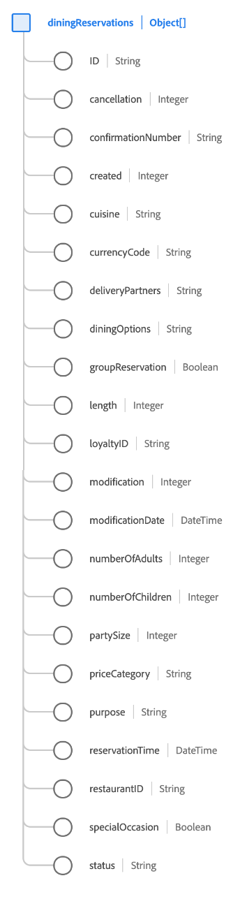

# [!UICONTROL Définition du groupe de champs ] de schéma de réservation

[!UICONTROL La ] réservation de repas est un groupe de champs de schéma standard pour la  [[!DNL XDM ExperienceEvent] ](../../classes/experienceevent.md) classe afin de capturer des informations concernant une réservation de repas.

Le groupe de champs est une extension du groupe de champs [!UICONTROL Détails de la réservation] et contient tous les mêmes champs sous un seul champ de type objet, `reservations`. En plus de ces champs génériques, [!UICONTROL Réservation de la définition] inclut également le tableau `diningReservations`. Ce tableau d’objets est utilisé pour décrire une ou plusieurs réservations avec des propriétés spécifiques à un restaurant.

>[!NOTE]
>
>Ce document couvre les détails du tableau `diningReservations`. Pour plus d’informations sur les autres champs fournis sous l’objet `reservations`, reportez-vous à la [[!UICONTROL Référence du groupe de champs ] ](./reservation-details.md).

## `diningReservations`

`diningReservations` est un tableau d’objets qui représente une liste de réservations de restaurants. Si un événement de réservation implique des réservations dans plusieurs restaurants différents à des moments différents de la journée, par exemple, ces réservations peuvent être répertoriées comme des objets individuels sous `diningReservations` pour un seul événement.

La structure de chaque objet fournie sous `diningReservations` est fournie ci-dessous.

| Propriété | Type de données | Description |
| --- | --- | --- |
| `ID` | Chaîne | Numéro ou identifiant de la réservation. |
| `cancellation` | Entier | Cette valeur est capturée lorsqu’une réservation a été annulée. |
| `confirmationNumber` | Chaîne | Numéro ou identifiant de confirmation de réservation. |
| `created` | Entier | Cette valeur est capturée lorsqu’une réservation a été créée. |
| `cuisine` | Entier | Le type de cuisine du restaurant. |
| `currencyCode` | Chaîne | Code de devise ISO 4217 utilisé pour effectuer l’achat. |
| `deliveryPartners` | Chaîne | Partenaires de diffusion disponibles depuis le restaurant. |
| `diningOptions` | Chaîne | Options de livraison et de restauration disponibles au restaurant. |
| `groupReservation` | Booléen | Indique si la réservation est faite pour un groupe. |
| `length` | Entier | Nombre total de jours pour la réservation. |
| `loyaltyID` | Chaîne | L’identifiant du programme de fidélité de l’invité répertorié dans la réservation. |
| `modification` | Entier | Cette valeur est capturée lorsqu’une réservation a été modifiée. |
| `modificationDate` | DateTime | Heure à laquelle la réservation a été modifiée pour la dernière fois. |
| `numberOfAdults` | Entier | Nombre d’adultes associés à la réservation. |
| `numberOfChildren` | Entier | Nombre d’enfants associés à la réservation. |
| `numberOfRooms` | Entier | Nombre de chambres associées à la réservation. |
| `partySize` | Entier | Le nombre d&#39;individus dans la fête. |
| `priceCategory` | Chaîne | La catégorie de prix de la réservation en cours. |
| `purpose` | Chaîne | L’objet de la réservation, généralement professionnel ou personnel. |
| `reservationTime` | DateTime | Heure pour laquelle la réservation de repas est effectuée. |
| `restaurantID` | Chaîne | Identifiant du restaurant ou de l’emplacement du restaurant. |
| `reservationStatus` | Chaîne | Le statut de la réservation. |
| `specialOccasion` | Booléen | Indique si la réservation est faite pour une occasion particulière. |
| `status` | Entier | Statut de la réservation du repas. |

{style=&quot;table-layout:auto&quot;}

Pour plus d’informations sur le groupe de champs, reportez-vous au référentiel XDM public :

* [Exemple rempli](https://github.com/adobe/xdm/blob/master/components/fieldgroups/experience-event/industry-verticals/experienceevent-dining-reservation.example.1.json)
* [Schéma complet](https://github.com/adobe/xdm/blob/master/components/fieldgroups/experience-event/industry-verticals/experienceevent-dining-reservation.schema.json)
