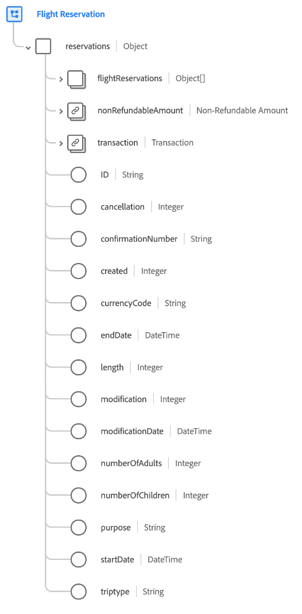
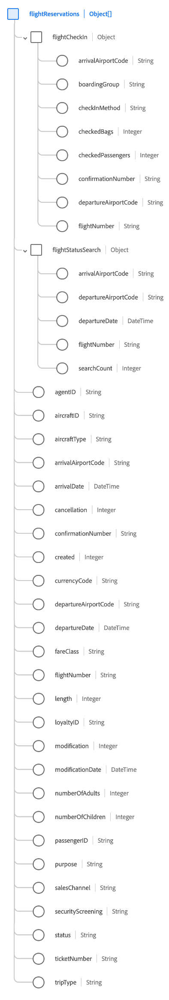

# Groupe de champs de schéma [!UICONTROL Réservation de vol]

[!UICONTROL Réservation de vol] est un groupe de champs de schéma standard pour la [[!DNL XDM ExperienceEvent] classe](../../classes/experienceevent.md) utilisé pour capturer des informations concernant une réservation de vol.

Le groupe de champs est une extension du groupe de champs [!UICONTROL &#x200B; Détails de la réservation &#x200B;] et contient tous les mêmes champs sous un seul champ de type objet, `reservations`. Outre ces champs génériques, [!UICONTROL réservation de vol] inclut également `flightReservations` tableau . Ce tableau d’objets est utilisé pour décrire une ou plusieurs réservations avec des propriétés uniques au transport aérien.

>[!NOTE]
>
>Ce document couvre les détails du tableau de `flightReservations`. Pour plus d&#39;informations sur les autres champs fournis sous l&#39;objet `reservations`, reportez-vous à la référence du groupe de champs [[!UICONTROL Détails de la réservation]](./reservation-details.md).

## `flightReservations`

`flightReservations` est un tableau d’objets qui représente une liste de réservations de vol. Si un événement de réservation implique des réservations pour plusieurs vols de correspondance au cours d’un voyage, par exemple, ces réservations peuvent être répertoriées comme des objets individuels sous `flightReservations` pour un seul événement.

La structure de chaque objet fourni sous `flightReservations` est fournie ci-dessous.

| Propriété | Type de données | Description |
| --- | --- | --- |
| `flightCheckIn` | Objet | Capture les détails de l’enregistrement du vol. L’objet contient les propriétés suivantes :<ul><li>`arrivalAirportCode` : (chaîne). Code de l’aéroport de la ville d’arrivée.</li><li>`boardingGroup` : (chaîne) indicateur d’ordre d’embarquement spécifique à la compagnie aérienne.</li><li>`checkInMethod`: (chaîne). Méthode utilisée pour l&#39;enregistrement, telle que comptoir, en ligne, kiosque ou libre-service.</li><li>`checkedBags` : (entier) nombre de bagages enregistrés pour le vol.</li><li>`checkedPassengers` : (entier) nombre de passagers enregistrés pour le vol, s’il existe plusieurs passagers pour le même numéro de réservation.</li><li>`confirmationNumber` : (chaîne) numéro ou identifiant de confirmation de la réservation.</li><li>`departureAirportCode` : (chaîne). Code de l’aéroport de la ville de départ.</li><li>`flightNumber` : (chaîne). Numéro du vol en cours de réservation.</li></ul> |
| `flightStatusSearch` | Objet | Capture les détails renvoyés lors de la recherche du statut du vol. L’objet contient les propriétés suivantes :<ul><li>`arrivalAirportCode` : (chaîne). Code de l’aéroport de la ville d’arrivée.</li><li>`boardingGroup` : (chaîne) indicateur d’ordre d’embarquement spécifique à la compagnie aérienne.</li><li>`departureAirportCode` : (chaîne). Code de l’aéroport de la ville de départ.</li><li>`departureDate` : (Date et heure) date de départ du vol en cours de réservation.</li><li>`flightNumber` : (chaîne). Numéro du vol en cours de réservation.</li><li>`searchCount` : (entier) nombre de fois que le statut du vol réservé a été recherché.</li></ul> |
| `agentID` | Chaîne | L’agent ou le booker responsable de la réservation, le cas échéant. |
| `aircraftID` | Chaîne | Identifiant de l’avion. |
| `aircraftType` | Chaîne | Type d’avion. |
| `arrivalAirportCode` | Chaîne | Code de l’aéroport de la ville d’arrivée. |
| `arrivalDate` | DateTime | Date d’arrivée du vol en cours de réservation. |
| `cancellation` | Entier | Cette valeur est capturée lorsqu’une réservation a été annulée. |
| `confirmationNumber` | Chaîne | Numéro ou identifiant de confirmation de la réservation. |
| `created` | Chaîne | Cette valeur est capturée lorsqu’une réservation a été créée. |
| `currencyCode` | Chaîne | Code de devise ISO 4217 utilisé pour effectuer l’achat. |
| `departureAirportCode` | Chaîne | Code aéroport de la ville de départ. |
| `departureDate` | DateTime | Date de départ du vol en cours de réservation. |
| `fareClass` | Chaîne | Classe tarifaire du vol réservé. |
| `flightNumber` | Chaîne | Numéro du vol en cours de réservation. |
| `length` | Entier | Nombre total de jours pour la réservation. |
| `loyaltyID` | Chaîne | ID du programme de fidélité ou de récompenses pour le passager répertorié dans la réservation. |
| `modification` | Entier | Cette valeur est capturée lorsqu’une réservation a été modifiée. |
| `modificationDate` | DateTime | Heure à laquelle la réservation a été modifiée pour la dernière fois. |
| `numberOfAdults` | Entier | Nombre d’adultes associés à la réservation. |
| `numberOfChildren` | Entier | Nombre d’enfants associés à la réservation. |
| `passengerID` | Chaîne | Informations sur le passager associées à la réservation. |
| `purpose` | Chaîne | L’objectif de la réservation, généralement professionnel ou personnel. |
| `salesChannel` | Chaîne | Canal de vente à partir duquel la réservation a été effectuée. |
| `securityScreening` | Chaîne | Type de contrôle de sécurité auquel le passager est soumis. |
| `status` | Chaîne | Statut de la réservation de vol. |
| `ticketNumber` | Chaîne | Numéro ou identifiant de la réservation. |
| `tripType` | Chaîne | Indique si la réservation concerne un aller simple, un aller-retour ou un voyage multi-villes. |

{style="table-layout:auto"}

Pour plus d’informations sur le groupe de champs , consultez le référentiel XDM public :

* [Exemple renseigné](https://github.com/adobe/xdm/blob/master/components/fieldgroups/experience-event/industry-verticals/experienceevent-flight-reservation.example.1.json)
* [Schéma complet](https://github.com/adobe/xdm/blob/master/components/fieldgroups/experience-event/industry-verticals/experienceevent-flight-reservation.schema.json)
