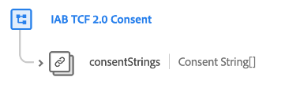

# Groupe de champs [!UICONTROL Consentement IAB TCF 2.0] pour les schémas d’événement

>[!IMPORTANT]
>
>Ce document couvre le groupe de champs de schéma [!UICONTROL Consentement IAB TCF 2.0] pour la classe XDM ExperienceEvent. Ce groupe de champs ne doit être utilisé que si vous avez l’intention de suivre les événements de changement de consentement au fil du temps.
>
>Notez que les valeurs de consentement enregistrées dans les données d’événement ne sont pas respectées dans les workflows d’application automatiques. Pour que l’application automatique ait lieu, les valeurs de consentement doivent être ingérées dans la classe XDM Individual Profile et activées pour le profil client en temps réel.
>
>Pour le groupe de champs destiné à la classe XDM Individual Profile, reportez-vous plutôt au [document](../profile/iab.md) suivant.

[!UICONTROL Consentement IAB TCF 2.0] est un groupe de champs de schéma standard pour la [[!DNL XDM ExperienceEvent] classe](../../classes/experienceevent.md) utilisé pour capturer une série horodatée de chaînes de consentement IAB, afin de suivre les modèles de changement de consentement au fil du temps.

| Propriété | Type de données | Description |
| --- | --- | --- |
| `consentStrings` | Tableau de [chaînes de consentement](../../data-types/consent-string.md) | Tableau de valeurs de chaîne de consentement associées à l’événement. |

{style="table-layout:auto"}

Pour plus d’informations sur le cas d’utilisation de ce groupe de champs[&#128279;](../../../landing/governance-privacy-security/consent/iab/overview.md) consultez le guide sur la prise en charge d’ IAB TCF 2.0 dans Experience Platform . Pour plus d’informations sur le groupe de champs lui-même, consultez le référentiel XDM public :

* [&#x200B; Exemple renseigné &#x200B;](https://github.com/adobe/xdm/blob/master/components/fieldgroups/experience-event/experienceevent-privacy.example.1.json)
* [Schéma complet](https://github.com/adobe/xdm/blob/master/components/fieldgroups/experience-event/experienceevent-privacy.schema.json)
