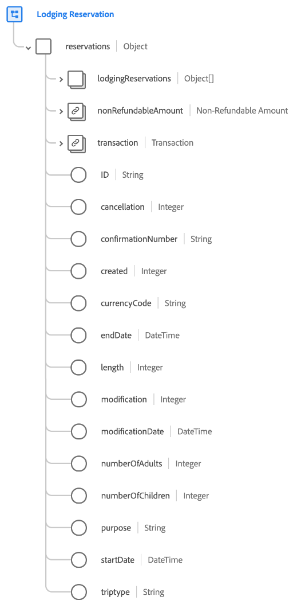
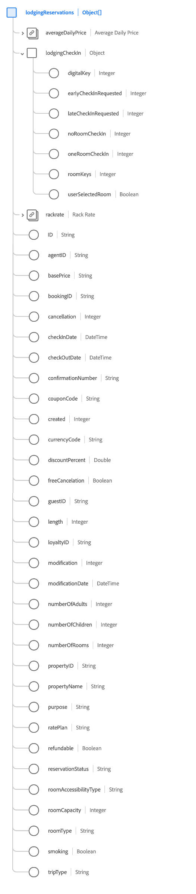

# [!UICONTROL Lodging Reservation] groupe de champs de schéma

[!UICONTROL Lodging Reservation] est un groupe de champs de schéma standard pour la [[!DNL XDM ExperienceEvent] classe](../../classes/experienceevent.md) utilisé pour capturer des informations concernant une réservation d’hébergement.

Le groupe de champs est une extension du groupe de champs [!UICONTROL Reservation Details] et contient tous les mêmes champs sous un seul champ de type objet, `reservations`. En plus de ces champs génériques, [!UICONTROL Lodging Reservation] inclut également `lodgingReservations` tableau . Ce tableau d’objets est utilisé pour décrire une ou plusieurs réservations avec des propriétés uniques à l’hébergement.

>[!NOTE]
>
>Ce document couvre les détails du tableau de `lodgingReservations`. Pour plus d’informations sur les autres champs fournis sous l’objet `reservations` , reportez-vous à la référence du groupe de champs [[!UICONTROL Reservation Details] &#x200B;](./reservation-details.md).

## `lodgingReservations`

`lodgingReservations` est un tableau d’objets qui représente une liste de réservations d’hébergement. Si un événement de réservation implique des réservations dans plusieurs hôtels différents le long du parcours d’un voyage, par exemple, ces réservations peuvent être répertoriées comme des objets individuels sous `lodgingReservations` pour un seul événement.

La structure de chaque objet fourni sous `lodgingReservations` est fournie ci-dessous.

| Propriété | Type de données | Description |
| --- | --- | --- |
| `averageDailyPrice` | [[!UICONTROL Currency]](../../data-types/currency.md) | Prix quotidien moyen de la chambre d&#39;hôtel. |
| `lodgingCheckIn` | Objet | Objet décrivant les détails d’enregistrement de l’hébergement. Inclut les valeurs suivantes :<ul><li>`digitalKey` : (entier). Indique lorsqu’un invité sélectionne l’utilisation d’une clé numérique lors de l’enregistrement.</li><li>`earlyCheckInRequested` : (entier) indique quand un invité demande à s’enregistrer avant les heures d’enregistrement normales.</li><li>`lateCheckInRequested` : (entier) indique le moment où un invité demande à s’enregistrer après les heures d’enregistrement normales.</li><li>`noRoomCheckIn` : (entier). Cette valeur est capturée lorsqu’un invité termine son enregistrement alors qu’il n’y a pas de chambre disponible à ce moment-là.</li><li>`oneRoomCheckIn` : (entier) cette valeur est capturée lorsqu’un invité termine son enregistrement alors qu’une seule chambre est disponible à ce moment.</li><li>`roomKeys` : (Entier) nombre de clés de chambre standard fournies au moment de l’enregistrement.</li><li>`userSelectedRoom` : (booléen). Indique si le client a sélectionné sa chambre au moment de l’enregistrement.</li></ul> |
| `rackrate` | [[!UICONTROL Currency]](../../data-types/currency.md) | Le coût d&#39;une réservation le jour même sans dispositions de réservation préalables. |
| `ID` | Chaîne | Numéro ou identifiant de la réservation. |
| `agentID` | Chaîne | ID d’agent associé à la réservation d’hôtel. |
| `basePrice` | Chaîne | Prix de base avant ajout de remises. |
| `bookingID` | Chaîne | Identifiant de réservation associé à la réservation d’hôtel. |
| `cancellation` | Entier | Cette valeur est capturée lorsqu’une réservation a été annulée. |
| `checkInDate` | DateTime | Date d’enregistrement de la réservation de la chambre. |
| `checkOutDate` | DateTime | Date de départ pour la réservation de la chambre. |
| `confirmationNumber` | Chaîne | Numéro ou identifiant de confirmation de la réservation. |
| `couponCode` | Chaîne | Code de coupon associé à la réservation d’hôtel. |
| `created` | Entier | Cette valeur est capturée lorsqu’une réservation a été créée. |
| `currencyCode` | Chaîne | Code de devise ISO 4217 utilisé pour effectuer l’achat. |
| `discountPercent` | Double | Pourcentage de remise associé à la réservation. |
| `freeCancelation` | Booléen | Indique si la chambre a une politique d&#39;annulation gratuite. |
| `guestID` | Chaîne | ID d’invité associé à la réservation d’hôtel. |
| `length` | Entier | Nombre total de jours pour la réservation. |
| `loyaltyID` | Chaîne | ID du programme de fidélité de l’invité répertorié dans la réservation. |
| `modification` | Entier | Cette valeur est capturée lorsqu’une réservation a été modifiée. |
| `modificationDate` | DateTime | Heure à laquelle la réservation a été modifiée pour la dernière fois. |
| `numberOfAdults` | Entier | Nombre d’adultes associés à la réservation. |
| `numberOfChildren` | Entier | Nombre d’enfants associés à la réservation. |
| `numberOfRooms` | Entier | Nombre de chambres associées à la réservation. |
| `propertyID` | Chaîne | Identifiant de l’hôtel ou du complexe pour la réservation. |
| `propertyName` | Chaîne | Nom de l’hôtel ou du complexe hôtelier correspondant à la réservation. |
| `purpose` | Chaîne | L’objectif de la réservation, généralement professionnel ou personnel. |
| `ratePlan` | Chaîne | Taux négocié auquel la chambre a été vendue. |
| `refundable` | Booléen | Indique si la chambre est remboursable. |
| `reservationStatus` | Chaîne | Statut de la réservation. |
| `roomAccessibilityType` | Chaîne | Type d’accessibilité de la chambre, telle que mobilité, audition ou autre. |
| `roomCapacity` | Entier | Nombre de personnes dans la chambre d’hôtel. |
| `roomType` | Chaîne | Type de chambre en cours de réservation. |
| `smoking` | Booléen | Indique si la chambre est fumeur. |
| `tripType` | Chaîne | Indique si la réservation concerne un aller simple, un aller-retour ou un voyage multi-villes. |

{style="table-layout:auto"}

Pour plus d’informations sur le groupe de champs , consultez le référentiel XDM public :

* [Exemple renseigné](https://github.com/adobe/xdm/blob/master/components/fieldgroups/experience-event/industry-verticals/experienceevent-lodging-reservation.example.1.json)
* [Schéma complet](https://github.com/adobe/xdm/blob/master/components/fieldgroups/experience-event/industry-verticals/experienceevent-lodging-reservation.schema.json)
