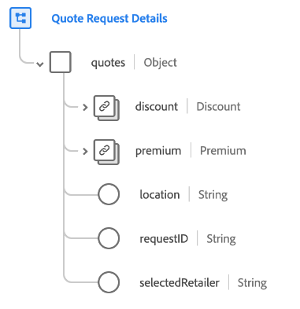

# [!UICONTROL Quote Request Details] groupe de champs de schéma

[!UICONTROL Quote Request Details] groupe de champs de schéma standard pour la [[!DNL XDM ExperienceEvent] classe](../../classes/experienceevent.md). Le groupe de champs fournit un seul objet `quotes` à un schéma, qui capture les détails du processus de demande pour divers types de devis, y compris les polices d&#39;assurance, les soins de santé, les ordres de fabrication et les commandes high-tech.

| Propriété | Type de données | Description |
| --- | --- | --- |
| `discount` | [[!UICONTROL Currency]](../../data-types/currency.md) | Montant de la remise pour un devis présenté à un visiteur ou une visiteuse. |
| `premium` | [[!UICONTROL Currency]](../../data-types/currency.md) | Montant de la prime d’un devis présenté à un visiteur ou une visiteuse. |
| `location` | [!UICONTROL String] | Code postal utilisé pour rechercher des revendeurs à proximité de la position du visiteur. |
| `requestID` | [!UICONTROL String] | Identifiant unique de la demande de devis. |
| `selectedRetailer` | [!UICONTROL String] | Retailer sélectionnée pour la demande de devis, le cas échéant. |

{style="table-layout:auto"}

Pour plus d’informations sur le groupe de champs , consultez le [référentiel XDM public](https://github.com/adobe/xdm/blob/master/docs/reference/fieldgroups/experience-event/experienceevent-quote-request-details.schema.json).
