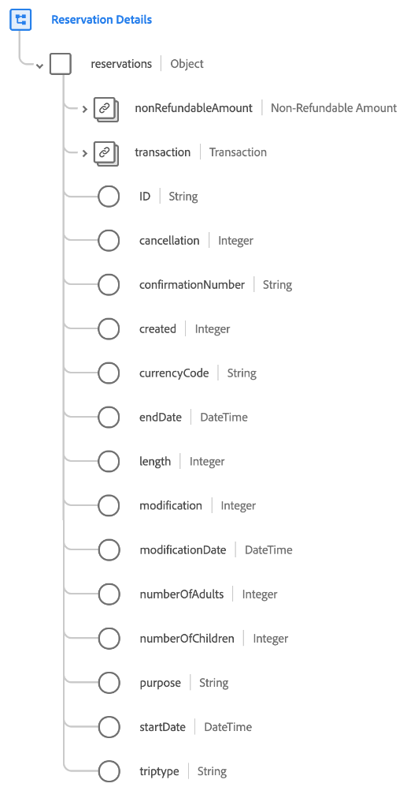

# [!UICONTROL Détails de la réservation] groupe de champs de schéma

[!UICONTROL Détails de la réservation] est un groupe de champs de schéma standard pour la [[!DNL XDM ExperienceEvent] classe](../../classes/experienceevent.md) utilisée pour capturer des informations concernant une réservation, notamment la longueur, la modification, le statut remboursable et le nombre de chambres.

Le groupe de champs fournit un seul champ de type objet, `reservations`. Les propriétés contenues dans cet objet sont expliquées ci-dessous.

| Propriété | Type de données | Description |
| --- | --- | --- |
| `nonRefundableAmount` | [Devise](../../data-types/currency.md) | Montant du prix de réservation qui est marqué comme non remboursable. |
| `transaction` | [Transaction](../../data-types/transaction.md) | Décrit la transaction de devise pour la réservation. |
| `id` | Chaîne | Identifiant unique de la réservation. |
| `cancellation` | Nombre entier | Cette valeur est capturée lorsqu’une réservation a été annulée. |
| `confirmationNumber` | Chaîne | Numéro ou identifiant de confirmation de la réservation. |
| `created` | Nombre entier | Cette valeur est capturée lorsque la réservation a été créée. |
| `currencyCode` | Chaîne | Code de devise ISO 4217 utilisé pour effectuer l’achat. |
| `endDate` | DateTime | Date de fin d’abandon, de retour ou d’extraction pour la réservation. |
| `length` | Nombre entier | Nombre total de jours pour la réservation. |
| `modification` | Nombre entier | Cette valeur est capturée lorsqu’une réservation a été modifiée. |
| `modificationDate` | DateTime | Heure de la dernière modification de la réservation. |
| `numberOfAdults` | Nombre entier | Nombre d’adultes associés à la réservation. |
| `numberOfChildren` | Nombre entier | Nombre d’enfants associés à la réservation. |
| `purpose` | Chaîne | L’objet de la réservation, généralement professionnel ou personnel. |
| `startDate` | DateTime | Date de démarrage, de sortie ou d’archivage de la réservation. |
| `triptype` | Chaîne | Indique si la réservation est pour un aller simple, un aller-retour ou un voyage dans plusieurs villes. |

{style="table-layout:auto"}

Pour plus d’informations sur le groupe de champs, reportez-vous au référentiel XDM public :

* [Exemple renseigné](https://github.com/adobe/xdm/blob/master/components/fieldgroups/experience-event/industry-verticals/experienceevent-reservation-details.example.1.json)
* [Schéma complet](https://github.com/adobe/xdm/blob/master/components/fieldgroups/experience-event/industry-verticals/experienceevent-reservation-details.schema.json)

## Groupes de champs de réservation spécifiques au secteur

Il existe plusieurs autres groupes de champs standard qui étendent le schéma [!UICONTROL Détails de la réservation] pour des cas d’utilisation spécifiques au secteur. Pour plus d’informations, consultez la documentation suivante :

* [[!UICONTROL Réservation de restaurant]](./dining-reservation.md)
* [[!UICONTROL Réservation de vol]](./flight-reservation.md)
* [[!UICONTROL Réservation de logement]](./lodging-reservation.md)
