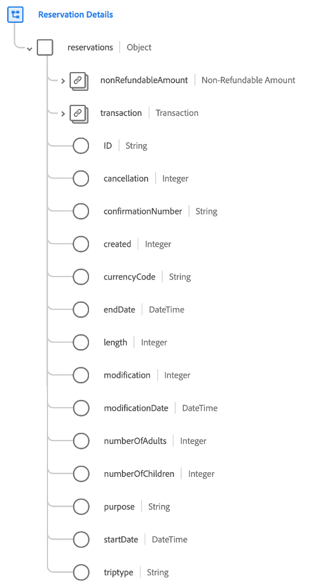

# [!UICONTROL Détails de la réservation] groupe de champs de schéma

[!UICONTROL Détails de la réservation] est un groupe de champs de schéma standard pour la [[!DNL XDM ExperienceEvent] classe](../../classes/experienceevent.md) utilisé pour capturer des informations concernant une réservation, notamment la durée, la modification, le statut de remboursement et le nombre de chambres.

Le groupe de champs fournit un seul champ de type objet, `reservations`. Les propriétés contenues dans cet objet sont expliquées ci-dessous.

| Propriété | Type de données | Description |
| --- | --- | --- |
| `nonRefundableAmount` | [Devise](../../data-types/currency.md) | Montant du prix de la réservation marqué comme non remboursable. |
| `transaction` | [ Transaction ](../../data-types/transaction.md) | Décrit la transaction de devise pour la réservation. |
| `id` | Chaîne | Identifiant unique de la réservation. |
| `cancellation` | Entier | Cette valeur est capturée lorsqu’une réservation a été annulée. |
| `confirmationNumber` | Chaîne | Numéro ou identifiant de confirmation de la réservation. |
| `created` | Entier | Cette valeur est capturée lorsque la réservation a été créée. |
| `currencyCode` | Chaîne | Code de devise ISO 4217 utilisé pour effectuer l’achat. |
| `endDate` | DateTime | Date de fin de la restitution, du retour ou du départ pour la réservation. |
| `length` | Entier | Nombre total de jours pour la réservation. |
| `modification` | Entier | Cette valeur est capturée lorsqu’une réservation a été modifiée. |
| `modificationDate` | DateTime | Heure à laquelle la réservation a été modifiée pour la dernière fois. |
| `numberOfAdults` | Entier | Nombre d’adultes associés à la réservation. |
| `numberOfChildren` | Entier | Nombre d’enfants associés à la réservation. |
| `purpose` | Chaîne | L’objectif de la réservation, généralement professionnel ou personnel. |
| `startDate` | DateTime | Date de début de prise en charge, de départ ou d’enregistrement de la réservation. |
| `triptype` | Chaîne | Indique si la réservation concerne un aller simple, un aller-retour ou un voyage multi-villes. |

{style="table-layout:auto"}

Pour plus d’informations sur le groupe de champs , consultez le référentiel XDM public :

* [Exemple renseigné](https://github.com/adobe/xdm/blob/master/components/fieldgroups/experience-event/industry-verticals/experienceevent-reservation-details.example.1.json)
* [Schéma complet](https://github.com/adobe/xdm/blob/master/components/fieldgroups/experience-event/industry-verticals/experienceevent-reservation-details.schema.json)

## Groupes de champs de réservation spécifiques au secteur

Il existe plusieurs autres groupes de champs standard qui étendent le schéma [!UICONTROL  Détails de la réservation ] pour des cas d’utilisation spécifiques au secteur. Pour plus d’informations, consultez la documentation suivante :

* [[!UICONTROL Réservation de restaurant]](./dining-reservation.md)
* [[!UICONTROL Réservation de vol]](./flight-reservation.md)
* [[!UICONTROL Réservation de logement]](./lodging-reservation.md)
