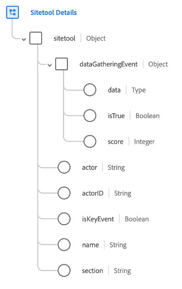

# [!UICONTROL Détails sur l’outil de site] groupe de champs de schéma

[!UICONTROL Sitetool Details] est un groupe de champs de schéma standard pour la [[!DNL XDM ExperienceEvent] classe](../../classes/experienceevent.md). Le groupe de champs fournit un seul objet `sitetool` à un schéma, qui capture les informations collectées par un outil de site.

| Propriété | Type de données | Description |
| --- | --- | --- |
| `dataGatheringEvent` | Objet | Indique si cet événement est un événement de collecte de données avec d’autres détails connexes. Contient les propriétés suivantes :<ul><li>`data` : (carte) contient les données JSON collectées et envoyées dans le cadre d’un événement d’envoi de quiz, de questionnaire ou d’enquête.</li><li>`isTrue` : (booléen). Indique si cet événement est un événement de collecte de données tel qu’un quiz, un questionnaire ou un sondage.</li><li>`score` : (entier) score obtenu par l’acteur en fonction des réponses à un événement.</li></ul> |
| `actor` | Chaîne | Personne/membre qui a effectué l’action. |
| `actorID` | Chaîne | Identifiant unique de la personne/du membre qui a effectué l’action. |
| `isKeyEvent` | Booléen | Indique si cet événement est un événement clé. |
| `name` | Chaîne | Nom de l’outil de site, tel que le chatbot, le questionnaire, etc. |
| `section` | Chaîne | Section pertinente de l’outil de site telle que principale ou secondaire. |

{style="table-layout:auto"}

Pour plus d’informations sur le groupe de champs , consultez le [référentiel XDM public](https://github.com/adobe/xdm/blob/master/components/fieldgroups/experience-event/industry-verticals/experienceevent-healthcare-sitetool.schema.json).
