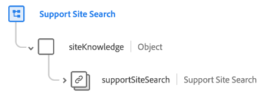

# [!UICONTROL Recherche de site d’assistance] groupe de champs de schéma

[!UICONTROL Recherche de site d’assistance] est un groupe de champs de schéma standard pour la [[!DNL XDM ExperienceEvent] classe](../../classes/experienceevent.md). Il fournit un objet `siteKnowledge.supportSiteSearch` unique à un schéma qui capture les informations relatives à une recherche de site d’assistance.

| Propriété | Type de données | Description |
| --- | --- | --- |
| `supportSiteSearch` | [[!UICONTROL Recherche interne au site]](../../data-types/internal-site-search.md) | Capture les détails de l’événement de recherche. |

{style="table-layout:auto"}

Pour plus d’informations sur le groupe de champs , consultez le [référentiel XDM public](https://github.com/adobe/xdm/blob/master/docs/reference/fieldgroups/experience-event/experienceevent-support-site-search.schema.json).
