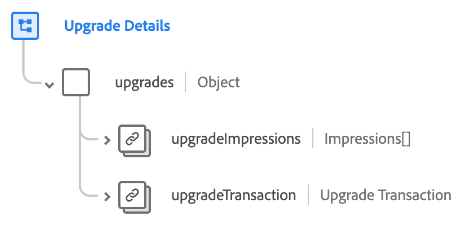

# [!UICONTROL Détails de mise à niveau] groupe de champs de schéma

[!UICONTROL Détails de la mise à niveau] est un groupe de champs de schéma standard pour la [[!DNL XDM ExperienceEvent] classe](../../classes/experienceevent.md) utilisé pour capturer des informations concernant un événement marketing de mise à niveau, y compris des détails sur la transaction et les différentes manières dont l’offre a été présentée à un client.

Le groupe de champs fournit un seul champ de type objet, `upgrades`. Les propriétés contenues dans cet objet sont expliquées ci-dessous.

| Propriété | Type de données | Description |
| --- | --- | --- |
| `upgradeImpressions` | Tableau d’[impressions](../../data-types/impressions.md) | Tableau qui répertorie les impressions enregistrées (vues numériques ou engagements avec l’offre de mise à niveau) pour le client. |
| `upgradeTransaction` | [ Transaction ](../../data-types/transaction.md) | Décrit la transaction de devise pour la mise à niveau. |

{style="table-layout:auto"}

Pour plus d’informations sur le groupe de champs , consultez le référentiel XDM public :

* [Exemple renseigné](https://github.com/adobe/xdm/blob/master/components/fieldgroups/experience-event/industry-verticals/experienceevent-upgrade-details.example.1.json)
* [Schéma complet](https://github.com/adobe/xdm/blob/master/components/fieldgroups/experience-event/industry-verticals/experienceevent-upgrade-details.schema.json)
