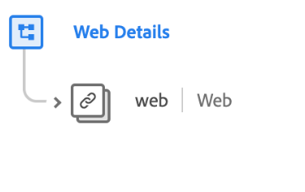

# [!UICONTROL Détails web] groupe de champs de schéma

>[!NOTE]
>
>Les noms de plusieurs groupes de champs de schéma ont changé. Pour plus d’informations, consultez le document sur les [mises à jour des noms de groupes de champs](../name-updates.md).

[!UICONTROL Détails web] est un groupe de champs de schéma standard pour la [[!DNL XDM ExperienceEvent] classe](../../classes/experienceevent.md), utilisé pour décrire des informations concernant les événements de détails web tels que les interactions, les détails de page et le référent.

| Propriété | Type de données | Description |
| --- | --- | --- |
| `web` | [Informations web](../../data-types/web-information.md) | Décrit les clics sur les liens, les détails de la page web, les informations sur le référent et les informations sur le navigateur. |

{style="table-layout:auto"}

Pour plus d’informations sur le groupe de champs , consultez le référentiel XDM public :

* [Exemple renseigné](https://github.com/adobe/xdm/blob/master/components/fieldgroups/experience-event/experienceevent-web.example.1.json)
* [Schéma complet](https://github.com/adobe/xdm/blob/master/components/fieldgroups/experience-event/experienceevent-web.schema.json)
