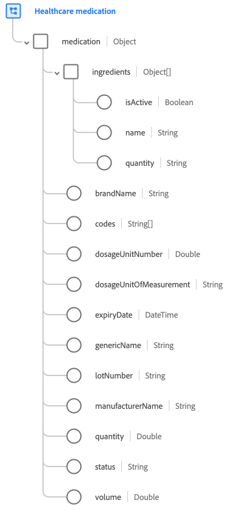

# [!UICONTROL Médicaments pour la santé] groupe de champs de schéma

[!UICONTROL Médicaments] est un groupe de champs de schéma standard pour la classe [[!UICONTROL Médicaments]](../../classes/medication.md). Il fournit un `medication` de champ de type objet unique qui recueille les informations telles que le nom de la marque, le numéro de lot et la quantité.

| Propriété | Type de données | Description |
| --- | --- | --- |
| `ingredients` | Tableau d’objets | Dresse la liste des ingrédients présents dans le médicament. Chaque objet comprend les propriétés suivantes : <ul><li>`isActive` : (booléen) Indique si cet ingrédient est encore utilisé activement dans ce médicament.</li><li>`name` : (chaîne). Nom de l’ingrédient.</li><li>`quantity` : (Chaîne) La quantité de l&#39;ingrédient présent dans le médicament.</li></ul> |
| `brandName` | Chaîne | Nom de marque du médicament. |
| `codes` | Tableau de chaînes | Une liste de codes qui identifient ce médicament. |
| `dosageUnitNumber` | Double | Numéro d’unité de dosage du médicament. |
| `dosageUnitOfMeasurement` | Chaîne | Unité de mesure du nombre de doses. |
| `expiryDate` | DateTime | Date de péremption du médicament. |
| `genericName` | Chaîne | Nom générique du médicament. |
| `lotNumber` | Chaîne | Identifiant unique du lot du médicament. |
| `manufacturerName` | Chaîne | Le nom du fabricant du médicament. |
| `quantity` | Double | La quantité de médicament dans l’emballage. |
| `status` | Chaîne | État général indiquant si le médicament est actif ou non. |
| `volume` | Double | Le volume du médicament. |

{style="table-layout:auto"}

Pour plus d’informations sur le groupe de champs , consultez le [référentiel XDM public](https://github.com/adobe/xdm/blob/master/components/fieldgroups/medication/healthcare-medication.schema.json).
