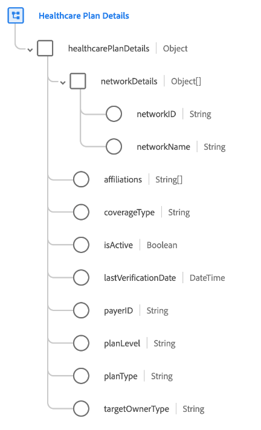

# [!UICONTROL Healthcare Plan Details] groupe de champs de schéma

[!UICONTROL Healthcare Plan Details] est un groupe de champs de schéma standard pour la classe [[!UICONTROL Plan]](../../classes/plan.md). Il fournit un `healthcarePlanDetails` de champ de type objet unique qui capture les propriétés liées à un plan médical.

| Propriété | Type de données | Description |
| --- | --- | --- |
| `networkDetails` | Tableau d’objets | Dresse la liste des coordonnées du ou des réseaux de prestataires définis par l’assureur auxquels le bénéficiaire peut demander un traitement, et sera couvert au taux « in-network ». Chaque objet comprend les propriétés suivantes : <ul><li>`networkID` : (chaîne) ID spécifique à l’assureur pour le réseau.</li><li>`networkName` : (chaîne). Nom spécifique à l’assureur pour le réseau.</li></ul> |
| `affiliations` | Tableau de chaînes | Liste des entités commerciales affiliées au plan. |
| `coverageType` | Chaîne | Type de couverture du plan. Les valeurs acceptées sont les suivantes :<ul><li>`medical`</li><li>`dental`</li><li>`vision`</li><li>`accident`</li></ul> |
| `isActive` | Booléen | Indique si le plan est actif. |
| `lastVerificationDate` | DateTime | Date de la dernière vérification du plan. |
| `payerID` | Chaîne | Identifiant unique du payeur (en d’autres termes, le fournisseur d’assurance du plan). |
| `planLevel` | Chaîne | Indique le niveau du plan. Les valeurs acceptées sont les suivantes :<ul><li>`primary`</li><li>`secondary`</li><li>`tertiary`</li><li>`quaternary`</li></ul> |
| `planType` | Chaîne | Indique le type de plan. Les valeurs acceptées sont les suivantes :<ul><li>`hmo`</li><li>`epo`</li><li>`pos`</li><li>`hdhp`</li></ul> |
| `targetOwnerType` | Chaîne | Type de propriétaire auquel un plan est destiné. Par exemple, un individu, un groupe, une organisation, etc. |

{style="table-layout:auto"}

Pour plus d’informations sur le groupe de champs , consultez le [référentiel XDM public](https://github.com/adobe/xdm/blob/master/docs/reference/fieldgroups/plan/healthcare-plan-details.schema.json).
