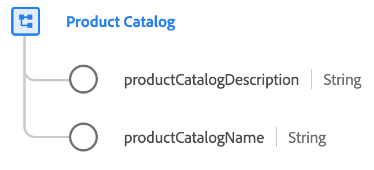

# [!UICONTROL Catalogue de produits] groupe de champs de schéma

[!UICONTROL Catalogue de produits] est un groupe de champs de schéma standard pour la classe [[!UICONTROL Product]](../../classes/product.md) qui capture les propriétés liées à un catalogue de produits.

| Propriété | Type de données | Description |
| --- | --- | --- |
| `productCatalogDescription` | Chaîne | Description du catalogue de produits. |
| `productCatalogName` | Chaîne | Nom du catalogue de produits. |

{style="table-layout:auto"}

Pour plus d’informations sur le groupe de champs , consultez le [référentiel XDM public](https://github.com/adobe/xdm/blob/master/docs/reference/fieldgroups/product/product-catalog.schema.json).
