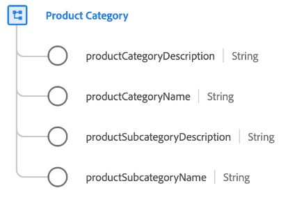

# [!UICONTROL Catégorie de produits] groupe de champs de schéma

[!UICONTROL Catégorie de produits] est un groupe de champs de schéma standard pour la classe [[!UICONTROL Product]](../../classes/product.md) qui capture les propriétés liées à la catégorie d’un produit.

| Propriété | Type de données | Description |
| --- | --- | --- |
| `productCategoryDescription` | Chaîne | Description de la catégorie de produits. |
| `productCategoryName` | Chaîne | Nom de la catégorie de produits. |
| `productSubcategoryDescription` | Chaîne | Description de la sous-catégorie de produits. |
| `productSubcategoryName` | Chaîne | Nom de la sous-catégorie de produits. |

{style="table-layout:auto"}

Pour plus d’informations sur le groupe de champs , consultez le [référentiel XDM public](https://github.com/adobe/xdm/blob/master/docs/reference/fieldgroups/product/product-category.schema.json).
