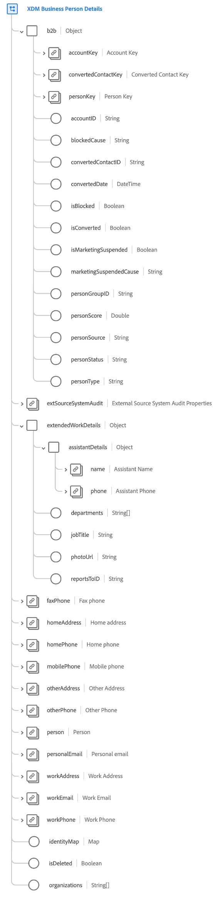

# [!UICONTROL XDM Business Person Details] groupe de champs de schéma

>[!AVAILABILITY]
>
>Ce groupe de champs n’est disponible que pour les organisations ayant accès au B2B edition Real-Time CDP.

[!UICONTROL XDM Business Person Details] est un groupe de champs de schéma standard pour la [[!DNL XDM Individual Profile] classe](../../classes/individual-profile.md) qui recueille les informations sur une personne individuelle dans le contexte d’une entreprise B2B (business-to-business).

| Propriété | Type de données | Description |
| --- | --- | --- |
| `b2b` | Objet | Objet capturant les détails spécifiques B2B de la personne. |
| `b2b.accountKey` | [[!UICONTROL B2B Source]](../../data-types/b2b-source.md) | Identifiant composite du compte professionnel associé à la personne. |
| `b2b.convertedContactKey` | [[!UICONTROL B2B Source]](../../data-types/b2b-source.md) | Identifiant composite du contact associé si le prospect a été converti. |
| `b2b.personKey` | [[!UICONTROL B2B Source]](../../data-types/b2b-source.md) | Identifiant composite de la personne ou du fragment de profil. |
| `b2b.accountID` | Chaîne | ID unique du compte professionnel auquel cette personne est associée. |
| `b2b.blockedCause` | Chaîne | Si la personne est bloquée, cette propriété en indique la raison. |
| `b2b.convertedContactID` | Chaîne | ID de contact en cas de conversion réussie du prospect. |
| `b2b.convertedDate` | DateTime | Date de conversion si le prospect a été converti. |
| `b2b.isBlocked` | Booléen | Indique si la personne est bloquée. |
| `b2b.isConverted` | Booléen | Indique si le prospect est converti. |
| `b2b.isMarketingSuspended` | Booléen | Indique si le marketing est suspendu pour la personne. |
| `b2b.marketingSuspendedCause` | Chaîne | Si le marketing est suspendu pour la personne, cette propriété en indique la raison. |
| `b2b.personGroupID` | Chaîne | Identifiant de groupe de la personne. |
| `b2b.personScore` | Double | Score généré pour la personne par un système CRM. |
| `b2b.personSource` | Chaîne | Source de réception des informations de la personne. |
| `b2b.personStatus` | Chaîne | Statut actuel de vente ou de marketing de la personne. |
| `b2b.personType` | Chaîne | Type de personne B2B. |
| `extSourceSystemAudit` | [Attributs d’audit du système Source externe](../../data-types/external-source-system-audit-attributes.md) | Si la relation de l&#39;entrepreneur provient d&#39;un système source externe, cet objet capture les attributs d&#39;audit de ce système. |
| `extendedWorkDetails` | Objet | Capture d’autres détails professionnels sur la personne. |
| `extendedWorkDetails.assistantDetails` | Objet | Capture les attributs suivants liés à l’assistant de la personne : <ul><li>`name` : ([Nom de la personne](../../data-types/person-name.md)) nom complet de l’assistant.</li><li>`phone` : ([Numéro de téléphone](../../data-types/phone-number.md)) numéro de téléphone de l’assistant.</li></ul> |
| `extendedWorkDetails.departments` | Tableau de chaînes | Liste des noms de service où travaille la personne. |
| `extendedWorkDetails.jobTitle` | Chaîne | Fonction de la personne. |
| `extendedWorkDetails.photoUrl` | Chaîne | URL vers une photo de la personne. |
| `extendedWorkDetails.reportsToID` | Chaîne | Identifiant du responsable des rapports de la personne. |
| `faxPhone` | [Numéro de téléphone](../../data-types/phone-number.md) | Numéro de fax de la personne. |
| `homeAddress` | [Adresse postale](../../data-types/postal-address.md) | Adresse personnelle de la personne. |
| `homePhone` | [Numéro de téléphone](../../data-types/phone-number.md) | Numéro de téléphone personnel de la personne. |
| `mobilePhone` | [Numéro de téléphone](../../data-types/phone-number.md) | Numéro de téléphone mobile de la personne. |
| `otherAddress` | [Adresse postale](../../data-types/postal-address.md) | Adresse de remplacement de la personne. |
| `otherPhone` | [Numéro de téléphone](../../data-types/phone-number.md) | Autre numéro de téléphone de la personne. |
| `person` | [&#x200B; Personne &#x200B;](../../data-types/person.md) | Acteur, contact ou propriétaire individuel. |
| `personalEmail` | [Adresse électronique](../../data-types/email-address.md) | Adresse e-mail personnelle de la personne. |
| `workAddress` | [Adresse postale](../../data-types/postal-address.md) | Adresse professionnelle de la personne. |
| `workEmail` | [Adresse électronique](../../data-types/email-address.md) | Adresse e-mail professionnelle de la personne. |
| `workPhone` | [Numéro de téléphone](../../data-types/phone-number.md) | Numéro de téléphone professionnel de la personne. |
| `identityMap` | Carte | Champ de mappage contenant un ensemble d’identités d’espace de noms pour la personne. Ce champ est automatiquement mis à jour par le système lors de l’ingestion des données d’identité. Pour utiliser correctement ce champ pour [Real-Time Customer Profile](../../../profile/home.md), n’essayez pas de mettre à jour manuellement le contenu du champ dans vos opérations de données.  Pour plus d’informations sur les cas d’utilisation des mappages dʼidentités, consultez la section correspondante sur la page consacrée aux [principes de base de la composition des schémas](../../schema/composition.md#identityMap). |
| `isDeleted` | Booléen | Indique si cette personne a été supprimée dans Marketo Engage.  Lors de l’utilisation du connecteur source [Marketo](../../../sources/connectors/adobe-applications/marketo/marketo.md), tous les enregistrements supprimés dans Marketo sont automatiquement répercutés dans le profil client en temps réel. Cependant, les enregistrements relatifs à ces profils peuvent toujours persister dans le lac de données. En définissant `isDeleted` sur `true`, vous pouvez utiliser le champ pour filtrer les enregistrements qui ont été supprimés de vos sources lors de l’interrogation du lac de données. |
| `organizations` | Tableau de chaînes | Liste des noms d’organisation où travaille la personne. |

{style="table-layout:auto"}

Pour plus d’informations sur le groupe de champs , consultez le référentiel XDM public :

* [&#x200B; Exemple renseigné &#x200B;](https://github.com/adobe/xdm/blob/master/components/fieldgroups/profile/b2b-person-details.example.1.json)
* [Schéma complet](https://github.com/adobe/xdm/blob/master/components/fieldgroups/profile/b2b-person-details.schema.json)
