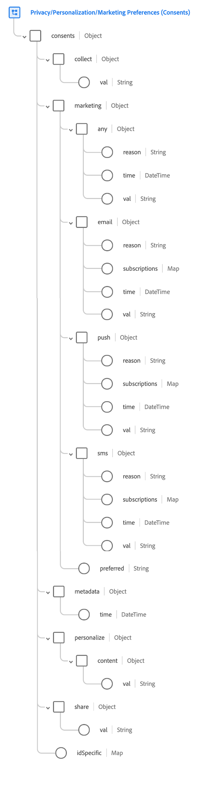

# Groupe de champs [!UICONTROL Contenus et Préférences]

[!UICONTROL Contenus et Préférences] est un groupe de champs standard pour la [[!DNL XDM Individual Profile] classe](../../classes/individual-profile.md) qui capture les informations de consentement et de préférence pour un client individuel.

>[!NOTE]
>
>Ce groupe de champs n’étant compatible qu’avec [!DNL XDM Individual Profile], il ne peut pas être utilisé pour les schémas [!DNL XDM ExperienceEvent]. Si vous souhaitez inclure les données de consentement et de préférence dans votre schéma d’événement d’expérience, ajoutez le type de données [[!UICONTROL Consent for Privacy, Personalization and Marketing Preferences]](../../data-types/consents.md) au schéma en utilisant un [groupe de champs personnalisé](../../ui/resources/field-groups.md#create) à la place.

## Structure du groupe de champs {#structure}

Le groupe de champs [!UICONTROL Contenus et Préférences] fournit un champ de type objet unique, `consents`, pour capturer les informations de consentement et de préférence. Ce champ étend le type de données [[!UICONTROL Consentement pour la confidentialité, Personalization et préférences marketing]](../../data-types/consents.md), supprimant le champ `adID` et ajoutant un champ de mappage `idSpecific`.



>[!TIP]
>
>Consultez le guide sur l’ [exploration des ressources XDM](../../ui/explore.md) vers pour savoir comment rechercher une ressource XDM et examiner sa structure dans l’interface utilisateur de Platform.

Le fichier JSON suivant illustre un exemple du type de données que le groupe de champs [!UICONTROL Contenus et Préférences] peut traiter. Pour plus d’informations sur l’utilisation de la plupart des champs fournis par le groupe de champs, consultez le guide sur le [type de données Contenus et Préférences](../../data-types/consents.md). Les sous-sections ci-dessous portent sur les attributs uniques que le groupe de champs ajoute au type de données.

```json
{
  "consents": {
    "collect": {
      "val": "VI"
    },
    "share": {
      "val": "y"
    },
    "personalize": {
      "content": {
        "val": "y"
      }
    },
    "marketing": {
      "preferred": "email",
      "any": {
        "val": "y"
      },
      "email": {
        "val": "y"
      }
    },
    "idSpecific": {
      "ECID": {
        "37784337855396895622558625508046772577": {
          "adID": {
            "val": "n",
          },
          "share": {
            "val": "n"
          },
          "marketing": {
            "push": {
              "val": "n",
              "time": "2020-09-30T01:02:33+00:00",
              "reason": "not relevant"
            }
          }
        }
      },
      "email": {
        "john@xyz.com": {
          "marketing": {
            "email": {
              "val": "y"
            }
          }
        }
      }
    },
    "metadata": {
      "time": "2019-01-01T15:52:25+00:00"
    }
  }
}
```

>[!TIP]
>
>Vous pouvez générer des exemples de données JSON pour tout schéma XDM que vous définissez dans Experience Platform afin de mieux visualiser la manière dont vos données de consentement et de préférence client doivent être mappées. Pour plus d’informations, consultez la documentation suivante :
>
>* [Générer des exemples de données dans l’interface utilisateur](../../ui/sample.md)
>* [Générer des exemples de données dans l’API](../../api/sample-data.md)

### `idSpecific`

`idSpecific` peut être utilisé lorsqu’un consentement ou une préférence spécifique ne s’applique pas universellement à un client, mais est limité à un seul appareil ou à un seul identifiant. Par exemple, un client peut refuser de recevoir des emails à une adresse, tout en autorisant éventuellement l’envoi d’emails à une autre.

>[!IMPORTANT]
>
>Les consentements et préférences au niveau du canal (c’est-à-dire ceux fournis sous `consents` en dehors de `idSpecific`) s’appliquent à tous les identifiants de ce canal. Par conséquent, tous les consentements et préférences au niveau du canal influent directement sur le respect des paramètres équivalents d’ID ou spécifiques à l’appareil :
>
>* Si le client s’est désabonné au niveau du canal, tous les consentements ou préférences équivalents dans `idSpecific` sont ignorés.
>* Si le consentement ou la préférence au niveau du canal n’est pas définie, ou si le client s’est inscrit, les consentements ou préférences équivalents dans `idSpecific` sont respectés.

Chaque clé de l’objet `idSpecific` représente un espace de noms d’identité spécifique reconnu par Adobe Experience Platform Identity Service. Bien que vous puissiez définir vos propres espaces de noms personnalisés pour classer différents identifiants, il est recommandé d’utiliser l’un des espaces de noms standard fournis par Identity Service pour réduire les tailles de stockage pour Real-Time Customer Profile. Pour plus d’informations sur les espaces de noms d’identité, consultez la [présentation des espaces de noms d’identité](../../../identity-service/features/namespaces.md) dans la documentation Identity Service.

Les clés de chaque objet d’espace de noms représentent les valeurs d’identité uniques pour lesquelles le client a défini des préférences. Chaque valeur d’identité peut contenir un ensemble complet de consentements et de préférences, formaté de la même manière que `consents`.

```json
"idSpecific": {
  "email": {
    "jdoe@example.com": {
      "marketing": {
        "email": {
          "val": "n"
        }
      }
    }
  },
  "ECID": {
    "37784337855396895622558625508046772577": {
      "collect": {
        "val": "y"
      },
      "adID": {
        "val": "n"
      },
      "marketing": {
        "push": {
          "val": "n"
        }
      }
    }
  }
}
```

Dans les objets `marketing` fournis dans la section `idSpecific`, les champs `any` et `preferred` ne sont pas pris en charge. Ces champs ne peuvent être configurés qu’au niveau de l’utilisateur. En outre, les préférences marketing `idSpecific` pour `email`, `sms` et `push` ne prennent pas en charge les champs `subscriptions`.

Il existe également un consentement qui ne peut être fourni que dans la section `idSpecific` : `adID`. Ce champ est traité dans la sous-section ci-dessous.

#### `adID`

Le consentement `adID` représente le consentement du client pour savoir si un ID d’annonceur (IDFA ou GAID) peut être utilisé pour lier le client à travers les applications de cet appareil. Cette valeur ne peut être configurée que sous l’espace de noms d’identité `ECID` de la section `idSpecific` et ne peut pas être définie pour d’autres espaces de noms ou au niveau de l’utilisateur pour ce groupe de champs.

```json
"idSpecific": {
  "ECID": {
    "37784337855396895622558625508046772577": {
      "collect": {
        "val": "y"
      },
      "adID": {
        "val": "n"
      },
      "marketing": {
        "push": {
          "val": "n"
        }
      }
    }
  }
}
```

>[!NOTE]
>
>Vous ne devez pas définir cette valeur directement, car le SDK Adobe Experience Platform Mobile la définit automatiquement le cas échéant.

## Ingestion de données à l’aide du groupe de champs {#ingest}

Pour utiliser le groupe de champs [!UICONTROL Contenus et Préférences] afin d’ingérer des données de consentement de vos clients, vous devez créer un jeu de données basé sur un schéma qui contient ce groupe de champs.

Consultez le tutoriel sur la [création d’un schéma dans l’interface utilisateur](https://www.adobe.com/go/xdm-schema-editor-tutorial-en) pour savoir comment attribuer des groupes de champs à des champs. Une fois que vous avez créé un schéma contenant un champ avec le groupe de champs [!UICONTROL Contenus et Préférences], reportez-vous à la section sur la [création d’un jeu de données](../../../catalog/datasets/user-guide.md#create) du guide de l’utilisateur du jeu de données, en suivant les étapes de création d’un jeu de données avec un schéma existant.

>[!IMPORTANT]
>
>Si vous souhaitez envoyer des données de consentement à [!DNL Real-Time Customer Profile], vous devez créer un schéma compatible [!DNL Profile] basé sur la classe [!DNL XDM Individual Profile] qui contient le groupe de champs [!UICONTROL Contenus et Préférences]. Le jeu de données que vous créez à partir de ce schéma doit également être activé pour [!DNL Profile]. Reportez-vous aux tutoriels liés ci-dessus pour connaître les étapes spécifiques aux [!DNL Real-Time Customer Profile] exigences relatives aux schémas et aux jeux de données.
>
>En outre, vous devez également vous assurer que vos stratégies de fusion sont configurées pour prioriser le ou les jeux de données qui contiennent les dernières données de consentement et de préférence, afin que les profils client soient correctement mis à jour. Pour plus d’informations, consultez la présentation de [stratégies de fusion](../../../rtcdp/profile/merge-policies.md) .

## Gestion des modifications du consentement et des préférences

Lorsqu’un client modifie ses consentements ou ses préférences sur votre site web, ces modifications doivent être collectées et appliquées immédiatement à l’aide du [SDK Web Adobe Experience Platform](../../../web-sdk/commands/setconsent.md). Si un client choisit de ne pas participer à la collecte de données, toute collecte de données doit immédiatement cesser. Si un client s’exclut de la personnalisation, aucune personnalisation ne doit être présente sur la page suivante qu’il consulte.

## Étapes suivantes

Ce document couvrait la structure et l’utilisation du groupe de champs [!UICONTROL Contenus et Préférences]. Pour plus d’informations sur les autres champs fournis par le groupe de champs, consultez le document sur le type de données [[!UICONTROL Consentement pour la confidentialité, Personalization et préférences marketing]](../../data-types/consents.md).
