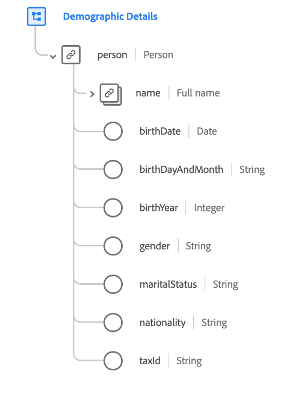

# [!UICONTROL Détails démographiques] groupe de champs de schéma

>[!NOTE]
>
>Les noms de plusieurs groupes de champs de schéma ont changé. Pour plus d’informations, consultez le document sur les [mises à jour des noms de groupes de champs](../name-updates.md).

[!UICONTROL Détails démographiques] est un groupe de champs de schéma standard pour la [[!DNL XDM Individual Profile] classe](../../classes/individual-profile.md). Le groupe de champs fournit un objet `person` de niveau racine dont les sous-champs décrivent des informations sur une personne individuelle.

| Propriété | Type de données | Description |
| --- | --- | --- |
| `person.name` | [ Nom de la personne ](../../data-types/person-name.md) | Objet dont les sous-champs décrivent divers éléments du nom d’une personne. |
| `person.birthDate` | Date | Date de naissance complète d’une personne, sous la forme d’un horodatage ISO 8601. |
| `person.birthDayAndMonth` | Chaîne | Jour et mois de naissance d’une personne, au format MM-JJ. Ce champ doit être utilisé lorsque le jour et le mois de naissance d’une personne sont connus, mais pas l’année. |
| `person.birthYear` | Entier | Année de naissance d’une personne, y compris le siècle (comme 1989). Ce champ doit être utilisé lorsque seul l’âge de la personne est connu, pas sa date de naissance complète. |
| `person.gender` | Chaîne | Identité sexuelle de la personne. |
| `person.martialStatus` | Chaîne | Décrit la relation d’une personne avec une autre personne importante. |
| `person.nationality` | Chaîne | Relation juridique entre une personne et son état représenté à l’aide du code ISO 3166-1 Alpha-2. |
| `person.taxId` | Chaîne | Identifiant fiscal de la personne, tel que le NIF aux États-Unis ou le CIF/NIF en Espagne. |

{style="table-layout:auto"}

Pour plus d’informations sur le groupe de champs , consultez le référentiel XDM public :

* [Exemple renseigné](https://github.com/adobe/xdm/blob/master/components/fieldgroups/profile/profile-person-details.example.1.json)
* [Schéma complet](https://github.com/adobe/xdm/blob/master/components/fieldgroups/profile/profile-person-details.schema.json)