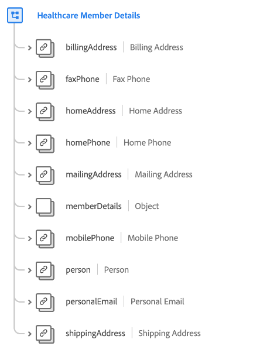
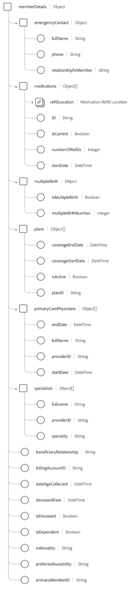

# [!UICONTROL Healthcare Member Details] groupe de champs de schéma

[!UICONTROL Healthcare Member Details] est un groupe de champs de schéma standard pour la classe [[!DNL XDM Individual Profile] class](../../classes/individual-profile.md) qui recueille les informations sur une personne qui a reçu ou qui bénéficiera d’un service ou de soins médicaux, telles que les coordonnées, le médecin traitant principal et les informations sur le plan.

| Propriété | Type de données | Description |
| --- | --- | --- |
| `billingAddress` | [[!UICONTROL Postal address]](../../data-types/postal-address.md) | Adresse de facturation de la personne. |
| `faxPhone` | [[!UICONTROL Phone number]](../../data-types/phone-number.md) | Numéro de fax de la personne. |
| `homeAddress` | [[!UICONTROL Postal address]](../../data-types/postal-address.md) | Adresse personnelle de la personne. |
| `homePhone` | [[!UICONTROL Phone number]](../../data-types/phone-number.md) | Numéro de téléphone personnel de la personne. |
| `mailingAddress` | [[!UICONTROL Postal address]](../../data-types/postal-address.md) | Adresse postale de la personne. |
| `memberDetails` | Objet | Objet contenant des informations détaillées sur les attributs et les relations de la personne liés aux soins de santé. Pour plus d’informations sur la structure de l’objet[ consultez la ](#memberDetails)sous-section ci-dessous. |
| `mobilePhone` | [[!UICONTROL Phone number]](../../data-types/phone-number.md) | Numéro de téléphone mobile de la personne. |
| `person` | [[!UICONTROL Person]](../../data-types/person.md) | Acteur, contact ou propriétaire individuel lié à l’adhésion de la personne au système de santé. |
| `personalEmail` | [[!UICONTROL Email address]](../../data-types/email-address.md) | Adresse e-mail personnelle de la personne. |
| `shippingAddress` | [[!UICONTROL Postal address]](../../data-types/postal-address.md) | Adresse de livraison de la personne. |

{style="table-layout:auto"}

## `memberDetails` {#memberDetails}

`memberDetails` est un objet qui contient des informations détaillées sur les attributs et les relations de la personne liés aux soins de santé. La structure de `memberDetails` est décrite ci-dessous.

| Propriété | Type de données | Description |
| --- | --- | --- |
| `emergencyContact` | Objet | Capture les coordonnées d’urgence suivantes pour la personne : <ul><li>`fullName` : (chaîne). Nom complet du contact d’urgence.</li><li>`phone` : (chaîne). Numéro de téléphone du contact d’urgence.</li><li>`relationshipToMember` : (chaîne). Relation du contact d’urgence à la personne.</li></ul> |
| `medications` | Tableau d’objets | Répertorie les détails des médicaments actuels et passés associés à la personne. Chaque élément de tableau est un objet qui capture les détails suivants : <ul><li>`refillLocation` : ([[!UICONTROL Postal address]](../../data-types/postal-address.md)) Emplacement de remplissage du médicament.</li><li>`ID` : (chaîne) identifiant du médicament.</li><li>`isCurrent` : (booléen). Indique si le médicament est actuel ou antérieur.</li><li>`numberOfRefills` : (Entier) Nombre de renouvellements prescrits par le fournisseur de ce médicament.</li><li>`startDate` : (Date et heure) date à laquelle la personne a commencé à prendre le médicament.</li></ul> |
| `multipleBirth` | Objet | Capture les détails liés aux naissances multiples : <ul><li>`isMultipleBirth` : (booléen). Indique si la personne a donné plusieurs naissances.</li><li>`multipleBirthNumber` : (entier). Nombre de bébés nés si `isMultipleBirth` est vrai.</li></ul> |
| `plans` | Tableau d’objets | Répertorie les détails des plans médicaux actuels et passés associés à la personne. Chaque élément de tableau est un objet qui capture les détails suivants : <ul><li>`coverageEndDate` : (DateTime) date de fin de couverture du plan.</li><li>`coverageStartDate` : (DateTime) date à laquelle la couverture du plan commence.</li><li>`isActive` : (booléen). Indique si le plan est actif.</li><li>`planId` : (chaîne). Identifiant du plan.</li></ul> |
| `primaryCarePhysicians` | Tableau d’objets | Répertorie les coordonnées des médecins généralistes associés à la personne. Chaque élément de tableau est un objet qui capture les détails suivants : <ul><li>`endDate` : (Date et heure) date à laquelle le médecin généraliste a arrêté de prendre soin de la personne.</li><li>`fullname` : (chaîne). Nom complet du médecin.</li><li>`providerId` : (chaîne). Identifiant unique du médecin.</li><li>`startDate` : (Date et heure) date à laquelle le médecin généraliste a commencé à s’occuper de la personne.</li></ul> |
| `specialists` | Tableau d’objets | Répertorie les informations sur les spécialistes des soins de santé associés à la personne. Chaque élément de tableau est un objet qui capture les détails suivants : <ul><li>`fullname` : (chaîne). Nom complet du spécialiste.</li><li>`providerId` : (chaîne). Identifiant unique du spécialiste.</li><li>`specialty` : (chaîne). Spécialité du prestataire (anesthésiologie, urologie, radiologie, dermatologie, etc.).</li></ul> |
| `beneficiaryRelationship` | Chaîne | Relation de bénéficiaire avec le affilié si la personne est une personne à charge (par exemple, soi-même, son conjoint, son enfant, etc.). |
| `billingAccountID` | Chaîne | Identifiant unique du compte de facturation de la personne. |
| `dateAgeCollected` | DateTime | Date à laquelle l’âge de la personne a été collecté. |
| `deceasedDate` | DateTime | Date à laquelle la personne est décédée. |
| `isDeceased` | Booléen | Indique si la personne est décédée. |
| `isDependent` | Booléen | Indique si la personne est à charge. |
| `nationality` | Chaîne | Relation juridique entre la personne et son état, représenté à l’aide du code ISO 3166-1 Alpha-2. |
| `preferredAvailability` | Chaîne | Jour et heure de disponibilité préférés de la personne pour un rendez-vous. |
| `primaryMemberID` | Chaîne | Identifiant unique de l’abonné principal si la personne est une personne à charge. |

{style="table-layout:auto"}

Pour plus d’informations sur le groupe de champs , consultez le référentiel XDM public :

* [ Exemple renseigné ](https://github.com/adobe/xdm/blob/master/components/fieldgroups/profile/profile-healthcare-member.example.1.json)
* [Schéma complet](https://github.com/adobe/xdm/blob/master/components/fieldgroups/profile/profile-healthcare-member.schema.json)

Pour plus d’informations sur l’utilisation de ce groupe de champs pour des cas d’utilisation courants du secteur de la [santé](../../schema/industries/healthcare.md), consultez la documentation sur les schémas du secteur .
