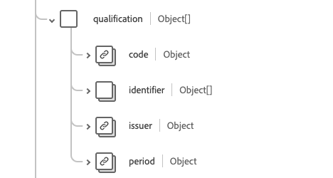

# Groupe de champs de schéma [!UICONTROL Prationer]

[!UICONTROL Praticien] est un groupe de champs de schéma standard pour la [[!DNL XDM Individual Profile] classe](../../classes/individual-profile.md) et le [[!DNL Provider class]](../../classes/provider.md). Il fournit un champ de type objet unique `healthcarePractioner` qui contient des informations sur une personne qui est directement ou indirectement impliquée dans la prestation de soins de santé ou de services connexes.

| Nom d’affichage | Propriété | Type de données | Description |
| --- | --- | --- | --- |
| [!UICONTROL Adresse] | `address` | Tableau de [[!UICONTROL Address]](../../data-types/healthcare/address.md) | Adresse(s) du praticien au-delà de son lieu de travail, comme son adresse à domicile. |
| [!UICONTROL Communication] | `communication` | Tableau d’objets | Langue pouvant être utilisée pour communiquer avec le praticien. Pour plus d’informations, consultez la [section ci-dessous](#communication) . |
| [!UICONTROL Identifiant] | `identifier` | Tableau de [[!UICONTROL Identifiant]](../../data-types/healthcare/identifier.md) | Identifiant qui s’applique à cette personne dans ce rôle. |
| [!UICONTROL Nom] | `name` | Tableau de [[!UICONTROL Nom de l’homme]](../../data-types/healthcare/human-name.md) | Nom(s) associé(s) au praticien. |
| [!UICONTROL Qualification] | `qualification` | Tableau d’objets | Les qualifications officielles, certifications, certifications, certifications, formation, licences ou autres qui autorisent ou se rapportent à la prestation de soins par le praticien. Pour plus d’informations, consultez la [section ci-dessous](#qualification) . |
| [!UICONTROL Détails du contact] | `telecom` | Tableau de [[!UICONTROL Point de contact]](../../data-types/healthcare/contact-point.md) | Les coordonnées du praticien. |
| [!UICONTROL Actif] | `active` | Booléen | Indique si l’enregistrement de praticiens est en cours d’utilisation. |
| [!UICONTROL Date de naissance] | `birthDate` | Date | La date de naissance du praticien. |
| [!UICONTROL Indicateur déposé] | `deceasedBoolean` | Booléen | Indique si le praticien est décédé. |
| [!UICONTROL Heure de date de décès] | `deceasedDateTime` | DateTime | Date et heure du décès du praticien. |
| [!UICONTROL Genre] | `gender` | Chaîne | Identité de genre de la personne. La valeur de cette propriété doit être égale à l’une des valeurs d’énumération connues suivantes. <li> `female` </li> <li> `male` </li> <li> `other` </li> <li> `unknown`</li> |

{style="table-layout:auto"}

Pour plus d’informations sur le groupe de champs, reportez-vous au référentiel XDM public :

* [Exemple renseigné](https://github.com/adobe/xdm/blob/master/extensions/industry/healthcare/fhir/fieldgroups/practitioner.example.1.json)
* [Schéma complet](https://github.com/adobe/xdm/blob/master/extensions/industry/healthcare/fhir/fieldgroups/practitioner.schema.json)

## `communication` {#communication}

`communication` est fourni sous la forme d’un tableau d’objets. La structure de chaque objet est décrite ci-dessous.

| Nom d’affichage | Propriété | Type de données | Description |
| --- | --- | --- | --- |
| [!UICONTROL Langue] | `language` | [[!UICONTROL Concept codeable]](../../data-types/healthcare/codeable-concept.md) | Le langage qui peut être utilisé pour communiquer avec la personne au sujet de sa santé. |
| [!UICONTROL Is Preferred Language] | `preferred` | Booléen | Indique si la langue est leur langue préférée ou non. |

{style="table-layout:auto"}

## `qualification` {#qualification}

`qualification` est fourni sous la forme d’un tableau d’objets. La structure de chaque objet est décrite ci-dessous.

| Nom d’affichage | Propriété | Type de données | Description |
| --- | --- | --- | --- |
| [!UICONTROL Code] | `code` | [[!UICONTROL Concept codeable]](../../data-types/healthcare/codeable-concept.md) | Représentation codée de la qualification. |
| [!UICONTROL Identifiant] | `identifier` | Tableau de [[!UICONTROL Identifiant]](../../data-types/healthcare/identifier.md) | Identifiant de la qualification. |
| [!UICONTROL Émetteur] | `issuer` | [[!UICONTROL Référence]](../../data-types/healthcare/reference.md) | L’organisation qui réglemente et publie la qualification. |
| [!UICONTROL Période] | `period` | [[!UICONTROL Période]](../../data-types/healthcare/period.md) | La période pendant laquelle la qualification est valide. |

{style="table-layout:auto"}
