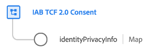

# Groupe de champs [!UICONTROL Consentement IAB TCF 2.0] pour les schémas de profil

>[!NOTE]
>
>Ce document couvre le groupe de champs de schéma [!UICONTROL Consentement IAB TCF 2.0] pour la classe XDM Individual Profile. Pour le groupe de champs destiné à la classe XDM ExperienceEvent , reportez-vous au [document](../event/iab.md) suivant à la place.

[!UICONTROL Consentement IAB TCF 2.0] est un groupe de champs de schéma standard pour la [[!DNL XDM Individual Profile] classe](../../classes/individual-profile.md) utilisé pour capturer une série horodatée de chaînes de consentement IAB, afin de suivre les modèles de changement de consentement au fil du temps.



| Propriété | Type de données | Description |
| --- | --- | --- |
| `identityPrivacyInfo` | Carte | Objet de type map qui associe les valeurs d’identité individuelles d’un client à différentes chaînes de consentement TCF. Vous trouverez ci-dessous un exemple de la structure de cet objet. |

{style="table-layout:auto"}

Le fichier JSON suivant illustre la structure de la carte `identityPrivacyInfo`.

```json
{
  "identityPrivacyInfo": {
    "ECID": {
      "13782522493631189": {
        "identityIABConsent": {
          "consentTimestamp": "2020-04-11T05:05:05Z",
          "consentString": {
            "consentStandard": "IAB TCF",
            "consentStandardVersion": "2.0",
            "consentStringValue": "BObdrPUOevsguAfDqFENCNAAAAAmeAAA.PVAfDObdrA.DqFENCAmeAENCDA",
            "gdprApplies": true,
            "containsPersonalData": false
          }
        }
      }
    }
  }
}
```

Comme le montre l’exemple, chaque clé de niveau racine de `xdm:identityPrivacyInfo` correspond à un espace de noms d’identité reconnu par Identity Service. À son tour, chaque propriété d’espace de noms doit comporter au moins une sous-propriété dont la clé correspond à la valeur d’identité correspondante du client pour cet espace de noms. Dans cet exemple, le client est identifié avec une valeur d’Experience Cloud ID (`ECID`) de `13782522493631189`.

>[!NOTE]
>
>Bien que l’exemple ci-dessus utilise une seule paire espace de noms/valeur pour représenter l’identité du client, vous pouvez ajouter des clés supplémentaires pour d’autres espaces de noms et chaque espace de noms peut avoir plusieurs valeurs d’identité, chacune avec son propre jeu de préférences de consentement TCF.

Pour chaque valeur d’identité, une propriété `identityIABConsent` doit être fournie, qui fournit la valeur de consentement TCF pour l’identité. La valeur de cette propriété doit être conforme au type de données [[!UICONTROL Chaîne de consentement]](../../data-types/consent-string.md).

Pour plus d’informations sur le cas d’utilisation de ce groupe de champs[&#128279;](../../../landing/governance-privacy-security/consent/iab/overview.md) consultez le guide sur la prise en charge d’ IAB TCF 2.0 dans Experience Platform . Pour plus d’informations sur le groupe de champs lui-même, consultez le référentiel XDM public :

* [ Exemple renseigné ](https://github.com/adobe/xdm/blob/master/components/fieldgroups/profile/profile-privacy.example.1.json)
* [Schéma complet](https://github.com/adobe/xdm/blob/master/components/fieldgroups/profile/profile-privacy.schema.json)
