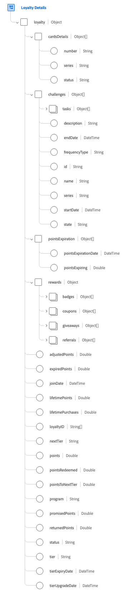

# Groupe de champs de schéma [!UICONTROL Détails de fidélité]

[!UICONTROL Détails de fidélité] est un groupe de champs de schéma standard pour la classe [[!UICONTROL Profil individuel XDM]](../../classes/individual-profile.md). Il fournit un champ unique de type objet, `loyalty`, qui modélise l’état d’appartenance au programme de fidélité d’un client, y compris les identifiants de fidélité, les soldes de points, les affectations de niveau, les récompenses, les défis et les détails de carte.

Cette page est destinée aux concepteurs de schémas et aux ingénieurs de données qui connaissent bien XDM Individual Profile et [les groupes de champs de schéma](../../ui/resources/field-groups.md). Après avoir lu cette page, vous pouvez mapper les données du profil de fidélité aux chemins d’accès aux champs de `loyalty` corrects.

>[!IMPORTANT]
>
>Ce groupe de champs capture l’état d’appartenance au programme de fidélité. Les événements de fidélité individuels sont généralement modélisés dans des schémas [[!UICONTROL XDM ExperienceEvent]](../../classes/experienceevent.md).

## Quand utiliser ce groupe de champs ? {#when-to-use}

Utilisez ce groupe de champs lorsque toutes les conditions suivantes s’appliquent.

- La classe de schéma est XDM Individual Profile et représente le statut actuel d’un membre du programme de fidélité.
- Le schéma stocke les attributs de fidélité persistants dans le profil client en temps réel.
- Les cas d’utilisation en aval nécessitent un état d’appartenance de fidélité pour la segmentation ou la personnalisation.

Utilisez des schémas [[!UICONTROL XDM ExperienceEvent]](../../classes/experienceevent.md) pour les activités de fidélité basées sur un événement, telles que l’accumulation de points, les tâches terminées par un défi ou les événements de changement de niveau.



## Structure du groupe de champs {#structure}

L’objet `loyalty` contient les propriétés suivantes.

| Propriété | Type de données | Description |
| --- | --- | --- |
| `adjustedPoints` | Double | Points ajustés en raison de corrections, retours ou autres modifications. |
| `cardsDetails` | Tableau d’objets | Répertorie les cartes de fidélité associées au membre. Voir la sous-section [cardsDetails](#cardsDetails) pour plus d’informations. |
| `challenges` | Tableau d’objets | Répertorie les défis de fidélité associés au membre. Pour plus d’informations, consultez la [sous-section des défis](#challenges). |
| `expiredPoints` | Double | Nombre total de points ayant expiré et ne pouvant plus être utilisés. |
| `joinDate` | DateTime | Date et heure [ISO 8601](https://datatracker.ietf.org/doc/html/rfc3339#section-5.6) (`yyyy-MM-dd'T'HH:mm:ssXXX`) indiquant le moment où la personne a rejoint le programme de fidélité. |
| `lifetimePoints` | Double | Total de points gagnés tout au long de l’adhésion au programme de fidélité du client. |
| `lifetimePurchases` | Double | Valeur monétaire totale de tous les achats effectués tout au long de l’adhésion au programme de fidélité du client. |
| `loyaltyID` | Tableau de chaînes | Identifiants du programme de fidélité associé au membre. |
| `nextTier` | Chaîne | Niveau de fidélité suivant que le membre peut obtenir. |
| `points` | Double | Solde actuel de points de fidélité ou de récompenses pour le membre. |
| `pointsExpiration` | Tableau d’objets | Répertorie les points de fidélité, ou groupes de points de fidélité, dont l’expiration est planifiée. Chaque élément de tableau contient : <ul><li>`pointsExpirationDate` : date et heure d’expiration des points.</li><li>`pointsExpiring` : nombre de points expirant à la date associée.</li></ul> |
| `pointsRedeemed` | Double | Montant total de points échangés contre des achats ou autres récompenses. |
| `pointsToNextTier` | Double | Nombre de points requis avant que le membre ne se qualifie pour le niveau de fidélité suivant. |
| `program` | Chaîne | Nom du programme de fidélité auquel la personne est inscrite. |
| `promisedPoints` | Double | Points promis au client mais pas encore crédités sur le compte. |
| `returnedPoints` | Double | Points retournés au compte du client en raison de remboursements ou d&#39;ajustements. |
| `rewards` | Objet | Capture les récompenses disponibles ou affectées au membre via le programme de fidélité. Pour plus d’informations, consultez la sous-section [récompenses](#rewards). |
| `status` | Chaîne | Statut actuel de l’abonnement au programme de fidélité, tel que `active`, `disabled` ou `suspended`. |
| `tier` | Chaîne | Niveau de fidélité actuel auquel le membre est inscrit. |
| `tierExpiryDate` | DateTime | Date et heure d’expiration du niveau de fidélité actuel du client ou de la cliente. |
| `tierUpgradeDate` | DateTime | Date et heure auxquelles le client a été promu au niveau de fidélité suivant. |
| `upgradeDate` | Chaîne | Obsolète. Utilisez `tierUpgradeDate` à la place. Mettez à jour les schémas existants et les mappages source qui font référence aux `upgradeDate` à utiliser `tierUpgradeDate`. |

{style="table-layout:auto"}

L’exemple suivant illustre l’objet `loyalty` avec des valeurs représentatives pour les structures imbriquées. Voir l’[exemple renseigné](https://github.com/adobe/xdm/blob/master/components/fieldgroups/profile/profile-loyalty-details.example.1.json) dans le référentiel XDM pour une payload valide complète.

```json
{
  "loyalty": {
    "program": "Acme Rewards",
    "tier": "gold",
    "points": 4200,
    "pointsExpiration": [
      { "pointsExpirationDate": "2026-12-31T00:00:00Z", "pointsExpiring": 500 }
    ],
    "cardsDetails": [
      { "number": "LC-0042", "status": "active" }
    ],
    "challenges": [
      {
        "id": "CH-001",
        "state": "active",
        "tasks": [{ "name": "Make 3 purchases", "goal": 3, "progress": 1 }]
      }
    ],
    "rewards": {
      "badges": [
        { "id": "BDG-100", "state": "active" }
      ]
    }
  }
}
```

## `cardsDetails` {#cardsDetails}

`cardsDetails` est un tableau d’objets qui recueille les informations sur les cartes de fidélité associées au membre.

| Propriété | Type de données | Description |
| --- | --- | --- |
| `number` | Chaîne | Numéro ou identifiant de la carte de fidélité. |
| `series` | Chaîne | Série ou collection à laquelle appartient la carte de fidélité. |
| `status` | Chaîne | Statut actuel de la carte de fidélité, tel que `active`, `inactive` ou `suspended`. |

{style="table-layout:auto"}

## `challenges` {#challenges}

`challenges` est un tableau d’objets qui capture les défis de fidélité associés au membre, y compris la progression du défi et les tâches associées.

| Propriété | Type de données | Description |
| --- | --- | --- |
| `description` | Chaîne | Description détaillée du défi de fidélité. |
| `endDate` | DateTime | Date et heure de fin du défi. |
| `frequencyType` | Chaîne | Fréquence associée au défi, telle que quotidienne, hebdomadaire ou mensuelle. |
| `id` | Chaîne | Identifiant unique du défi de fidélité. |
| `name` | Chaîne | Nom du défi de fidélité. |
| `series` | Chaîne | Série ou collection à laquelle appartient le défi. |
| `startDate` | DateTime | Date et heure de début du défi. |
| `state` | Chaîne | État du défi actuel, tel que `active`, `completed` ou `expired`. |
| `tasks` | Tableau d’objets | Répertorie les tâches associées au défi de fidélité. Chaque élément de tableau contient : <ul><li>`endDate` : date et heure de fin de la tâche.</li><li>`entity` : entité associée à la tâche.</li><li>`goal` : valeur cible de la tâche.</li><li>`name` : nom de la tâche.</li><li>`progress` : progression actuelle vers l’objectif de la tâche.</li><li>`startDate` : date et heure de début de la tâche.</li><li>`state` : état actuel de la tâche.</li><li>`type` : type ou catégorie de tâche.</li></ul> |

{style="table-layout:auto"}

## `rewards` {#rewards}

L’objet `rewards` capture les récompenses associées au programme de fidélité.

| Propriété | Type de données | Description |
| --- | --- | --- |
| `badges` | Tableau d’objets | Badges d’accomplissement gagnés par le membre. Chaque élément de tableau contient : <ul><li>`id` : identifiant du badge.</li><li>`name` : nom du badge.</li><li>`series` : collection ou série de badges.</li><li>`startDate` : date et heure auxquelles le badge est devenu actif.</li><li>`endDate` : date et heure d’expiration du badge.</li><li>`state` : état actuel du badge.</li></ul> |
| `coupons` | Tableau d’objets | Coupons de fidélité disponibles pour le membre. Chaque élément de tableau contient : <ul><li>`discountValue` : valeur d&#39;escompte monétaire.</li><li>`endDate` : date d’expiration du coupon.</li><li>`id` : identifiant du coupon.</li><li>`name` : nom du coupon.</li><li>`redemptionCount` : nombre de fois que le coupon a été échangé.</li><li>`redemptionLimit` : nombre maximal de coupons échangés.</li><li>`series` : série de coupons ou campagne.</li><li>`startDate` : date et heure de validité du coupon.</li><li>`state` : état actuel du coupon.</li><li>`storeName` : nom du magasin associé.</li></ul> |
| `giveaways` | Tableau d’objets | Promotions de cadeau associées au membre. Chaque élément de tableau contient : <ul><li>`endDate` : date de fin du cadeau.</li><li>`id` : identifiant du cadeau.</li><li>`name` : nom du cadeau.</li><li>`partnerId` : identifiant du partenaire.</li><li>`partnerName` : nom du partenaire.</li><li>`series` : série ou campagne de cadeaux.</li><li>`startDate` : date de début du cadeau.</li><li>`state` : état actuel du cadeau.</li><li>`type` : type ou catégorie de cadeau.</li></ul> |
| `referrals` | Tableau d’objets | Récompenses de référence gagnées par le membre. Chaque élément de tableau contient : <ul><li>`endDate` : date de fin du parrainage.</li><li>`id` : identifiant de référence.</li><li>`name` : nom de la récompense de référence.</li><li>`recipient` : identifiant ou nom de la personne à laquelle il est fait référence.</li><li>`series` : série de recommandations ou campagne.</li><li>`startDate` : date de début de la référence.</li><li>`state` : état de référence actuel.</li></ul> |

{style="table-layout:auto"}

## Étapes suivantes {#next-steps}

Utilisez les ressources suivantes lors de l’implémentation de schémas de profil de fidélité.

- Ajoutez ce groupe de champs à un schéma Profil individuel XDM à l’aide du guide [Groupe de champs de l’éditeur de schémas](../../ui/resources/field-groups.md) avant d’ingérer des données de profil de fidélité.
- Utilisez l’[exemple renseigné](https://github.com/adobe/xdm/blob/master/components/fieldgroups/profile/profile-loyalty-details.example.2.json) dans le référentiel XDM pour valider les mappages de payload de fidélité.
- Consultez le [schéma complet](https://github.com/adobe/xdm/blob/master/components/fieldgroups/profile/profile-loyalty-details.schema.json) pour connaître les contraintes de type de données et les définitions de champ requises.
