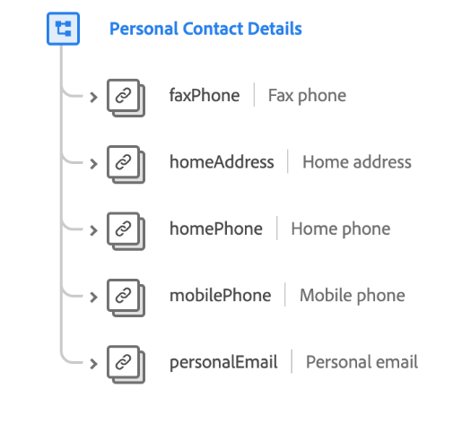

# [!UICONTROL Coordonnées personnelles] groupe de champs de schéma

>[!NOTE]
>
>Les noms de plusieurs groupes de champs de schéma ont changé. Pour plus d’informations, consultez le document sur les [mises à jour des noms de groupes de champs](../name-updates.md).

[!UICONTROL Coordonnées personnelles] est un groupe de champs de schéma standard pour la [[!DNL XDM Individual Profile] classe](../../classes/individual-profile.md) qui décrit les informations de contact d’une personne individuelle.

| Propriété | Type de données | Description |
| --- | --- | --- |
| `faxPhone` | [Numéro de téléphone](../../data-types/phone-number.md) | Décrit le numéro de télécopie de la personne. |
| `homeAddress` | [Adresse postale](../../data-types/postal-address.md) | Décrit l’adresse résidentielle de la personne. |
| `homePhone` | [Numéro de téléphone](../../data-types/phone-number.md) | Décrit le numéro de téléphone personnel de la personne. |
| `mobilePhone` | [Numéro de téléphone](../../data-types/phone-number.md) | Décrit le numéro de téléphone mobile de la personne. |
| `personalEmail` | [Adresse électronique](../../data-types/email-address.md) | Décrit l’adresse e-mail de la personne. |

{style="table-layout:auto"}

Pour plus d’informations sur le groupe de champs , consultez le référentiel XDM public :

* [Exemple renseigné](https://github.com/adobe/xdm/blob/master/components/fieldgroups/profile/profile-personal-details.example.1.json)
* [Schéma complet](https://github.com/adobe/xdm/blob/master/components/fieldgroups/profile/profile-personal-details.schema.json)
