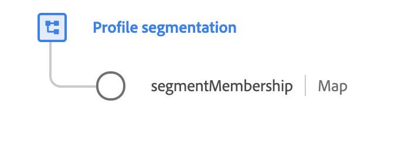

# [!UICONTROL Segment Membership Details] groupe de champs de schéma

>[!NOTE]
>
>Les noms de plusieurs groupes de champs de schéma ont changé. Pour plus d’informations, consultez le document sur les [mises à jour des noms de groupes de champs](../name-updates.md).

[!UICONTROL Segment Membership Details] groupe de champs de schéma standard pour la [[!DNL XDM Individual Profile] classe](../../classes/individual-profile.md). Le groupe de champs fournit un champ de mappage unique qui recueille des informations sur l’appartenance au segment, notamment les segments auxquels appartient la personne, l’heure de la dernière qualification et la date de validité de l’abonnement.

>[!WARNING]
>
>Bien que le champ `segmentMembership` doive être ajouté manuellement à votre schéma de profil à l’aide de ce groupe de champs, vous ne devez pas tenter de renseigner ou de mettre à jour manuellement ce champ. Le système met automatiquement à jour la carte des `segmentMembership` pour chaque profil au fur et à mesure que les tâches de segmentation sont effectuées.

{width=400}

| Propriété | Type de données | Description |
| --- | --- | --- |
| `segmentMembership` | Carte | Objet map qui décrit les appartenances à un segment de l’individu. La structure de cet objet est décrite en détail ci-dessous. |

{style="table-layout:auto"}

Voici un exemple `segmentMembership` mappage que le système a renseigné pour un profil particulier. Les appartenances aux segments sont triées par espace de noms, comme indiqué par les clés de niveau racine de l’objet . De même, les clés individuelles sous chaque espace de noms représentent les identifiants des segments dont le profil est membre. Chaque objet de segment contient plusieurs sous-champs qui fournissent des détails supplémentaires sur l’appartenance :

```json
{
  "xdm:segmentMembership": {
    "AAM": {
      "04a81716-43d6-4e7a-a49c-f1d8b3129ba9": {
        "xdm:version": "15",
        "xdm:lastQualificationTime": "2018-04-26T15:52:25+00:00",
        "xdm:validUntil": "2019-04-26T15:52:25+00:00",
        "xdm:status": "realized",
        "xdm:payload": {
          "xdm:payloadBooleanValue": true,
          "xdm:payloadType": "boolean"
        }
      },
      "53cba6b2-a23b-454a-8069-fc41308f1c0f": {
        "xdm:version": "3",
        "xdm:lastQualificationTime": "2018-04-26T15:52:25+00:00",
        "xdm:validUntil": "2018-04-27T15:52:25+00:00",
        "xdm:status": "realized",
        "xdm:payload": {
          "xdm:payloadPropensityValue": 0.5,
          "xdm:payloadType": "propensity"
        }
      }
    },
    "Email": {
      "abcd@adobe.com": {
        "xdm:version": "1",
        "xdm:lastQualificationTime": "2017-09-26T15:52:25+00:00",
        "xdm:validUntil": "2017-12-26T15:52:25+00:00",
        "xdm:status": "exited"
      }
    }
  }
}
```

| Propriété | Description |
| --- | --- |
| `xdm:version` | Version du segment pour lequel ce profil s’est qualifié. |
| `xdm:lastQualificationTime` | Date et heure de la dernière qualification de ce profil pour le segment. |
| `xdm:validUntil` | Date et heure auxquelles l’appartenance à un segment ne doit plus être considérée comme valide. Pour les audiences externes, si ce champ n’est pas défini, l’appartenance à un segment n’est conservée que pendant 30 jours à compter de la `lastQualificationTime`. |
| `xdm:status` | Un champ de chaîne qui indique si l’appartenance à un segment a été réalisée dans le cadre de la requête actuelle. Les valeurs suivantes sont acceptées : <ul><li>`realized` : le profil est qualifié pour le segment.</li><li>`exited` : le profil quitte le segment dans le cadre de la requête actuelle.</li></ul> |
| `xdm:payload` | Certains abonnements de segment incluent une payload qui décrit des valeurs supplémentaires directement liées à l’abonnement. Une seule payload d’un type donné peut être fournie pour chaque abonnement. `xdm:payloadType` indique le type de payload (`boolean`, `number`, `propensity` ou `string`), tandis que sa propriété frère fournit la valeur pour le type de payload. |

{style="table-layout:auto"}

>[!NOTE]
>
>Toute appartenance à un segment avec le statut `exited` pendant plus de 30 jours, selon le `lastQualificationTime`, peut être supprimée.

Pour plus d’informations sur le groupe de champs , consultez le référentiel XDM public :

* [Exemple renseigné](https://github.com/adobe/xdm/blob/master/components/fieldgroups/profile/profile-personal-details.example.1.json)
* [Schéma complet](https://github.com/adobe/xdm/blob/master/components/fieldgroups/profile/profile-personal-details.schema.json)
