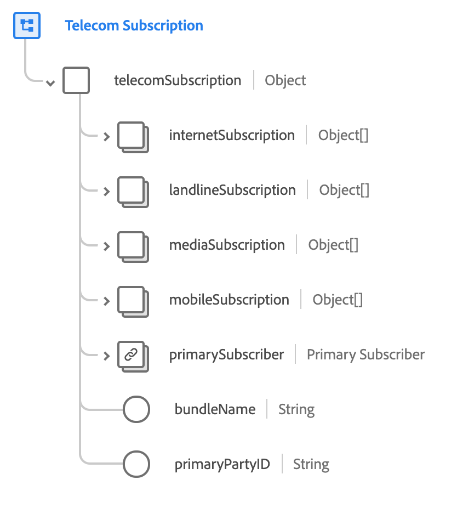
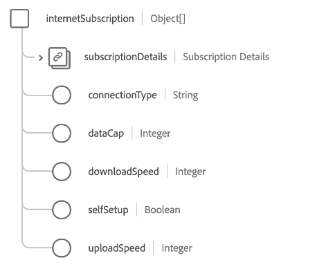
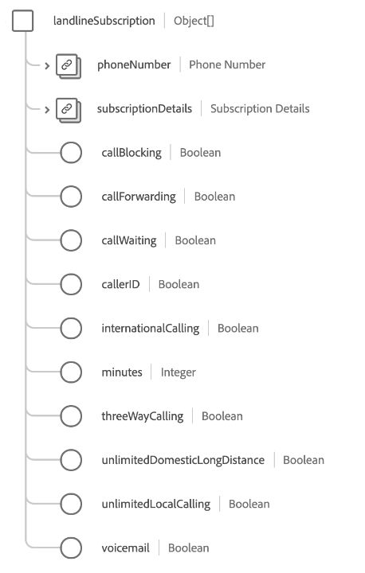
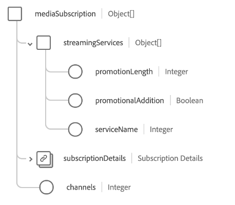
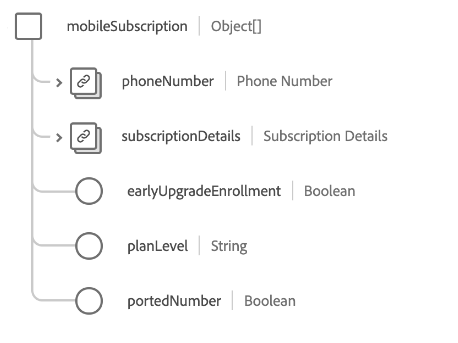

# Groupe de champs de schéma [!UICONTROL Abonnement aux télécommunications]

>[!NOTE]
>
>Les noms de plusieurs groupes de champs de schéma ont changé. Pour plus d’informations, consultez le document sur les [mises à jour des noms de groupes de champs](../name-updates.md).

[!UICONTROL Abonnement aux télécommunications] est un groupe de champs de schéma standard pour la [[!DNL XDM Individual Profile] classe](../../classes/individual-profile.md) qui décrit la formule d’abonnement aux télécommunications d’un client, y compris les tarifs, les forfaits et les abonnements aux différents produits.

Le groupe de champs fournit un champ de type objet unique, `telecomSubscription`, dont les propriétés sont décrites ci-dessous.

| Propriété | Type de données | Description |
| --- | --- | --- |
| `internetSubscription` | Tableau d’objets | Décrit les détails de la formule d’abonnement Internet, tels que la limite des données, le type de connexion et les informations sur la vitesse. Pour plus d’informations, consultez la [section ci-dessous](#internetSubscription). |
| `landlineSubscription` | Tableau d’objets | Décrit les détails de la formule d’abonnement de téléphonie fixe, y compris les fonctions, minutes et formules de numérotation sélectionnées. Pour plus d’informations, consultez la [section ci-dessous](#landlineSubscription). |
| `mediaSubscription` | Tableau d’objets | Décrit les détails de la formule d’abonnement au média, y compris le nombre de canaux et les services de streaming inclus. Pour plus d’informations, consultez la [section ci-dessous](#mediaSubscription). |
| `mobileSubscription` | Tableau d’objets | Décrit les détails de la formule d’abonnement mobile, notamment le nombre de lignes, les tarifs de données, le coût, etc. Pour plus d’informations, consultez la [section ci-dessous](#mobileSubscription). |
| `primarySubscriber` | [[!UICONTROL  Personne ]](../../data-types/person.md) | Décrit le propriétaire de l’abonnement. |
| `bundleName` | Chaîne | Capture le nom du type de la formule d’abonnement à laquelle le client est inscrit (`Internet + Media`, par exemple). |
| `primaryPartyID` | Chaîne | Identifiant de la personne principale responsable de l’abonnement. Il peut s’agir, par exemple, du numéro de téléphone de cette personne. |

{style="table-layout:auto"}

Pour plus d’informations sur le groupe de champs , consultez le référentiel XDM public :

* [Exemple renseigné](https://github.com/adobe/xdm/blob/master/components/fieldgroups/profile/profile-personal-details.example.1.json)
* [Schéma complet](https://github.com/adobe/xdm/blob/master/components/fieldgroups/profile/profile-personal-details.schema.json)

## `internetSubscription` {#internetSubscription}

`internetSubscription` est fourni sous la forme d’un tableau d’objets . La structure de chaque objet est décrite ci-dessous.

| Propriété | Type de données | Description |
| --- | --- | --- |
| `subscriptionDetails` | [[!UICONTROL Abonnement télécom]](../../data-types/telecom-subscription.md) | Décrit les détails généraux sur l’abonnement, y compris la durée de l’abonnement, les frais, le statut, etc. Décrit les détails généraux sur l’abonnement, y compris la durée de l’abonnement, les frais, le statut, etc. |
| `connectionType` | Chaîne | Type de connexion de l’abonnement. |
| `dataCap` | Entier | Limite de données pour le compte, en mégaoctets (Mo). |
| `downloadSpeed` | Entier | Vitesse de téléchargement maximale disponible pour l’abonnement, en mégaoctets (Mo). |
| `selfSetup` | Booléen | Indique si un client peut effectuer la configuration Internet sans la visite d&#39;un technicien. |
| `uploadSpeed` | Entier | Vitesse de chargement maximale disponible pour l’abonnement, en mégaoctets (Mo). |

{style="table-layout:auto"}

## `landlineSubscription` {#landlineSubscription}

`landlineSubscription` est fourni sous la forme d’un tableau d’objets . La structure de chaque objet est décrite ci-dessous.

| Propriété | Type de données | Description |
| --- | --- | --- |
| `phoneNumber` | [[!UICONTROL Numéro de téléphone]](../../data-types/telecom-subscription.md) | Numéro de téléphone affecté à cet abonnement. |
| `subscriptionDetails` | [[!UICONTROL Abonnement télécom]](../../data-types/telecom-subscription.md) | Décrit les détails généraux sur l’abonnement, y compris la durée de l’abonnement, les frais, le statut, etc. |
| `callBlocking` | Booléen | Indique si les fonctions d’abonnement de téléphonie fixe incluent le blocage des appels. |
| `callForwarding` | Booléen | Indique si les fonctions d’abonnement de téléphonie fixe incluent le transfert d’appel. |
| `callWaiting` | Booléen | Indique si les appels en attente sont inclus dans l’abonnement de téléphonie fixe. |
| `callerID` | Booléen | Indique si les fonctions d&#39;abonnement de téléphonie fixe incluent l&#39;identifiant de l&#39;appelant. |
| `internationalCalling` | Booléen | Indique si les appels internationaux sont inclus dans l’abonnement de téléphonie fixe. |
| `minutes` | Entier | Nombre de minutes mensuelles disponibles dans l’abonnement. |
| `threeWayCalling` | Booléen | Indique si les appels à trois sont inclus dans l&#39;abonnement de téléphonie fixe. |
| `unlimitedDomesticLongDistance` | Booléen | Indique si les appels longue distance nationaux illimités sont inclus dans l&#39;abonnement de téléphonie fixe. |
| `unlimitedLocalCalling` | Booléen | Indique si les appels locaux illimités sont inclus dans l&#39;abonnement de téléphonie fixe. |
| `voicemail` | Booléen | Indique si la messagerie vocale est incluse dans l&#39;abonnement de téléphonie fixe. |

{style="table-layout:auto"}

## `mediaSubscription` {#mediaSubscription}

`mediaSubscription` est fourni sous la forme d’un tableau d’objets . La structure de chaque objet est décrite ci-dessous.

| Propriété | Type de données | Description |
| --- | --- | --- |
| `streamingServices` | Tableau d’objets | Liste de tous les services de streaming inclus dans l’abonnement. Chaque élément de tableau comprend les propriétés suivantes : <ul><li>`promotionLength` : durée de la promotion, en mois, si le service de streaming a été ajouté dans le cadre d’une promotion.</li><li>`promotionalAddition` : indique si le service de streaming a été ajouté dans le cadre d’une promotion.</li><li>`serviceName` : nom du service de streaming.</li></ul> |
| `subscriptionDetails` | [[!UICONTROL Abonnement télécom]](../../data-types/telecom-subscription.md) | Décrit les détails généraux sur l’abonnement, y compris la durée de l’abonnement, les frais, le statut, etc. |
| `channels` | Entier | Nombre de canaux inclus dans l’abonnement au média. |

{style="table-layout:auto"}

## `mobileSubscription` {#mobileSubscription}

`mobileSubscription` est fourni sous la forme d’un tableau d’objets . La structure de chaque objet est décrite ci-dessous.

| Propriété | Type de données | Description |
| --- | --- | --- |
| `phoneNumber` | [[!UICONTROL Numéro de téléphone]](../../data-types/telecom-subscription.md) | Numéro de téléphone affecté à cet abonnement. |
| `subscriptionDetails` | [[!UICONTROL Abonnement télécom]](../../data-types/telecom-subscription.md) | Décrit les détails généraux sur l’abonnement, y compris la durée de l’abonnement, les frais, le statut, etc. |
| `earlyUpgradeEnrollment` | Booléen | Indique si le client choisit des mises à niveau anticipées. |
| `planLevel` | Chaîne | Nom du forfait mobile affecté à cet abonnement. |
| `portedNumber` | Booléen | Indique si le client a transféré son numéro depuis un autre opérateur. |

{style="table-layout:auto"}
