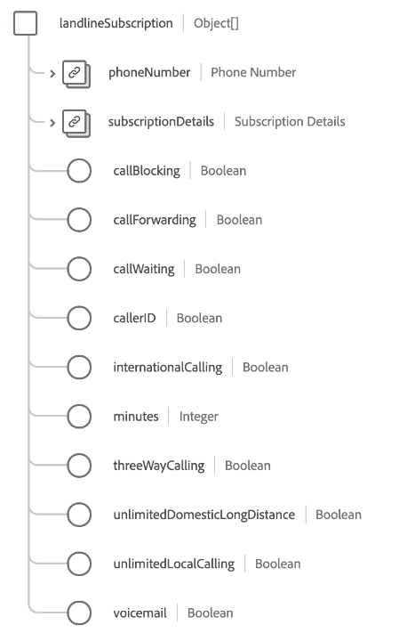

# [!UICONTROL Groupe de champs ] de schéma d&#39;abonnements Telecom

>[!NOTE]
>
>Les noms de plusieurs groupes de champs de schéma ont changé. Pour plus d’informations, consultez le document [mises à jour des noms de groupe de champs](../name-updates.md) .

[!UICONTROL L’] abonnement aux télécommunications est un groupe de champs de schéma standard pour la  [[!DNL XDM Individual Profile] ](../../classes/individual-profile.md) classe qui décrit le plan d’abonnement d’un client aux services de télécommunication, notamment les tarifs, les packages et les abonnements à des produits individuels.

Le groupe de champs fournit un champ de type objet unique, `telecomSubscription`, dont les propriétés sont décrites ci-dessous.

| Propriété | Type de données | Description |
| --- | --- | --- |
| `internetSubscription` | Tableau d’objets | Décrit les détails du plan d’abonnement Internet, tels que la limite de données, le type de connexion et les détails de vitesse. Pour plus d’informations, consultez la [section ci-dessous](#internetSubscription). |
| `landlineSubscription` | Tableau d’objets | Décrit les détails du plan d’abonnement fixe, y compris les fonctionnalités, les minutes et les plans de numérotation sélectionnés. Pour plus d’informations, consultez la [section ci-dessous](#landlineSubscription). |
| `mediaSubscription` | Tableau d’objets | Décrit les détails du plan d’abonnement au média, y compris le nombre de canaux et les services de diffusion en continu inclus. Pour plus d’informations, consultez la [section ci-dessous](#mediaSubscription). |
| `mobileSubscription` | Tableau d’objets | Décrit les détails du plan d’abonnement mobile, notamment le nombre de lignes, les taux de données, le coût, etc. Pour plus d’informations, consultez la [section ci-dessous](#mobileSubscription). |
| `primarySubscriber` | [[!UICONTROL Personne]](../../data-types/person.md) | Décrit le propriétaire de l’abonnement. |
| `bundleName` | Chaîne | Capture le nom de tout type de regroupement d’abonnement auquel le client est inscrit, tel que `Internet + Media`. |
| `primaryPartyID` | Chaîne | Identifiant de la Principale personne responsable de l’abonnement, qui peut généralement être son numéro de téléphone d’appareil. |

{style=&quot;table-layout:auto&quot;}

Pour plus d’informations sur le groupe de champs, reportez-vous au référentiel XDM public :

* [Exemple rempli](https://github.com/adobe/xdm/blob/master/components/fieldgroups/profile/profile-personal-details.example.1.json)
* [Schéma complet](https://github.com/adobe/xdm/blob/master/components/fieldgroups/profile/profile-personal-details.schema.json)

## `internetSubscription` {#internetSubscription}

`internetSubscription` est fourni sous la forme d’un tableau d’objets. La structure de chaque objet est décrite ci-dessous.

| Propriété | Type de données | Description |
| --- | --- | --- |
| `subscriptionDetails` | [[!UICONTROL Abonnement aux télécommunications]](../../data-types/telecom-subscription.md) | Décrit les détails généraux de l’abonnement, notamment la durée de l’abonnement, les frais, l’état, etc. Décrit les détails généraux de l’abonnement, notamment la durée de l’abonnement, les frais, l’état, etc. |
| `connectionType` | Chaîne | Type de connexion de l’abonnement. |
| `dataCap` | Entier | Limite de la limite de données pour le compte, en mégaoctets (Mo). |
| `downloadSpeed` | Entier | Vitesse de téléchargement maximale disponible pour l’abonnement, en mégaoctets (Mo). |
| `selfSetup` | Booléen | Indique si un client est éligible à la configuration Internet sans visite d’un technicien. |
| `uploadSpeed` | Entier | Vitesse de chargement maximale disponible pour l’abonnement, en mégaoctets (Mo). |

{style=&quot;table-layout:auto&quot;}

## `landlineSubscription` {#landlineSubscription}

`landlineSubscription` est fourni sous la forme d’un tableau d’objets. La structure de chaque objet est décrite ci-dessous.

| Propriété | Type de données | Description |
| --- | --- | --- |
| `phoneNumber` | [[!UICONTROL Numéro de téléphone]](../../data-types/telecom-subscription.md) | Numéro de téléphone attribué à cet abonnement. |
| `subscriptionDetails` | [[!UICONTROL Abonnement aux télécommunications]](../../data-types/telecom-subscription.md) | Décrit les détails généraux de l’abonnement, notamment la durée de l’abonnement, les frais, l’état, etc. |
| `callBlocking` | Booléen | Indique si les fonctionnalités d’abonnement fixe incluent le blocage des appels. |
| `callForwarding` | Booléen | Indique si les fonctionnalités d’abonnement fixe incluent le transfert d’appel. |
| `callWaiting` | Booléen | Indique si les fonctionnalités d’abonnement fixe incluent l’attente d’appel. |
| `callerID` | Booléen | Indique si les fonctionnalités d’abonnement fixe incluent l’ID d’appelant. |
| `internationalCalling` | Booléen | Indique si les fonctions d&#39;abonnement aux lignes fixes incluent des appels internationaux. |
| `minutes` | Entier | Nombre de minutes mensuelles disponibles dans l’abonnement. |
| `threeWayCalling` | Booléen | Indique si les fonctionnalités d’abonnement fixe incluent des appels tridirectionnels. |
| `unlimitedDomesticLongDistance` | Booléen | Indique si les fonctionnalités d’abonnement fixe incluent un nombre illimité d’appels interurbains nationaux. |
| `unlimitedLocalCalling` | Booléen | Indique si les fonctionnalités d’abonnement fixe incluent un nombre illimité d’appels locaux. |
| `voicemail` | Booléen | Indique si les fonctionnalités d’abonnement fixe incluent la messagerie vocale. |

{style=&quot;table-layout:auto&quot;}

## `mediaSubscription` {#mediaSubscription}

`mediaSubscription` est fourni sous la forme d’un tableau d’objets. La structure de chaque objet est décrite ci-dessous.

| Propriété | Type de données | Description |
| --- | --- | --- |
| `streamingServices` | Tableau d’objets | Liste de tous les services de diffusion en continu inclus dans l’abonnement. Chaque élément de tableau comprend les propriétés suivantes : <ul><li>`promotionLength`: Durée de la promotion, en mois, si le service de diffusion en continu a été ajouté dans le cadre d’une promotion.</li><li>`promotionalAddition`: Indique si le service de diffusion en continu a été ajouté dans le cadre d’une promotion.</li><li>`serviceName`: Nom du service de diffusion en continu.</li></ul> |
| `subscriptionDetails` | [[!UICONTROL Abonnement aux télécommunications]](../../data-types/telecom-subscription.md) | Décrit les détails généraux de l’abonnement, notamment la durée de l’abonnement, les frais, l’état, etc. |
| `channels` | Entier | Nombre de canaux inclus dans l’abonnement au média. |

{style=&quot;table-layout:auto&quot;}

## `mobileSubscription` {#mobileSubscription}

`mobileSubscription` est fourni sous la forme d’un tableau d’objets. La structure de chaque objet est décrite ci-dessous.

| Propriété | Type de données | Description |
| --- | --- | --- |
| `phoneNumber` | [[!UICONTROL Numéro de téléphone]](../../data-types/telecom-subscription.md) | Numéro de téléphone attribué à cet abonnement. |
| `subscriptionDetails` | [[!UICONTROL Abonnement aux télécommunications]](../../data-types/telecom-subscription.md) | Décrit les détails généraux de l’abonnement, notamment la durée de l’abonnement, les frais, l’état, etc. |
| `earlyUpgradeEnrollment` | Booléen | Indique si le client s’inscrit aux mises à niveau anticipées. |
| `planLevel` | Chaîne | Nom du plan mobile affecté à cet abonnement. |
| `portedNumber` | Booléen | Indique si le client porte son numéro depuis un autre opérateur. |

{style=&quot;table-layout:auto&quot;}
