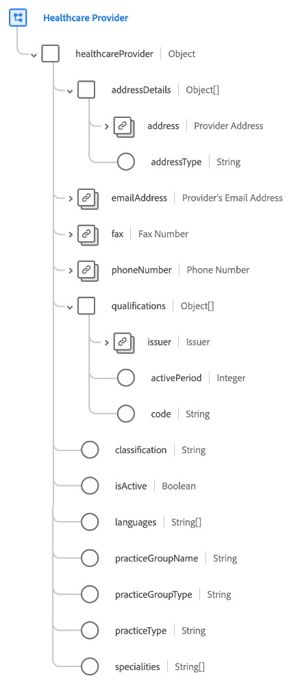

# [!UICONTROL Prestataire de soins de santé] groupe de champs de schéma

[!UICONTROL Prestataire de soins de santé] est un groupe de champs de schéma standard pour la classe [[!UICONTROL Prestataire]](../../classes/provider.md). Il fournit un `healthcareProvider` de champ de type objet unique qui capture les propriétés liées à un professionnel de santé individuel ou à un organisme d’établissement de santé autorisé à fournir des diagnostics et des traitements médicaux.

| Propriété | Type de données | Description |
| --- | --- | --- |
| `addressDetails` | Tableau d’objets | Répertorie les détails de l’adresse du fournisseur. Chaque objet comprend les propriétés suivantes : <ul><li>`address` : ([[!UICONTROL Adresse postale]](../../data-types/postal-address.md)) : adresse postale du fournisseur.</li><li>`addressType` : (chaîne). Type d’adresse, indiquant où le fournisseur fournit des services.</li></ul> |
| `emailAddress` | [[!UICONTROL Adresse électronique]](../../data-types/email-address.md) | Adresse e-mail du fournisseur. |
| `fax` | [[!UICONTROL Numéro de téléphone]](../../data-types/phone-number.md) | Numéro de fax du fournisseur. |
| `phoneNumber` | [[!UICONTROL Numéro de téléphone]](../../data-types/phone-number.md) | Numéro de téléphone du fournisseur. |
| `qualifications` | Tableau d’objets | Répertorie les certifications, les licences ou les formations relatives à la prestation de soins. Chaque objet comprend les propriétés suivantes : <ul><li>`issuer` : ([[!UICONTROL Détails du compte]](../../data-types/account-details.md)) : organisation qui réglemente et émet la qualification.</li><li>`activePeriod` : (entier). Année jusqu’à laquelle la qualification est valide.</li><li>`code` : (chaîne). Représentation codée de la qualification.</li></ul> |
| `classification` | Chaîne | Classification du prestataire de services en fonction de la classe ou de la catégorie (soins aux patients, soins autres que les patients, etc.). |
| `isActive` | Booléen | Indique si le fournisseur est actif. |
| `languages` | Tableau de chaînes | Liste des langues dans lesquelles le fournisseur effectue des opérations. |
| `practiceGroupName` | Chaîne | Nom du groupe d&#39;exercices pratiques du fournisseur de services. |
| `practiceGroupType` | Chaîne | Type de groupe d&#39;exercices pratiques pour le fournisseur de services. |
| `practiceType` | Chaîne | Type d’exercice pour le fournisseur de services. |
| `specialties` | Tableau de chaînes | Liste des spécialités proposées par ce fournisseur. |

{style="table-layout:auto"}

Pour plus d’informations sur le groupe de champs , consultez le [référentiel XDM public](https://github.com/adobe/xdm/blob/master/components/fieldgroups/provider/healthcare-provider-details.schema.json).
