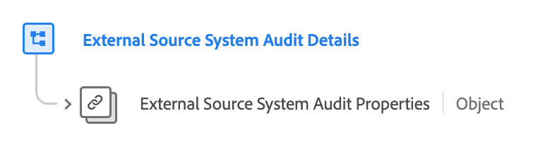

# [!UICONTROL &#x200B; Groupe de champs Détails de l’audit du système Source externe]

[!UICONTROL External Source System Audit Details] est un groupe de champs de modèle de données d’expérience (XDM) standard qui étend le type de données &quot;External Source System Audit Attributes&quot; principal en référençant ses propriétés et en ajoutant des métadonnées contextuelles. Cela permet un suivi d’audit détaillé et une intégration flexible des données à partir de sources externes.

| Nom d’affichage | Propriété | Type de données | Description |
| -------------------------------------------------| ---------------------------------------- | --------- | --- |
| [!UICONTROL Détails de l’audit du système Source externe] | `external-source-system-audit-details` | [[!UICONTROL &#x200B; Attributs d’audit système Source externes]](../../data-types/external-source-system-audit-attributes.md) | Le groupe de champs &#39;[!UICONTROL External Source System Audit Details]&#39; étend le type de données &quot;External Source System Audit Attributes&quot; principal en référençant ses propriétés et en ajoutant des métadonnées contextuelles. Cela facilite le suivi d’audit détaillé et l’intégration flexible des données pour les sources externes, en tenant compte de la nature asynchrone de l’ingestion des profils. |

{style="table-layout:auto"}

Pour plus d’informations sur le type de données, reportez-vous au référentiel XDM public :

* [Schéma complet](https://github.com/adobe/xdm/blob/master/docs/reference/fieldgroups/shared/external-source-system-audit-details.schema.json)