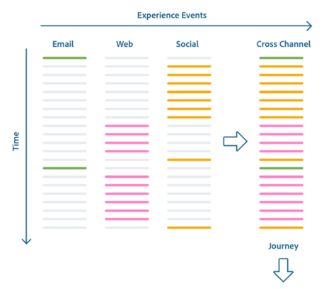

# Présentation du système XDM

La normalisation et l’interopérabilité sont les concepts clés d’Adobe Experience Platform. [!DNL Experience Data Model] (XDM), piloté par l’Adobe, vise à normaliser les données d’expérience client et à définir des schémas pour la gestion de l’expérience client.

XDM est une spécification documentée publiquement conçue pour améliorer la puissance des expériences numériques. It provides common structures and definitions for any application to use to communicate with [!DNL Platform] services. L’adhésion aux normes XDM permet d’intégrer toutes les données d’expérience client dans une représentation commune afin de fournir des informations de manière plus rapide et intégrée. Vous pouvez obtenir des insights précieux à partir des actions des clients, définir des audiences de clients par le biais de segments et utiliser les attributs du client à des fins de personnalisation.

XDM is the foundational framework that allows Adobe Experience Cloud, powered by [!DNL Experience Platform], to deliver the right message to the right person, on the right channel, at exactly the right moment. The methodology on which [!DNL Experience Platform] is built, **XDM System**, operationalizes [!DNL Experience Data Model] schemas for use by [!DNL Platform] services.

Ce document offre une vue d’ensemble du rôle du système XDM dans [!DNL Experience Platform].

## Schémas XDM

[!DNL Experience Platform] utilise des schémas pour décrire la structure des données de manière cohérente et réutilisable. En définissant les données de manière cohérente sur l’ensemble des systèmes, il est plus simple de leur donner du sens et donc d’en tirer profit.

Before data can be ingested into [!DNL Platform], a schema must be composed to describe the data&#39;s structure and provide constraints to the type of data that can be contained within each field. Les schémas se composent d’une classe de base et de zéro ou plusieurs mixins.

Pour plus d’informations sur le modèle de composition de schémas, y compris sur les principes de conception et les bonnes pratiques, consultez les [bases de la composition de schémas](schema/composition.md).

### [!DNL Schema Registry] et [!DNL Schema Library]

The **[!DNL Schema Registry]** provides a user interface and RESTful API from which you can view and manage all schema-related resources in the Adobe Experience Platform **[!DNL Schema Library]**. The [!DNL Schema Library] contains industry standard resources made available to you by Adobe, as well as resources from [!DNL Experience Platform] partners and vendors whose applications you use. L’interface utilisateur et l’API du registre des schémas peuvent aussi être utilisées pour créer et gérer de nouveaux schémas et ressources propres à votre organisation.

For a comprehensive guide to the major operations available in the [!DNL Schema Registry], see the [Schema Registry developer guide](api/getting-started.md).

## Comportements de données dans le système XDM {#data-behaviors}

Data intended for use in [!DNL Experience Platform] is grouped into two behavior types:

* **Enregistrer les données** : fournit des informations sur les attributs d’un sujet. Un sujet peut être une organisation ou un individu.
* **Données de série temporelle** : fournissent un instantané du système au moment où une action a été entreprise directement ou indirectement par un sujet enregistré.

Tous les schémas XDM décrivent des données pouvant être catégorisées en tant qu’enregistrement ou série temporelle. Le comportement des données d’un schéma est défini par la **classe** attribuée au schéma lorsqu’il est créé pour la première fois. Les classes XDM décrivent le plus petit nombre de propriétés qu’un schéma doit contenir pour représenter un comportement de données spécifique.

Although you are able to define your own classes within the [!DNL Schema Registry], it is recommended that you use the preferred classes **[!DNL XDM Individual Profile]** and **[!DNL XDM ExperienceEvent]** for record and time series data, respectively. Ces classes sont décrites plus en détail ci-dessous.

### [!DNL XDM Individual Profile]

[!DNL XDM Individual Profile] est une classe basée sur les enregistrements qui forme une représentation singulière des attributs des sujets identifiés et partiellement identifiés. Les profils hautement identifiés peuvent être utilisés pour des communications personnelles ou des engagements ciblés et peuvent contenir des informations personnelles détaillées telles que le nom, le genre, la date de naissance, l’adresse et les coordonnées, y compris les numéros de téléphone et les adresses électroniques.

Les profils moins identifiés peuvent n’être constitués que de signaux comportementaux anonymes tels que les cookies de navigateur. Dans ce cas, les données de profil éparses sont utilisées pour constituer une base d’informations dans laquelle les intérêts et les préférences du profil anonyme sont rassemblés et stockés. Ces identifiants peuvent devenir plus détaillés avec le temps si le sujet s’inscrit pour recevoir des notifications, souscrit à des abonnements, effectue des achats, etc. Ce développement des attributs de profil peut permettre d’obtenir un sujet identifié et un degré plus élevé d’engagement ciblé.

Au fur et à mesure qu’un profil client croît, il devient un solide référentiel des informations personnelles, des informations d’identification, des coordonnées et des préférences de communication d’une personne.

### [!DNL XDM ExperienceEvent]

XDM ExperienceEvent est une classe basée sur une série temporelle utilisée pour capturer l’état du système lorsqu’un événement (ou un ensemble d’événements) se produit, y compris le moment et l’identité du sujet concerné. Les événements d’expérience sont des enregistrements factuels de ce qui s’est passé. Par conséquent, ces événements sont inaltérables et représentent ce qui s’est passé sans agrégation ni interprétation. Ils sont essentiels à l’analyse du domaine temporel, puisqu’ils peuvent être utilisés pour analyser les modifications survenant au cours d’une période donnée et pour comparer plusieurs périodes afin de suivre les tendances.

Les événements d’expérience peuvent être explicites ou implicites. Les événements explicites sont des actions humaines directement observables qui ont lieu à un moment donné d’un parcours. Les événements implicites se produisent sans action humaine directe, mais restent liés à un individu. Les événements implicites incluent, par exemple, l’envoi planifié de newsletters par e-mail ou l’arrivée d’une batterie à un certain seuil de tension.

Bien qu’il ne soit pas facile de classer tous les événements de toutes les sources de données, il est extrêmement utile d’harmoniser les événements similaires en les groupant par types similaires quand cela est possible pour le traitement.

## XDM schemas and [!DNL Experience Platform] services

[!DNL Experience Platform] est « agnostique » en termes de schéma, ce qui signifie que tout schéma conforme à la norme XDM peut être utilisé par les services [!DNL Platform] The ways in which different [!DNL Platform] services use schemas are outlined in more detail below.

### [!DNL Catalog Service], [!DNL Data Ingestion] &amp; [!DNL Data Lake]

[!DNL Catalog Service] est le système d&#39;enregistrement des [!DNL Experience Platform] actifs et de leurs schémas connexes. [!DNL Catalog] ne correspond pas aux fichiers ou répertoires contenant des données, mais aux métadonnées et descriptions de ces fichiers et répertoires.

[!DNL Catalog] les données sont stockées dans le [!DNL Data Lake], un magasin de données très granulaire contenant toutes les données gérées par [!DNL Platform], quel que soit l’origine ou le format de fichier.

To begin ingesting data into [!DNL Experience Platform], a dataset is created using [!DNL Catalog Service]. Le jeu de données fait référence à un schéma XDM décrivant la structure des données à ingérer. If a dataset is created without a schema, [!DNL Experience Platform] will derive an &quot;observed schema&quot; by inspecting the type and content of ingested data fields. Datasets are then tracked in [!DNL Catalog] and stored in the [!DNL Data Lake] alongside the schemas and observed schemas on which they are based.

For more information on [!DNL Catalog], see the [Catalog Service overview](../catalog/home.md). Pour plus d’informations sur Adobe Experience Platform Data Ingestion, consultez la [présentation de Data Ingestion](../ingestion/home.md).

### [!DNL Query Service]

Adobe Experience Platform [!DNL Query Service] allows you to use standard SQL to query [!DNL Experience Platform] data to support many different use cases.

After a schema has been composed and a dataset has been created which references that schema, data is then ingested and stored in the [!DNL Data Lake]. Using [!DNL Query Service], you can join any datasets in the [!DNL Data Lake] and capture the query results as a new dataset for use in reporting, machine learning, or for ingestion into [!DNL Real-time Customer Profile].

To learn more about [!DNL Query Service], please see the [Query Service introduction](../query-service/home.md).

### [!DNL Real-time Customer Profile]

Real-time Customer Profile fournit un profil de consommateur centralisé pour une gestion d’expérience ciblée et personnalisée. Chaque profil contient des données agrégées sur tous les systèmes ainsi que des comptes horodatés exploitables d’événements impliquant les personnes concernées par l’un des systèmes que vous utilisez avec [!DNL Experience Platform].

[!DNL Real-time Customer Profile] consomme des données au format schéma en fonction des [!DNL XDM Individual Profile] ou [!DNL XDM ExperienceEvent] classes et répond aux requêtes en fonction de ces données. [!DNL Profile] ne prend pas en charge l’utilisation de schémas basés sur d’autres classes.

[!DNL Profile] conserve une instance de chaque profil client, fusionnant les données pour former une « source unique de vérité » pour l’individu. Ces données unifiées sont représentées à l’aide d’une « vue d’union ». Une vue d’union agrège les champs de tous les schémas qui mettent en œuvre la même classe dans un seul et même schéma.  When composing a schema using the UI or API, you can enable the schema for use with [!DNL Real-time Customer Profile] and tag it for inclusion in the union view. Le schéma balisé participe alors à la définition de schéma transmise à [!DNL Profile].

As [!DNL XDM Individual Profile] and [!DNL XDM ExperienceEvent] data is ingested and managed by [!DNL Catalog], it triggers [!DNL Real-time Customer Profile] to begin ingesting data that has been enabled for its use. Plus la quantité d’interactions et de détails ingérés est élevée, plus les profils deviennent robustes.

[!DNL XDM Individual Profile]Les données permettent d’informer et d’autonomiser les actions sur les canaux ou sur les intégrations de solutions Adobe. Associées à un riche historique de données sur les comportements et les interactions, ces données sont utilisées pour alimenter l’apprentissage automatique. The [!DNL Real-time Customer Profile] API can also be used to enrich the functionality of third-party solutions, CRMs, and proprietary solutions.

Pour plus d’informations, consultez la [présentation de Real-time Customer Profile](../profile/home.md).

### [!DNL Data Science Workspace]

Adobe Experience Platform [!DNL Data Science Workspace] uses machine learning and artificial intelligence to gain insights from data stored within [!DNL Experience Platform]. [!DNL Data Science Workspace] permet aux spécialistes des données de créer des recettes basées sur des données XDM Individual et concernant les clients et leurs activités, ce qui facilite les prédictions telles que la propension d’achat et les offres recommandées que l’individu est susceptible d’apprécier et de saisir.[!DNL Profile][!DNL XDM ExperienceEvent]

With [!DNL Data Science Workspace], data scientists can easily create intelligent services APIs powered by machine learning. Ces services fonctionnent avec d’autres solutions Adobe, y compris Adobe Target et Adobe Analytics Cloud, pour vous aider à automatiser les expériences numériques ciblées et personnalisées.

For more information on using [!DNL Experience Platform] data to power insights, see the [Data Science Workspace overview](../data-science-workspace/home.md).

### [!DNL Decisioning Service]

[!DNL Decisioning Service] permet de configurer la prise de décision personnalisée par offre dans les applications [!DNL Platform]intégrées. Ces offres peuvent aussi être des recommandations de produits, des composants de contenu pour une expérience web, des scripts de conversation et des actions à prendre.

[!DNL Decisioning Service] exploite [!DNL Real-time Customer Profile] les données et n&#39;est donc compatible qu&#39;avec les jeux de données basés sur les schémas implémentant la [!DNL XDM Individual Profile] classe ou la [!DNL XDM ExperienceEvent] classe.

Pour plus d’informations, consultez la [présentation du service de prise de décision](../decisioning-service/home.md).

## Étapes suivantes et ressources supplémentaires

Now that you better understand the role of schemas throughout [!DNL Experience Platform], you are ready to start composing your own. Pour continuer à compléter votre apprentissage, début en lisant la documentation suggérée et regardez la vidéo ci-dessous.

To learn design principles and best practices for composing schemas to be used with [!DNL Experience Platform], begin by reading the [basics of schema composition](schema/composition.md). Pour obtenir des instructions étape par étape sur la création d’un schéma, consultez les tutoriels sur la création d’un schéma [à l’aide de l’API](tutorials/create-schema-api.md) ou [de l’interface utilisateur](tutorials/create-schema-ui.md).

Pour mieux comprendre [!DNL XDM System] in [!DNL Experience Platform], regardez la vidéo suivante :

>[!VIDEO](https://video.tv.adobe.com/v/27105?quality=12&learn=on)

