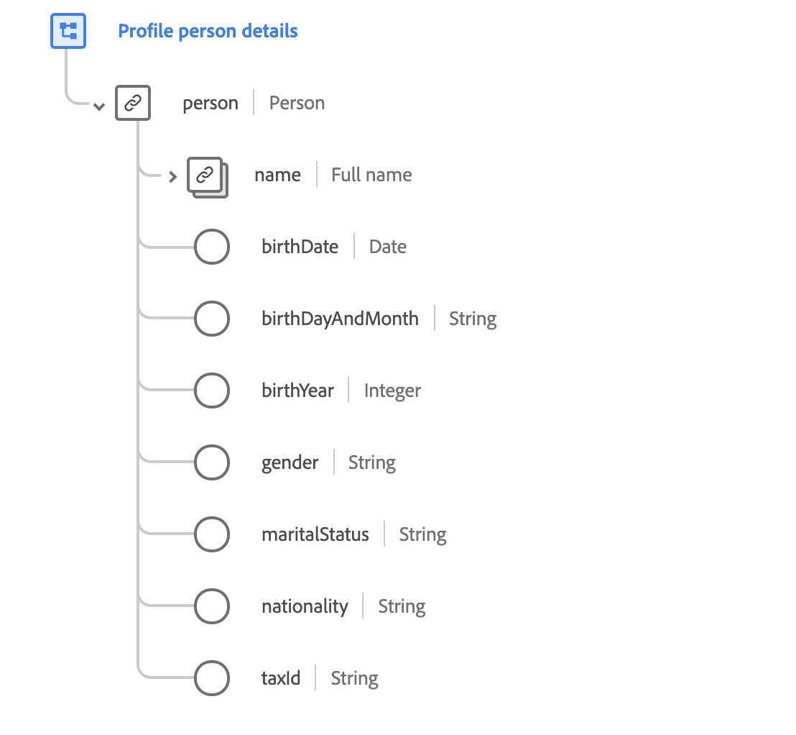

# [!UICONTROL Mélange des détails] démographiques

>[!NOTE]
>
>Les noms de plusieurs mixins ont changé. Pour plus d’informations, consultez le document sur les mises à jour [des noms de](../name-updates.md) mixin.

[!UICONTROL Les détails] démographiques sont un mélange standard pour la [[!DNL XDM Individual Profile] classe](../../classes/individual-profile.md). Le mixin fournit un objet de niveau racine `person` , dont les sous-champs décrivent les informations sur une personne.

 

| Propriété | Type de données | Description |
| --- | --- | --- |
| `person.name` | [Nom de la personne](../../data-types/person-name.md) | Objet dont les sous-champs décrivent divers éléments du nom d’une personne. |
| `person.birthDate` | Date | Date complète à laquelle une personne est née, sous la forme d&#39;un horodatage ISO 8601. |
| `person.birthDayAndMonth` | Chaîne | Jour et mois de naissance d’une personne, au format MM-JJ. Ce champ doit être utilisé lorsque le jour et le mois de naissance d’une personne sont connus, mais pas l’année. |
| `person.birthYear` | Entier | L&#39;année de naissance d&#39;une personne, y compris le siècle (comme 1989). Ce champ doit être utilisé lorsque seul l’âge de la personne est connu, pas sa date de naissance complète. |
| `person.gender` | Chaîne | L&#39;identité de genre de la personne. |
| `person.martialStatus` | Chaîne | Décrit la relation d&#39;une personne avec une autre personne importante. |
| `person.nationality` | Chaîne | La relation juridique entre une personne et son État représentée à l&#39;aide du code ISO 3166-1 Alpha-2. |
| `person.taxId` | Chaîne | ID fiscal de la personne, tel que le TIN aux États-Unis ou le CIF/NIF en Espagne. |

Pour plus d’informations sur le mixin, consultez le référentiel XDM public :

* [Exemple renseigné](https://github.com/adobe/xdm/blob/master/components/mixins/profile/profile-person-details.example.1.json)
* [Schéma](https://github.com/adobe/xdm/blob/master/components/mixins/profile/profile-person-details.schema.json)complet å