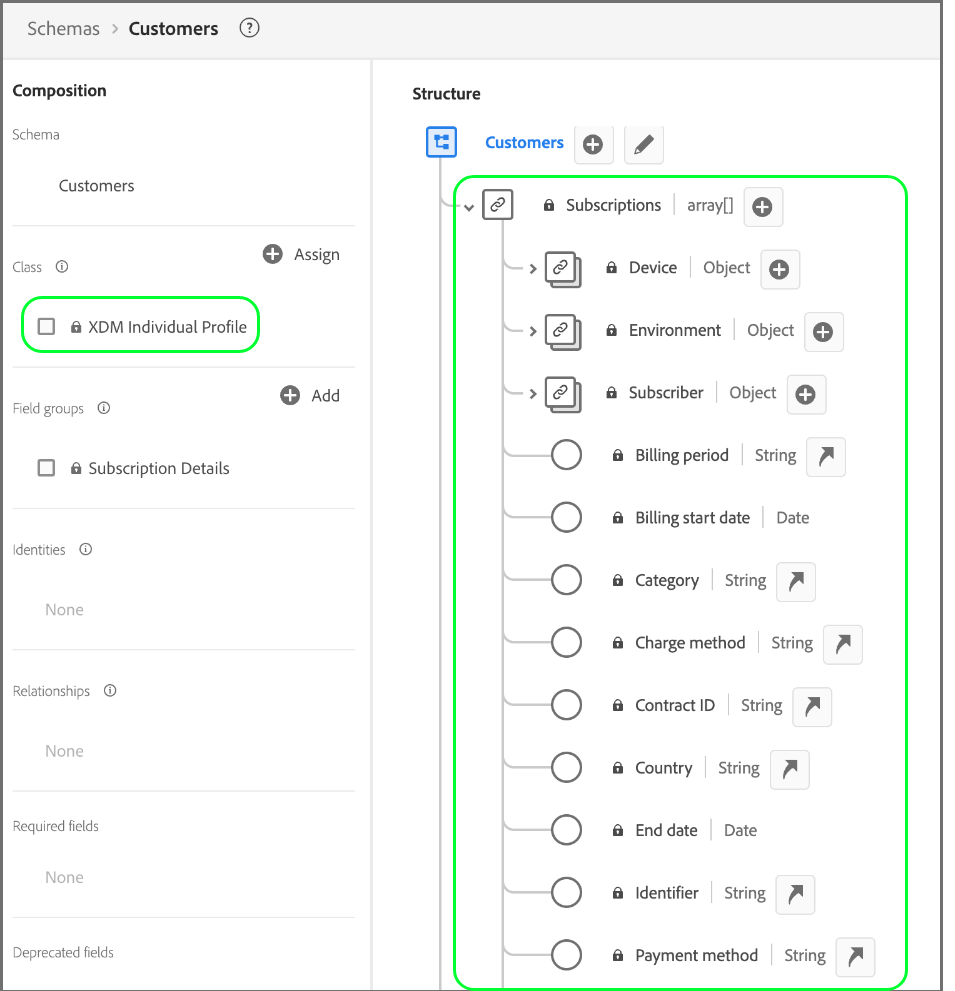

# Bonnes pratiques de modélisation des données

[!DNL Experience Data Model] (XDM) est le cadre de base qui normalise les données d’expérience client en fournissant des structures et des définitions communes à utiliser dans les services Adobe Experience Platform en aval. En adhérant aux normes XDM, toutes les données d’expérience client peuvent être intégrées à une représentation commune et utilisées pour obtenir des informations précieuses à partir des actions du client, définir des audiences de client et exprimer les attributs du client à des fins de personnalisation.

Étant donné que XDM est extrêmement polyvalent et personnalisable par sa conception, il est important de suivre les bonnes pratiques de modélisation des données lors de la conception de vos schémas. Ce document couvre les principales décisions et considérations à prendre lors du mappage des données d’expérience client à XDM.

## Commencer

Avant de lire ce guide, consultez la [présentation du système XDM](../home.md) pour une présentation de haut niveau de XDM et de son rôle dans Experience Platform.

Comme ce guide se concentre exclusivement sur les considérations clés concernant la conception de schéma, il est vivement recommandé de lire les [ principes de base de la composition de schémas](./composition.md) pour obtenir des explications détaillées sur les éléments de schéma individuels mentionnés tout au long de ce guide.

## Résumé des bonnes pratiques {#summary}

L’approche recommandée pour concevoir votre modèle de données à utiliser dans Experience Platform peut être résumée comme suit :

1. Comprendre les cas d’utilisation professionnels pour vos données.
1. Identifier les sources de données principales qui doivent être introduites dans [!DNL Platform] pour répondre à ces cas d’utilisation.
1. Identifier toutes les sources de données secondaires susceptibles d’être intéressantes. Par exemple, si actuellement une seule unité commerciale de votre organisation souhaite transférer ses données vers [!DNL Platform], une unité commerciale similaire pourrait également souhaiter transférer des données similaires à l’avenir. En prenant en compte ces sources secondaires, vous pouvez normaliser le modèle de données dans l’ensemble de votre organisation.
1. Créez un diagramme de relation d’entité détaillé (ERD) pour les sources de données qui ont été identifiées.
1. Convertissez l’ERD détaillé en un ERD centré sur [!DNL Platform] (y compris les profils, les événements d’expérience et les entités de recherche).

Les étapes relatives à l’identification des sources de données applicables requises pour exécuter vos cas d’utilisation métier varient d’une organisation à l’autre. Bien que le reste des sections de ce document se concentre sur les dernières étapes d’organisation et de construction d’un ERD une fois les sources de données identifiées, les explications des différents composants du diagramme peuvent vous éclairer sur les décisions à prendre concernant les sources de données qui devraient être migrées vers [!DNL Platform].

## Créer un ERD détaillé {#create-an-erd}

Une fois que vous avez déterminé les sources de données que vous souhaitez importer dans [!DNL Platform], créez un ERD de haut niveau pour vous aider à guider le processus de mappage de vos données aux schémas XDM.

L’exemple ci-dessous représente un ERD simplifié pour une entreprise qui souhaite importer des données dans [!DNL Platform]. Le diagramme présente les entités essentielles qui doivent être triées en classes XDM, notamment les comptes clients, les hôtels, les adresses et plusieurs événements e-commerce courants.

## Trier les entités en catégories de profil, de recherche et d’événement {#sort-entities}

Une fois que vous avez créé un ERD pour identifier les entités essentielles que vous souhaitez importer dans [!DNL Platform], ces entités doivent être triées en catégories de profil, de recherche et d’événement :

| Catégorie | Description |
| --- | --- |
| Entités de profil | Les entités de profil représentent les attributs relatifs à une personne, généralement un client ou une cliente. Les entités appartenant à cette catégorie doivent être représentées par des schémas basés sur la classe **[!DNL XDM Individual Profile]**. |
| Entités de recherche | Les entités de recherche représentent des concepts qui peuvent être associés à une personne, mais qui ne peuvent pas être directement utilisés pour identifier la personne. Les entités appartenant à cette catégorie doivent être représentées par des schémas basés sur des **classes personnalisées**, et sont liées à des profils et des événements au moyen de [relations de schéma](../tutorials/relationship-ui.md). |
| Entités d’événement | Les entités d’événement représentent des concepts liés aux actions qu’un client peut entreprendre, aux événements système ou à tout autre concept dans lequel vous souhaitez peut-être suivre les modifications au fil du temps. Les entités appartenant à cette catégorie doivent être représentées par des schémas basés sur la classe **[!DNL XDM ExperienceEvent]**. |

{style="table-layout:auto"}

### Considérations pour le tri des entités {#considerations}

Les sections ci-dessous fournissent des conseils supplémentaires sur la manière de trier vos entités dans les catégories ci-dessus.

#### Données mutables et immuables {#mutable-and-immutable-data}

Une principale méthode de tri entre les catégories d’entités consiste à déterminer si les données capturées sont mutables ou non.

Les attributs appartenant aux profils ou aux entités de recherche sont généralement mutables. Par exemple, les préférences d’un client ou d’une cliente peuvent changer au fil du temps et les paramètres d’une formule d’abonnement peuvent être mis à jour en fonction des tendances du marché.

En revanche, les données d’événement sont généralement immuables. Puisque les événements sont associés à une date et à une heure spécifique, l’« instantané système » fourni par un événement ne change pas. Par exemple, un événement peut capturer les préférences d’un client ou d’une cliente lors d’un passage en caisse d’un panier, et ne change pas même si les préférences finissent par changer ultérieurement. Les données d’événement ne peuvent pas être modifiées après leur enregistrement.

En résumé, les profils et les entités de recherche contiennent des attributs mutables et représentent les informations les plus récentes sur les objets qu’ils capturent, tandis que les événements sont des enregistrements non modifiables du système à un moment spécifique.

#### Attributs du client {#customer-attributes}

Si une entité contient des attributs liés à un client ou une cliente en particulier, il s’agit probablement d’une entité de profil. Voici quelques exemples d’attributs :

* Informations personnelles telles que le nom, la date de naissance, le sexe et le ou les identifiants de compte.
* Informations de localisation telles que les adresses et les informations GPS.
* Coordonnées telles que les numéros de téléphone et les adresses e-mail.

#### Suivi des données au fil du temps {#track-data}

Si vous souhaitez analyser la manière dont certains attributs au sein d’une entité changent au fil du temps, il s’agit probablement d’une entité d’événement. Par exemple, l’ajout d’articles à un panier peut être suivi en tant qu’événement ajouter-au-panier dans [!DNL Platform] :

| Identifiant client | Type | ID de produit | Quantité | Date et heure |
| --- | --- | --- | --- | --- |
| 1234567 | Ajouter | 275098 | 2 | 1er oct., 10 h 32 |
| 1234567 | Supprimer | 275098 | 1 | 1er oct., 10 h 33 |
| 1234567 | Ajouter | 486502 | 1 | 1er oct., 10 h 41 |
| 1234567 | Ajouter | 910482 | 5 | 3 oct., 14 h 15 |

{style="table-layout:auto"}

#### Cas d’utilisation de segmentation {#segmentation-use-cases}

Lors de la catégorisation de vos entités, il est important de réfléchir aux audiences que vous pourriez vouloir créer pour répondre aux cas d’utilisation particuliers de votre entreprise.

Prenons l’exemple d’une entreprise qui souhaite connaître toutes les personnes membres « Gold » ou « Platinum » de son programme de fidélité ayant effectué plus de cinq achats au cours de l’année dernière. Sur la base de cette logique de segmentation, vous pouvez tirer les conclusions suivantes concernant la manière dont les entités pertinentes doivent être représentées :

* « Gold » et « Platinum » représentent des statuts de fidélité applicables à une personne cliente particulière. Puisque la logique de segmentation ne concerne que le statut de fidélité actuel de la clientèle, ces données peuvent être modélisées dans le cadre d’un schéma de profil. Si vous souhaitez suivre les modifications du statut de fidélité au fil du temps, vous pouvez également créer un schéma d’événement supplémentaire pour les modifications du statut de fidélité.
* Les achats sont des événements qui se produisent à un moment donné et la logique de segmentation concerne les événements d’achat dans une fenêtre temporelle spécifiée. Ces données doivent donc être modélisées en tant que schéma d’événement.

#### Cas d’utilisation d’activation {#activation-use-cases}

Outre les considérations relatives aux cas d’utilisation de la segmentation, vous devez également examiner les cas d’utilisation de l’activation pour ces audiences afin d’identifier d’autres attributs pertinents.

Par exemple, une entreprise a créé une audience basée sur la règle stipulant que `country = US`. Ensuite, lors de l’activation de cette audience vers certaines cibles en aval, l’entreprise souhaite filtrer tous les profils exportés en fonction de l’État d’origine. Par conséquent, un attribut `state` doit également être capturé dans l’entité de profil applicable.

#### Valeurs agrégées {#aggregated-values}

En fonction du cas d’utilisation et de la granularité de vos données, vous devez décider si certaines valeurs doivent être pré-agrégées avant d’être incluses dans un profil ou une entité d’événement.

Par exemple, une entreprise souhaite créer une audience en fonction du nombre d’achats. Vous pouvez choisir d’incorporer ces données avec la granularité la plus faible en incluant chaque événement d’achat horodaté comme une entité à part entière. Cependant, cela peut parfois augmenter de façon exponentielle le nombre d’événements enregistrés. Pour réduire le nombre d’événements ingérés, vous pouvez choisir de créer une valeur agrégée `numberOfPurchases` sur une période d’une semaine ou d’un mois. D’autres fonctions d’agrégation telles que MIN et MAX peuvent également s’appliquer à ces situations.

>[!CAUTION]
>
>Experience Platform n’effectue actuellement pas d’agrégation automatique de valeurs, bien que cela soit prévu pour les prochaines versions. Si vous choisissez d’utiliser des valeurs agrégées, vous devez effectuer les calculs en externe avant d’envoyer les données à [!DNL Platform].

#### Cardinalité {#cardinality}

Les cardinalités établies dans votre ERD peuvent également fournir des indices sur la manière de classer vos entités. S’il existe une relation de type &quot;un à plusieurs&quot; entre deux entités, l’entité qui représente le &quot;nombre&quot; est susceptible d’être une entité d’événement. Cependant, il existe également des cas où le « plusieurs » est un ensemble d’entités de recherche fournies sous forme de tableau dans une entité de profil.

>[!NOTE]
>
>Comme il n’existe pas d’approche universelle pour tous les cas d’utilisation, il est important de tenir compte des avantages et des inconvénients de chaque situation lors de la classification des entités en fonction de leur cardinalité. Consultez la [section suivante](#pros-and-cons) pour plus d’informations.

Le tableau suivant décrit certaines relations d’entité courantes et les catégories qui peuvent en découler :

| Relation | Cardinalité | Catégories d’entité |
| --- | --- | --- |
| Clients et passages en caisse | Un à plusieurs | Un seul client peut avoir plusieurs passages en caisse, c’est-à-dire des événements qui peuvent être suivis au fil du temps. Les clients seraient donc une entité de profil, tandis que les passages en caisse seraient une entité d’événement. |
| Clients et comptes de fidélité | Un à un | Un seul client ne peut avoir qu’un seul compte de fidélité et un compte de fidélité ne peut appartenir qu’à un seul client. Comme il s’agit d’une relation un-à-un, les clients et les comptes de fidélité représentent tous deux des entités de profil. |
| Clients et abonnements | Un à plusieurs | Un seul client peut avoir plusieurs abonnements. Puisque l’entreprise ne s’intéresse qu’aux abonnements actuels d’un client, les clients sont une entité de profil, tandis que les abonnements sont une entité de recherche. |

{style="table-layout:auto"}

### Avantages et inconvénients de différentes classes d’entités {#pros-and-cons}

Bien que la section précédente ait fourni quelques instructions générales pour déterminer comment classer vos entités, il est important de comprendre que choisir une catégorie d’entités plutôt qu’une autre comporte souvent des avantages et des inconvénients. L’étude de cas suivante a pour but d’illustrer la manière dont vous pouvez envisager vos options dans ces situations.

Une entreprise effectue le suivi des abonnements actifs de ses clients, un même client pouvant disposer de nombreux abonnements. L’entreprise souhaite également inclure des abonnements pour les cas d’utilisation de segmentation, comme la recherche de tous les utilisateurs avec des abonnements actifs.

Dans ce scénario, l’entreprise dispose de deux options potentielles pour représenter les abonnements d’un client dans son modèle de données :

1. [l’utilisation des attributs de profil](#profile-approach)
1. [l’utilisation des entités d’événement](#event-approach)

#### Approche 1 : utilisation des attributs de profil {#profile-approach}

La première approche consiste à inclure un tableau des abonnements en tant qu’attributs au sein de l’entité de profil pour les clients. Les objets de ce tableau contiendront des champs pour `category`, `status`, `planName`, `startDate` et `endDate`.

**Avantages**

* La segmentation est possible dans le cas d’utilisation prévu.
* Le schéma conserve uniquement les derniers enregistrements d’abonnement pour un client.

**Inconvénients**

* Le tableau entier doit être redémarré chaque fois que des modifications sont apportées à un champ du tableau.
* Si différentes sources de données ou unités opérationnelles alimentent des données dans le tableau, il devient difficile de synchroniser le dernier tableau mis à jour sur tous les canaux.

#### Approche 2 : utilisation des entités d’événement {#event-approach}

La seconde approche consiste à utiliser des schémas d’événement pour représenter les abonnements. Cela implique l’ingestion des mêmes champs d’abonnement que pour la première approche, avec l’ajout d’un ID d’abonnement, d’un ID de client et de la date et de l’heure auxquelles l’événement d’abonnement s’est produit.

**Avantages**

* Les règles de segmentation peuvent être plus flexibles (par exemple, la recherche de tous les clients qui ont modifié leurs abonnements au cours des 30 derniers jours).
* Lorsque le statut d’abonnement d’un client change, vous n’avez plus à mettre à jour un tableau long et potentiellement complexe dans les attributs de profil du client. Cela s’avère particulièrement utile si des modifications simultanées de la liste d’abonnements du client proviennent de plusieurs sources.

**Inconvénients**

* La segmentation devient plus complexe pour le cas d’utilisation original prévu (identification du statut des abonnements les plus récents des clients). L’audience a désormais besoin d’une logique supplémentaire pour marquer le dernier événement d’abonnement pour qu’un client puisse vérifier son état.
* Les événements risquent davantage d’expirer automatiquement et d’être purgés de la banque de profils. Pour plus d’informations, consultez le guide sur les [expirations des événements d’expérience](../../profile/event-expirations.md).

## Créer des schémas en fonction de vos entités classées {#schemas-for-categorized-entities}

Une fois que vous avez trié vos entités en catégories de profil, de recherche et d’événement, vous pouvez commencer à convertir votre modèle de données en schémas XDM. À des fins de démonstration, l’exemple de modèle de données illustré précédemment a été trié en catégories appropriées dans le diagramme suivant :

La catégorie sous laquelle une entité a été triée doit déterminer la classe XDM sur laquelle baser son schéma. Réitération :

* Les entités de profil doivent utiliser la classe [!DNL XDM Individual Profile].
* Les entités d’événement doivent utiliser la classe [!DNL XDM ExperienceEvent].
* Les entités de recherche doivent utiliser des classes XDM personnalisées définies par votre organisation. Les entités de profil et d’événement peuvent ensuite référencer ces entités de recherche par le biais de relations de schéma.

>[!NOTE]
>
>Bien que les entités d’événement soient presque toujours représentées par des schémas distincts, les entités des catégories de profil ou de recherche peuvent être combinées dans un seul schéma XDM, selon leur cardinalité.
>
>Par exemple, l’entité Clients ayant une relation un-à-un avec l’entité LoyaltyAccounts, le schéma de l’entité Clients peut également inclure un objet `LoyaltyAccount` pour contenir les champs de fidélité appropriés pour chaque client. Cependant, en cas de relation un-à-plusieurs, l’entité qui représente le « plusieurs » peut être représentée par un schéma distinct ou un tableau d’attributs de profil, selon sa complexité.

Les sections ci-dessous fournissent des conseils généraux sur la création de schémas basés sur votre ERD.

### Adopter une approche de modélisation itérative {#iterative-modeling}

Les [règles d’évolution des schémas](./composition.md#evolution) dictent que seules les modifications non destructives peuvent être apportées aux schémas une fois qu’ils ont été implémentés. En d’autres termes, une fois que vous avez ajouté un champ à un schéma et que les données ont été ingérées par rapport à ce champ, le champ ne peut plus être supprimé. Il est donc essentiel d’adopter une approche de modélisation itérative lorsque vous créez vos schémas pour la première fois, en commençant par une mise en oeuvre simplifiée qui gagne progressivement en complexité au fil du temps.

Si vous ne savez pas si un champ particulier est nécessaire pour l’inclure dans un schéma, la bonne pratique consiste à l’exclure. S’il est déterminé par la suite que le champ est nécessaire, il peut toujours être ajouté à l’itération suivante du schéma.

### Champs d’identité {#identity-fields}

Dans Experience Platform, les champs XDM marqués comme identités sont utilisés pour rassembler des informations sur les clients individuels provenant de plusieurs sources de données. Bien qu’un schéma puisse comporter plusieurs champs marqués comme identités, une seule identité principale doit être définie pour que le schéma puisse être utilisé dans [!DNL Real-Time Customer Profile]. Voir la section sur les [champs d’identité](./composition.md#identity) dans les principes de base de la composition des schémas pour plus d’informations sur le cas d’utilisation de ces champs.

Lors de la conception de vos schémas, toutes les clés primaires de vos tableaux de base de données relationnelle sont probablement candidates à des identités primaires. Les autres exemples de champs d’identité applicables sont les adresses électroniques du client, les numéros de téléphone, les ID de compte et les [ECID](../../identity-service/features/ecid.md).

### Groupes de champs de schéma d’application Adobe {#adobe-application-schema-field-groups}

Experience Platform fournit plusieurs groupes de champs de schéma XDM prêts à l’emploi pour la capture de données liées aux applications Adobe suivantes :

* Adobe Analytics
* Adobe Audience Manager
* Adobe Campaign
* Adobe Target

Par exemple, vous pouvez utiliser le [[!UICONTROL groupe de champs Adobe Analytics ExperienceEvent Template]](https://github.com/adobe/xdm/blob/master/extensions/adobe/experience/analytics/experienceevent-all.schema.json) pour mapper des champs [!DNL Analytics] spécifiques à vos schémas XDM. Selon les applications d’Adobe que vous utilisez, vous devez utiliser ces groupes de champs fournis par Adobe dans vos schémas.

![Schéma du [!UICONTROL Modèle Adobe Analytics ExperienceEvent].](../images/best-practices/analytics-field-group.png)

Les groupes de champs d’application Adobe attribuent automatiquement une identité principale par défaut grâce à l’utilisation du champ `identityMap`, qui est un objet généré par le système et en lecture seule qui mappe les valeurs d’identité standard pour un client individuel.

Pour Adobe Analytics, ECID est l’identité principale par défaut. Si une valeur ECID n’est pas fournie par un client, l’identité principale est définie par défaut sur AAID.

>[!IMPORTANT]
>
>Lors de l’utilisation de groupes de champs d’application Adobe, aucun autre champ ne doit être marqué comme identité principale. Si d’autres propriétés doivent être marquées comme identités, ces champs doivent être attribués en tant qu’identités secondaires à la place.

## Champs de validation des données {#data-validation-fields}

Lorsque vous ingérez des données dans le lac de données, la validation des données n’est appliquée que pour les champs limités. Pour valider un champ particulier lors de l’ingestion par lots, vous devez le marquer comme limité dans le schéma XDM. Pour empêcher l’ingestion de données incorrectes dans Platform, il est recommandé de définir les critères de validation au niveau du champ lors de la création de vos schémas.

>[!IMPORTANT]
>
>La validation ne s’applique pas aux colonnes imbriquées. Si le format du champ se trouve dans une colonne de tableau, les données ne seront pas validées.

Pour définir des contraintes sur un champ particulier, sélectionnez le champ dans l’éditeur de schémas pour ouvrir la barre latérale **[!UICONTROL Propriétés du champ]**. Consultez la documentation sur les [propriétés de champ spécifiques au type](../ui/fields/overview.md#type-specific-properties) pour obtenir des descriptions exactes des champs disponibles.

![Éditeur de schéma avec les champs de contrainte surlignés dans la barre latérale [!UICONTROL Propriétés du champ].](../images/best-practices/data-validation-fields.png)

### Conseils pour préserver l’intégrité des données {#data-integrity-tips}

Vous trouverez ci-dessous un ensemble de suggestions pour préserver l’intégrité des données lors de la création d’un schéma.

* **Tenir compte des identités principales** : pour les produits d’Adobe tels que le SDK web, le SDK mobile, Adobe Analytics et Adobe Journey Optimizer, le champ `identityMap` sert souvent d’identité principale. Évitez de désigner des champs supplémentaires comme identités principales pour ce schéma.
* **Assurez-vous que `_id` n’est pas utilisé comme identité** : le champ `_id` des schémas d’événement d’expérience ne peut pas être utilisé comme identité, car il est destiné à l’unicité des enregistrements.
* **Définir des contraintes de longueur** : il est recommandé de définir des longueurs minimales et maximales sur les champs marqués comme identités. Un avertissement se déclenche si vous essayez d’attribuer un espace de noms personnalisé à un champ d’identité sans respecter les contraintes de longueur minimale et maximale. Ces limites permettent de maintenir la cohérence et la qualité des données.
* **Appliquez des modèles pour des valeurs cohérentes** : si vos valeurs d’identité suivent un modèle spécifique, vous devez utiliser le paramètre **[!UICONTROL Modèle]** pour appliquer cette contrainte. Ce paramètre peut inclure des règles telles que des chiffres uniquement, des majuscules, des minuscules ou des combinaisons de caractères spécifiques. Utilisez des expressions régulières pour faire correspondre des modèles dans vos chaînes.
* **Limiter les eVars dans les schémas Analytics** : en règle générale, un schéma Analytics ne doit avoir qu’un seul eVar désigné comme identité. Si vous envisagez d’utiliser plusieurs eVars comme identité, vous devez vérifier deux fois si la structure de données peut être optimisée.
* **Assurer l’unicité d’un champ sélectionné** : le champ choisi doit être unique par rapport à l’identité principale du schéma. Dans le cas contraire, ne le marquez pas comme une identité. Par exemple, si plusieurs clients peuvent fournir la même adresse électronique, cet espace de noms n’est pas une identité appropriée. Ce principe s’applique également à d’autres espaces de noms d’identité tels que les numéros de téléphone. Le fait de marquer un champ non unique comme identité peut entraîner l’effondrement du profil indésirable.
* **Vérifier la longueur minimale de chaîne** : tous les champs de chaîne doivent avoir au moins un caractère de longueur, car les valeurs de chaîne ne doivent jamais être vides. Toutefois, les valeurs nulles des champs non obligatoires sont acceptables.

## Étapes suivantes

Ce document couvrait les directives générales et les bonnes pratiques pour la conception de votre modèle de données pour Experience Platform. Pour résumer :

* Utilisez une approche descendante en triant vos tableaux de données en catégories de profil, de recherche et d’événement avant de créer vos schémas.
* Il existe souvent plusieurs approches et options lorsqu’il s’agit de concevoir des schémas à des fins différentes.
* Votre modèle de données doit prendre en charge vos cas d’utilisation métier, tels que la segmentation ou l’analyse du parcours client.
* Rendez vos schémas aussi simples que possible et ajoutez uniquement de nouveaux champs lorsque cela est absolument nécessaire.

Une fois que vous êtes prêt, consultez le tutoriel concernant la [création d’un schéma dans l’interface utilisateur](../tutorials/create-schema-ui.md) pour obtenir des instructions détaillées sur la création d’un schéma, attribuez la classe appropriée à l’entité et ajoutez des champs auxquels mapper vos données.
