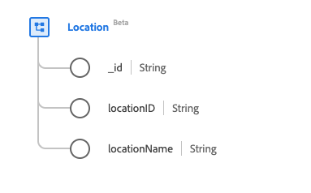

# Classe [!UICONTROL Location]

Dans le modèle de données d’expérience (XDM), la classe [!UICONTROL Location] capture les informations de localisation d’événement en direct, telles qu’une salle de voyage ou une salle de sport.

| Nom d’affichage | Propriété | Type de données | Description |
| --- | --- | --- | --- |
| [!UICONTROL Identifiant] | `_id` | [!UICONTROL Chaîne] | Identifiant de chaîne unique généré par le système pour l’enregistrement. Ce champ permet de déterminer l’unicité d’un enregistrement individuel, d’éviter la duplication des données et de rechercher cet enregistrement dans les services en aval.  Ce champ étant généré par le système, il n’est pas nécessaire de lui fournir une valeur explicite lors de l’ingestion des données. Cependant, vous pouvez toujours choisir de fournir vos propres valeurs d’ID uniques si vous le souhaitez. |
| [!UICONTROL Identifiant d’emplacement] | `locationID` | [!UICONTROL Chaîne] | Identifiant unique de l’emplacement. |
| [!UICONTROL Nom du lieu] | `locationName` | [!UICONTROL Chaîne] | Nom de l’emplacement. |

La classe peut être étendue avec le groupe de champs [[!UICONTROL Location] ](../field-groups/location.md) pour décrire d’autres détails sur un emplacement.
