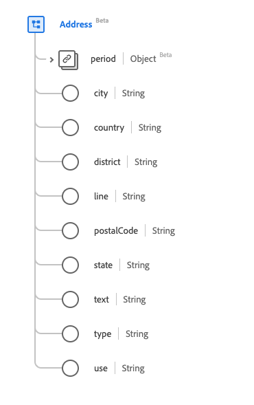

# Type de données [!UICONTROL Address]

[!UICONTROL Adresse] est un type de données standard du modèle de données d’expérience (XDM) qui décrit une adresse exprimée à l’aide de conventions postales (par opposition au GPS ou à d’autres formats de définition d’emplacement). Ce type de données est créé conformément aux spécifications HL7 FHIR Release 5.

| Nom d’affichage | Propriété | Type de données | Description |
| --- | --- | --- | --- |
| [!UICONTROL Période] | `period` | [[!UICONTROL Période]](../data-types/period.md) | Période au cours de laquelle l’adresse a été/est utilisée. |
| [!UICONTROL Ville] | `city` | Chaîne | Nom de la ville. |
| [!UICONTROL Pays] | `country` | Chaîne | Code pays décrit dans la norme internationale ISO 3166. Le code peut être alpha-2 ou alpha-3. |
| [!UICONTROL District] | `district` | Chaîne | Nom du district. |
| [!UICONTROL Line] | `line` | Chaîne | Nom, numéro, direction, case postale ou équivalent de la rue. |
| [!UICONTROL Code postal] | `postalCode` | Chaîne | Code postal. |
| [!UICONTROL État] | `state` | Chaîne | Sous-unité d’un pays. Les abréviations sont acceptables. |
| [!UICONTROL Texte] | `text` | Chaîne | Représentation textuelle de l’adresse. |
| [!UICONTROL Type] | `type` | Chaîne | Type d’adresse. La valeur de cette propriété doit être égale à l’une des valeurs d’énumération connues suivantes. <li> `postal` </li> <li> `physical` </li> <li> `both` </li> |
| [!UICONTROL Utiliser] | `use` | Chaîne | Objet de l’adresse. La valeur de cette propriété doit être égale à l’une des valeurs d’énumération connues suivantes. <li> `home` </li> <li> `work` </li> <li> `temp` </li> <li> `old`</li> <li> `billing`</li> |

Pour plus d’informations sur ce type de données, reportez-vous au référentiel XDM public :

* [Exemple renseigné](https://github.com/adobe/xdm/blob/master/extensions/industry/healthcare/fhir/datatypes/address.example.1.json)
* [Schéma complet](https://github.com/adobe/xdm/blob/master/extensions/industry/healthcare/fhir/datatypes/address.schema.json)
