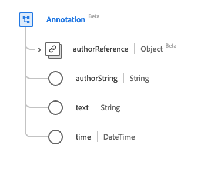

# Type de données [!UICONTROL Annotation]

[!UICONTROL Annotation] est un type de données standard du modèle de données d’expérience (XDM) qui contient un nœud de texte avec attribution à l’auteur. Ce type de données est créé conformément aux spécifications HL7 FHIR Release 5.

| Nom d’affichage | Propriété | Type de données | Description |
| --- | --- | --- | --- |
| [!UICONTROL Author Reference] | `authorReference` | [[!UICONTROL Reference]](../data-types/reference.md) | Référence à l’auteur. |
| [!UICONTROL Author] | `authorString` | Chaîne | Personne responsable de l’annotation. |
| [!UICONTROL Text] | `text` | Chaîne | Contenu de l’annotation. |
| [!UICONTROL Time] | `time` | DateTime | Date à laquelle l’annotation a été créée. |

Pour plus d’informations sur ce type de données, reportez-vous au référentiel XDM public :

* [Exemple renseigné](https://github.com/adobe/xdm/blob/master/extensions/industry/healthcare/fhir/datatypes/annotation.example.1.json)
* [Schéma complet](https://github.com/adobe/xdm/blob/master/extensions/industry/healthcare/fhir/datatypes/annotation.schema.json)
