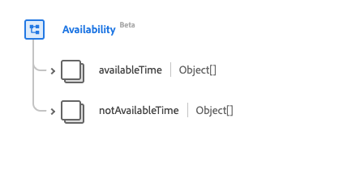
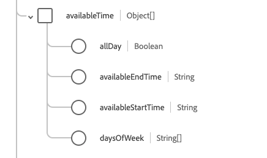
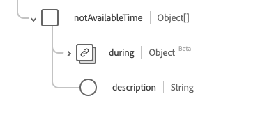

# Type de données [!UICONTROL Availability]

[!UICONTROL Availability] est un type de données standard du modèle de données d’expérience (XDM) qui décrit les données de disponibilité d’un élément. Ce type de données est créé conformément aux spécifications HL7 FHIR Release 5.

| Nom d’affichage | Propriété | Type de données | Description |
| --- | --- | --- | --- |
| [!UICONTROL Available Time] | `availableTime` | Tableau d’objets | Nombre de fois que l’élément est disponible. Pour plus d’informations, consultez la [section ci-dessous](#available-time). |
| [!UICONTROL Not Available Time] | `notAvailableTime` | Chaîne | Nombre de fois où l’élément n’est pas disponible, avec une raison fournie. Pour plus d’informations, consultez la [section ci-dessous](#not-available-time). |

Pour plus d’informations sur ce type de données, reportez-vous au référentiel XDM public :

* [Exemple renseigné](https://github.com/adobe/xdm/blob/master/extensions/industry/healthcare/fhir/datatypes/availability.example.1.json)
* [Schéma complet](https://github.com/adobe/xdm/blob/master/extensions/industry/healthcare/fhir/datatypes/availability.schema.json)

## `availableTime` {#available-time}

`availableTime` est fourni sous la forme d’un tableau d’objets . La structure de chaque objet est décrite ci-dessous.

| Nom d’affichage | Propriété | Type de données | Description |
| --- | --- | --- | --- |
| [!UICONTROL All Day] | `allDay` | Booléen | Valeur booléenne indiquant si l’élément est toujours disponible. |
| [!UICONTROL Available End Time] | `availableEndTime` | Chaîne | Heure à laquelle l’élément cesse d’être disponible. Ceci est ignoré si `allDay` est `true`. |
| [!UICONTROL Available Start Time] | `availableStartTime` | Chaîne | Heure à laquelle l’élément commence à être disponible. Ceci est ignoré si `allDay` est `true`. |
| [!UICONTROL Days Of Week] | `daysOfWeek` | Tableau de chaînes | Tableau de chaînes détaillant les jours disponibles. Les valeurs de cette propriété doivent être égales à une ou plusieurs des valeurs d’énumération connues suivantes. <li> `mon` </li> <li> `tues` </li> <li> `wed` </li> <li> `thurs`</li>  <li> `fri` </li> <li> `sat`</li> <li> `sun`</li> |

## `notAvailableTime` {#not-available-time}

`notAvailableTime` est fourni sous la forme d’un tableau d’objets . La structure de chaque objet est décrite ci-dessous.

| Nom d’affichage | Propriété | Type de données | Description |
| --- | --- | --- | --- |
| [!UICONTROL During] | `during` | [[!UICONTROL Period]](../data-types/period.md) | Durée pendant laquelle l’élément cesse d’être disponible. |
| [!UICONTROL Description] | `description` | Chaîne | Raison pour laquelle l’élément n’est pas disponible. |
