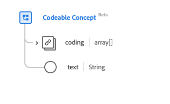

# Type de données [!UICONTROL Concept codable]

[!UICONTROL Concept codable] est un type de données standard des modèles de données d’expérience (XDM) qui décrit une référence d’une ressource à une autre. Ce type de données est créé conformément aux spécifications HL7 FHIR Release 5.

| Nom d’affichage | Propriété | Type de données | Description |
| --- | --- | --- | --- |
| [!UICONTROL Codage] | `coding` | Tableau de [[!UICONTROL codage]](../data-types/coding.md) | Code défini par un système terminologique. |
| [!UICONTROL Texte] | `text` | Chaîne | Représentation en texte brut du concept. |

Pour plus d’informations sur ce type de données, reportez-vous au référentiel XDM public :

* [Exemple renseigné](https://github.com/adobe/xdm/blob/master/extensions/industry/healthcare/fhir/datatypes/codeablereference.example.1.json)
* [Schéma complet](https://github.com/adobe/xdm/blob/master/extensions/industry/healthcare/fhir/datatypes/codeableconcept.schema.json)
