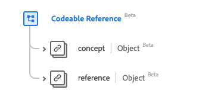

# [!UICONTROL Référence codable] type de données

[!UICONTROL Référence codable] est un type de données standard du modèle de données d’expérience (XDM) qui décrit une référence à une ressource ou à un concept. Ce type de données est créé conformément aux spécifications HL7 FHIR Release 5.

| Nom d’affichage | Propriété | Type de données | Description |
| --- | --- | --- | --- |
| [!UICONTROL Concept] | `concept` | [[!UICONTROL Concept codable]](../data-types/codeable-concept.md) | Référence à un concept (par classe). |
| [!UICONTROL Référence] | `reference` | [[!UICONTROL Référence]](../data-types/reference.md) | Référence à une ressource. |

Pour plus d’informations sur ce type de données, reportez-vous au référentiel XDM public :

* [Exemple renseigné](https://github.com/adobe/xdm/blob/master/extensions/industry/healthcare/fhir/datatypes/codeablereference.example.1.json)
* [Schéma complet](https://github.com/adobe/xdm/blob/master/extensions/industry/healthcare/fhir/datatypes/codeablereference.schema.json)
