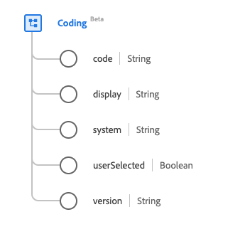

# Type de données [!UICONTROL Coding]

[!UICONTROL Coding] est un type de données standard du modèle de données d’expérience (XDM) qui décrit une référence à un code défini par un système terminologique. Ce type de données est créé conformément aux spécifications HL7 FHIR Release 5.

| Nom d’affichage | Propriété | Type de données | Description |
| --- | --- | --- | --- |
| [!UICONTROL Code] | `code` | Chaîne | Symbole dans la syntaxe définie par le système. |
| [!UICONTROL Display] | `display` | Chaîne | Représentation définie par le système. |
| [!UICONTROL System] | `system` | Chaîne | Espace de noms de la valeur d’identifiant, représentée sous la forme d’un URI. |
| [!UICONTROL Is Selected By User] | `userSelected` | Booléen | Indicateur indiquant si ce codage a été choisi par l’utilisateur. La valeur par défaut est false. |
| [!UICONTROL Version] | `version` | Chaîne | Version du système. |

Pour plus d’informations sur ce type de données, reportez-vous au référentiel XDM public :

* [Exemple renseigné](https://github.com/adobe/xdm/blob/master/extensions/industry/healthcare/fhir/datatypes/coding.example.1.json)
* [Schéma complet](https://github.com/adobe/xdm/blob/master/extensions/industry/healthcare/fhir/datatypes/coding.schema.json)
