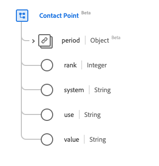

# Type de données [!UICONTROL Point de contact]

[!UICONTROL  Point de contact ] est un type de données standard des modèles de données d’expérience (XDM) qui décrit les coordonnées d’une personne. Ce type de données est créé conformément aux spécifications HL7 FHIR Release 5.

| Nom d’affichage | Propriété | Type de données | Description |
| --- | --- | --- | --- |
| [!UICONTROL Période] | `period` | [[!UICONTROL Période]](../data-types/period.md) | Période pendant laquelle le point de contact a été/est utilisé. |
| [!UICONTROL Classer] | `rank` | Entier | Classement indiquant l’utilisation préférée du point de contact. La valeur minimale est `1` et la valeur maximale est `2147483647` où `1` est la spécificité la plus élevée. |
| [!UICONTROL Système] | `system` | Chaîne | Système par lequel ils peuvent être contactés. La valeur de cette propriété doit être égale à l’une des valeurs d’énumération connues suivantes. <li> `phone` </li> <li> `fax` </li> <li> `email` </li> <li> `pager`</li> <li> `url`</li> <li> `sms`</li> <li> `other`</li> |
| [!UICONTROL Utiliser] | `use` | Chaîne | Objectif du point de contact. La valeur de cette propriété doit être égale à l’une des valeurs d’énumération connues suivantes. <li> `home` </li> <li> `work` </li> <li> `temp` </li> <li> `old`</li> <li> `mobile`</li> |
| [!UICONTROL Valeur] | `value` | Chaîne | Détails du point de contact. |

Pour plus d’informations sur ce type de données, reportez-vous au référentiel XDM public :

* [Exemple renseigné](https://github.com/adobe/xdm/blob/master/extensions/industry/healthcare/fhir/datatypes/contactpoint.example.1.json)
* [Schéma complet](https://github.com/adobe/xdm/blob/master/extensions/industry/healthcare/fhir/datatypes/contactpoint.schema.json)
