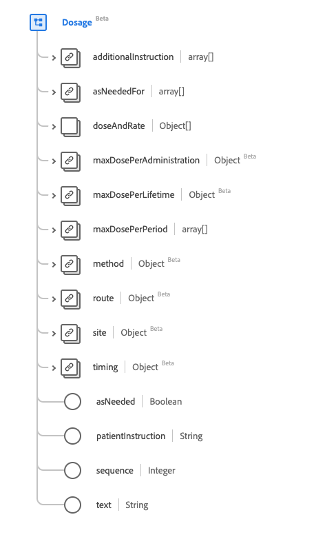
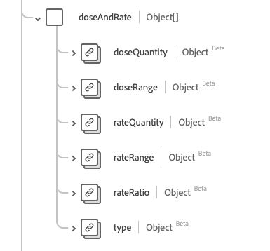

# Type de données [!UICONTROL Dosage]

[!UICONTROL Posologie] est un type de données standard du modèle de données d’expérience (XDM) qui décrit comment le médicament est/a été pris ou doit être pris. Ce type de données est créé conformément aux spécifications HL7 FHIR Release 5.

| Nom d’affichage | Propriété | Type de données | Description |
| --- | --- | --- | --- |
| [!UICONTROL Instructions supplémentaires] | `additionalInstruction` | Tableau de [[!UICONTROL concept codable]](../data-types/codeable-concept.md) | Instructions supplémentaires ou mises en garde adressées au patient. |
| [!UICONTROL Selon Les Besoins] | `asNeededFor` | Tableau de [[!UICONTROL concept codable]](../data-types/codeable-concept.md) | Décrit le problème pour lequel le médicament doit être pris selon les besoins. |
| [!UICONTROL Dose Et Débit] | `doseAndRate` | Tableau d’objets | La quantité de médicament administrée, à administrer, ou la quantité type à administrer. Voir la [section ci-dessous](#dose-and-rate) pour plus d’informations |
| [!UICONTROL Dose Maximale Par Administration] | `maxDosePerAdministration` | [[!UICONTROL Quantité simple]](../data-types/simple-quantity.md) | La limite supérieure du médicament par administration. |
| [!UICONTROL Dose Maximale Par Vie] | `maxDosePerLifetime` | [[!UICONTROL Quantité simple]](../data-types/simple-quantity.md) | La limite supérieure du médicament par vie du patient. |
| [!UICONTROL Dose Maximale Par Période] | `maxDosePerPeriod` | Tableau de [[!UICONTROL ratio]](../data-types/ratio.md) | La limite supérieure des médicaments par unité de temps. |
| [!UICONTROL Méthode] | `method` | [[!UICONTROL Concept codable]](../data-types/codeable-concept.md) | Technique d’administration des médicaments. |
| [!UICONTROL Route] | `route` | [[!UICONTROL Concept codable]](../data-types/codeable-concept.md) | Comment le médicament doit pénétrer dans l’organisme. |
| [!UICONTROL Site du corps] | `site` | [[!UICONTROL Concept codable]](../data-types/codeable-concept.md) | Site du corps où le médicament doit être administré. |
| [!UICONTROL Timing] | `timing` | [[!UICONTROL Timing]](../data-types/timing.md) | Quand le médicament doit-il être administré. |
| [!UICONTROL Au Besoin] | `asNeeded` | Booléen | Un indicateur indiquant si le médicament doit être pris selon les besoins. |
| [!UICONTROL Instructions patient] | `patientInstruction` | Chaîne | Instructions dans des termes à comprendre par le patient ou le consommateur. |
| [!UICONTROL Séquence] | `Integer` | [[!UICONTROL Concept codable]](../data-types/codeable-concept.md) | L’ordre des instructions posologiques. |
| [!UICONTROL Texte] | `text` | Chaîne | Planifiez les instructions de dosage textuelles. |

Pour plus d’informations sur ce type de données, reportez-vous au référentiel XDM public :

* [Exemple renseigné](https://github.com/adobe/xdm/blob/master/extensions/industry/healthcare/fhir/datatypes/dosage.example.1.json)
* [Schéma complet](https://github.com/adobe/xdm/blob/master/extensions/industry/healthcare/fhir/datatypes/dosage.schema.json)

## `doseAndRate` {#dose-and-rate}

`doseAndRate` est fourni sous la forme d’un tableau d’objets . La structure de chaque objet est décrite ci-dessous.

| Nom d’affichage | Propriété | Type de données | Description |
| --- | --- | --- | --- |
| [!UICONTROL Dose] | `doseQuantity` | [[!UICONTROL Quantité simple]](../data-types/simple-quantity.md) | La quantité de médicament par dose. |
| [!UICONTROL Intervalle De Doses] | `doseRange` | [[!UICONTROL Plage]](../data-types/range.md) | La quantité de médicament par dose. |
| [!UICONTROL Quantité de taux] | `rateQuantity` | [[!UICONTROL Quantité simple]](../data-types/simple-quantity.md) | La quantité de médicaments par unité de temps. |
| [!UICONTROL Plage de taux] | `rateRange` | [[!UICONTROL Plage]](../data-types/range.md) | La quantité de médicaments par unité de temps. |
| [!UICONTROL Ratio des taux] | `rateRatio` | [[!UICONTROL Rapport]](../data-types/ratio.md) | La quantité de médicaments par unité de temps. |
| [!UICONTROL Type] | `type` | [[!UICONTROL Concept codable]](../data-types/codeable-concept.md) | Le type de dose ou de débit spécifié. |
