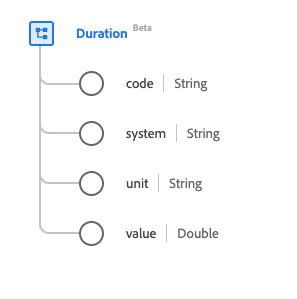

# [!UICONTROL Durée] type de données

[!UICONTROL Durée] est un type de données standard des modèles de données d’expérience (XDM) qui décrit une durée. Ce type de données est créé conformément aux spécifications HL7 FHIR Release 5.

| Nom d’affichage | Propriété | Type de données | Description |
| --- | --- | --- | --- |
| [!UICONTROL Code] | `code` | Chaîne | Forme codée de l’unité de temps. |
| [!UICONTROL Système] | `system` | Chaîne | Système qui décrit l’unité codée, représentée sous la forme d’un URI. |
| [!UICONTROL Unité] | `unit` | Chaîne | Unité de temps représentée en millisecondes, secondes, minutes, heures, jours, semaines, mois ou années. Les valeurs de cette propriété doivent être égales à une ou plusieurs des valeurs d’énumération connues suivantes. <li> `ms` (ms) </li> <li> `s` (secondes) </li> <li> `min` (minutes) </li> <li> `h` (heures) </li>  <li> `d` (jours) </li> <li> `wk` (semaines) </li> <li> `mo` (mois) </li> <li> `a` (années) </li> |
| [!UICONTROL Valeur] | `value` | Double | Valeur numérique pour l’unité de temps. |

Pour plus d’informations sur ce type de données, reportez-vous au référentiel XDM public :

* [Exemple renseigné](https://github.com/adobe/xdm/blob/master/extensions/industry/healthcare/fhir/datatypes/duration.example.1.json)
* [Schéma complet](https://github.com/adobe/xdm/blob/master/extensions/industry/healthcare/fhir/datatypes/duration.schema.json)
