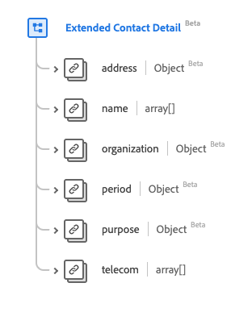

# Type de données [!UICONTROL Extended Contact Detail]

[!UICONTROL Extended Contact Detail] est un type de données standard du modèle de données d’expérience (XDM) qui décrit les informations d’un contact étendu. Ce type de données est créé conformément aux spécifications HL7 FHIR Release 5.

| Nom d’affichage | Propriété | Type de données | Description |
| --- | --- | --- | --- |
| [!UICONTROL Address] | `address` | [[!UICONTROL Address]](../data-types/address.md) | Adresse du contact. |
| [!UICONTROL Name] | `name` | Tableau de [[!UICONTROL Human Name]](../data-types/human-name.md) | Nom de la ou des personnes à contacter. |
| [!UICONTROL Organization] | `organization` | [[!UICONTROL Reference]](../data-types/reference.md) | Organisation qui gère/surveille les coordonnées. |
| [!UICONTROL Period] | `period` | [[!UICONTROL Period]](../data-types/period.md) | Période pendant laquelle le contact est ou était valide pour être utilisé. |
| [!UICONTROL Purpose] | `purpose` | [[!UICONTROL Codeable Concept]](../data-types/codeable-concept.md) | Type de contact. |
| [!UICONTROL Telecom] | `telecom` | Tableau de [[!UICONTROL Contact Point]](../data-types/contact-point.md) | Les coordonnées. |

Pour plus d’informations sur ce type de données, reportez-vous au référentiel XDM public :

* [Exemple renseigné](https://github.com/adobe/xdm/blob/master/extensions/industry/healthcare/fhir/datatypes/extendedcontactdetail.example.1.json)
* [Schéma complet](https://github.com/adobe/xdm/blob/master/extensions/industry/healthcare/fhir/datatypes/extendedcontactdetail.schema.json)
