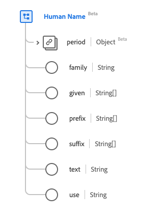

# [!UICONTROL Nom humain] type de données

[!UICONTROL Nom humain] est un type de données standard du modèle de données d’expérience (XDM) qui fournit des informations sur le nom d’un être humain ou d’une autre entité vivante. Ce type de données est créé conformément aux spécifications HL7 FHIR Release 5.

| Nom d’affichage | Propriété | Type de données | Description |
| --- | --- | --- | --- |
| [!UICONTROL Période] | `period` | [[!UICONTROL Période]](../data-types/period.md) | Période au cours de laquelle le nom est ou était utilisé. |
| [!UICONTROL  Famille ] | `family` | Chaîne | Le nom de famille ou de famille. |
| [!UICONTROL Donné] | `given` | Tableau de chaînes | Le prénom, y compris le ou les deuxième prénom(s). |
| [!UICONTROL Préfixe] | `prefix` | Tableau de chaînes | Toute partie du nom précédant le prénom ou le prénom. |
| [!UICONTROL Suffixe] | `suffix` | Tableau de chaînes | Toute partie du nom postérieure au nom de famille ou de famille. |
| [!UICONTROL Texte] | `text` | Chaîne | Représentation en texte brut du nom complet. |
| [!UICONTROL Utiliser] | `use` | Chaîne | Utilisation du nom. Les valeurs de cette propriété doivent être égales à une ou plusieurs des valeurs d’énumération connues suivantes. <li> `usual` </li> <li> `offical` </li> <li> `temp` </li> <li> `nickname` </li> <li> `anonymous` </li> <li> `old` </li> <li> `maiden` </li> |

Pour plus d’informations sur ce type de données, reportez-vous au référentiel XDM public :

* [Exemple renseigné](https://github.com/adobe/xdm/blob/master/extensions/industry/healthcare/fhir/datatypes/humanname.example.1.json)
* [Schéma complet](https://github.com/adobe/xdm/blob/master/extensions/industry/healthcare/fhir/datatypes/humanname.schema.json)
