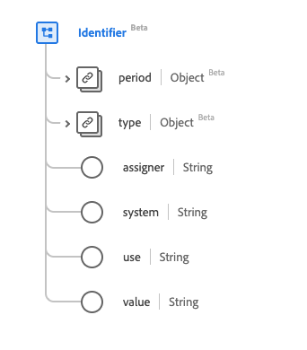

# Type de données [!UICONTROL Identifier]

[!UICONTROL Identifier] est un type de données standard du modèle de données d’expérience (XDM) qui fournit un identifiant destiné au calcul. Ce type de données est créé conformément aux spécifications HL7 FHIR Release 5.

| Nom d’affichage | Propriété | Type de données | Description |
| --- | --- | --- | --- |
| [!UICONTROL Period] | `period` | [[!UICONTROL Period]](../data-types/period.md) | Période pendant laquelle l’ID est ou était valide pour être utilisé. |
| [!UICONTROL Type] | `type` | [[!UICONTROL Codeable Concept]](../data-types/codeable-concept.md) | Description de l’identifiant. |
| [!UICONTROL Assigner] | `assigner` | Chaîne | Organisation qui a émis l’ID. |
| [!UICONTROL System] | `system` | Chaîne | Espace de noms de la valeur d’identifiant, représentée sous la forme d’un URI. |
| [!UICONTROL Use] | `use` | Chaîne | Utilisation de l’identifiant. Les valeurs de cette propriété doivent être égales à une ou plusieurs des valeurs d’énumération connues suivantes. <li> `usual` </li> <li> `offical` </li> <li> `temp` </li> <li> `secondary` </li> <li> `old` </li> |
| [!UICONTROL Value] | `value` | Chaîne | Valeur unique de l’ID. |

Pour plus d’informations sur ce type de données, reportez-vous au référentiel XDM public :

* [Exemple renseigné](https://github.com/adobe/xdm/blob/master/extensions/industry/healthcare/fhir/datatypes/identifier.example.1.json)
* [Schéma complet](https://github.com/adobe/xdm/blob/master/extensions/industry/healthcare/fhir/datatypes/identifier.schema.json)
