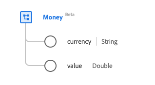

# Type de données [!UICONTROL Money]

[!UICONTROL Money] est un type de données XDM (Modèle de données d’expérience) standard qui fournit une quantité d’utilité économique dans une devise reconnue. Ce type de données est créé conformément aux spécifications HL7 FHIR Release 5.

| Nom d’affichage | Propriété | Type de données | Description |
| --- | --- | --- | --- |
| [!UICONTROL Currency] | `currency` | Chaîne | Code de devise ISO 4217. |
| [!UICONTROL Value] | `value` | Double | Valeur numérique. |

Pour plus d’informations sur ce type de données, reportez-vous au référentiel XDM public :

* [Exemple renseigné](https://github.com/adobe/xdm/blob/master/extensions/industry/healthcare/fhir/datatypes/money.example.1.json)
* [Schéma complet](https://github.com/adobe/xdm/blob/master/extensions/industry/healthcare/fhir/datatypes/money.schema.json)
