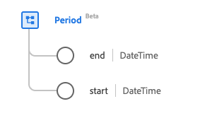

# [!UICONTROL Période] type de données

[!UICONTROL Période] est un type de données standard du modèle de données d’expérience (XDM) qui fournit une période définie par une date/heure de début et de fin. Ce type de données est créé conformément aux spécifications HL7 FHIR Release 5.

| Nom d’affichage | Propriété | Type de données | Description |
| --- | --- | --- | --- |
| [!UICONTROL Fin] | `end` | DateTime | Date et heure de fin. |
| [!UICONTROL Début] | `start` | DateTime | Date et heure de début. |

Pour plus d’informations sur ce type de données, reportez-vous au référentiel XDM public :

* [Exemple renseigné](https://github.com/adobe/xdm/blob/master/extensions/industry/healthcare/fhir/datatypes/period.example.1.json)
* [Schéma complet](https://github.com/adobe/xdm/blob/master/extensions/industry/healthcare/fhir/datatypes/period.schema.json)
