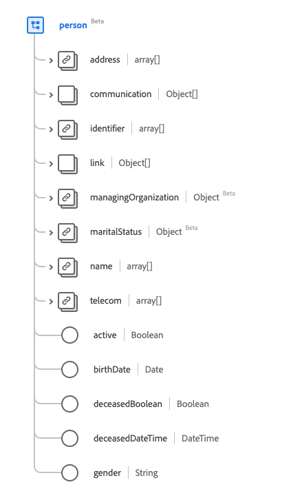
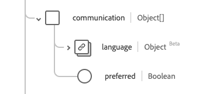
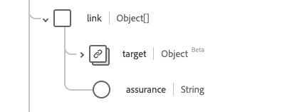

# Type de données [!UICONTROL Person]

[!UICONTROL Person] est un type de données standard du modèle de données d’expérience (XDM) qui fournit des informations sur un enregistrement de personne générique. Ce type de données est créé conformément aux spécifications HL7 FHIR Release 5.

| Nom d’affichage | Propriété | Type de données | Description |
| --- | --- | --- | --- |
| [!UICONTROL Address] | `address` | Tableau de [[!UICONTROL Address]](../data-types/address.md) | Une ou plusieurs adresses pour la personne. |
| [!UICONTROL Communication] | `communication` | Tableau d’objets | Langue pouvant être utilisée pour communiquer avec la personne au sujet de sa santé. Pour plus d’informations, consultez la [section ci-dessous](#communication). |
| [!UICONTROL Identifier] | `identifier` | Tableau de [[!UICONTROL Identifier]](../data-types/identifier.md) | Identifiant humain de cette personne. |
| [!UICONTROL Person Link Details] | `link` | Tableau d’objets | Lien vers une ressource qui concerne la même personne réelle. Pour plus d’informations, consultez la [section ci-dessous](#link). |
| [!UICONTROL Managing Organization] | `managingOrganization` | [[!UICONTROL Reference]](../data-types/reference.md) | L’organisation qui est la gardienne du dossier du patient. |
| [!UICONTROL Marital Status] | `maritalStatus` | [[!UICONTROL Codeable Concept]](../data-types/codeable-concept.md) | État civil (ou civil) d’une personne |
| [!UICONTROL Name] | `name` | Tableau de [[!UICONTROL Human Name]](../data-types/human-name.md) | Noms associés à une personne. |
| [!UICONTROL Contact Details] | `telecom` | Tableau de [[!UICONTROL Contact Point]] | Coordonnées permettant de contacter la personne. |
| [!UICONTROL Is Active] | `active` | Booléen | Indique si l&#39;enregistrement de la personne est utilisé activement. |
| [!UICONTROL Birth Date] | `birthDate` | Date | Date de naissance de la personne. |
| [!UICONTROL Deceased Indicator] | `deceasedBoolean` | Booléen | Indique si la personne est décédée ou non. |
| [!UICONTROL Deceased Date Time] | `deceasedDateTime` | DateTime | Date et heure du décès si la personne est décédée. |
| [!UICONTROL Gender] | `gender` | Chaîne | Identité sexuelle de la personne. La valeur de cette propriété doit être égale à l’une des valeurs d’énumération connues suivantes. <li> `female` </li> <li> `male` </li> <li> `other` </li> <li> `unknown`</li> |

Pour plus d’informations sur ce type de données, reportez-vous au référentiel XDM public :

* [Exemple renseigné](https://github.com/adobe/xdm/blob/master/extensions/industry/healthcare/fhir/datatypes/identifier.example.1.json)
* [Schéma complet](https://github.com/adobe/xdm/blob/master/extensions/industry/healthcare/fhir/datatypes/identifier.schema.json)

## `communication` {#communication}

`communication` est fourni sous la forme d’un tableau d’objets . La structure de chaque objet est décrite ci-dessous.

| Nom d’affichage | Propriété | Type de données | Description |
| --- | --- | --- | --- |
| [!UICONTROL Language] | `language` | [[!UICONTROL Codeable concept]](../data-types/codeable-concept.md) | Langue pouvant être utilisée pour communiquer avec la personne au sujet de sa santé. |
| [!UICONTROL Is Preferred Language] | `preferred` | Booléen | Indique si la langue est leur langue préférée ou non. |

## `link` {#link}

`link` est fourni sous la forme d’un tableau d’objets . La structure de chaque objet est décrite ci-dessous.

| Nom d’affichage | Propriété | Type de données | Description |
| --- | --- | --- | --- |
| [!UICONTROL Target] | `target` | [[!UICONTROL Reference]](../data-types/reference.md) | Ressource à laquelle cette personne réelle est associée. |
| [!UICONTROL Assurance] | `assurance` | Chaîne | Niveau d’assurance associé au lien. Les valeurs de cette propriété doivent être égales à une ou plusieurs des valeurs d’énumération connues suivantes. <li> `level1` </li> <li> `level2` </li> <li> `level3` </li> <li> `level4` </li> |
