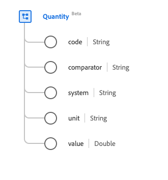

# Type de données [!UICONTROL Quantité]

[!UICONTROL Quantité] est un type de données standard du modèle de données d’expérience (XDM) qui fournit une quantité mesurée ou mesurable. Ce type de données est créé conformément aux spécifications HL7 FHIR Release 5.

| Nom d’affichage | Propriété | Type de données | Description |
| --- | --- | --- | --- |
| [!UICONTROL Code] | `code` | Chaîne | Forme codée de l’unité. |
| [!UICONTROL Comparateur] | `comparator` | Chaîne | Opérateur de comparaison. La valeur de cette propriété doit être égale à l’une des valeurs d’énumération connues suivantes. <li> `<` </li> <li> `<=` </li> <li> `>=` </li> <li> `>`</li> <li> `ad`</li> |
| [!UICONTROL Système] | `system` | Chaîne | Système qui définit le formulaire unitaire codé, représenté sous la forme d’un URI. |
| [!UICONTROL Unité] | `unit` | Chaîne | Représentation de l’unité. |
| [!UICONTROL Valeur] | `value` | Double | Valeur numérique. |

Pour plus d’informations sur ce type de données, reportez-vous au référentiel XDM public :

* [Exemple renseigné](https://github.com/adobe/xdm/blob/master/extensions/industry/healthcare/fhir/datatypes/quantity.example.1.json)
* [Schéma complet](https://github.com/adobe/xdm/blob/master/extensions/industry/healthcare/fhir/datatypes/quantity.schema.json)
